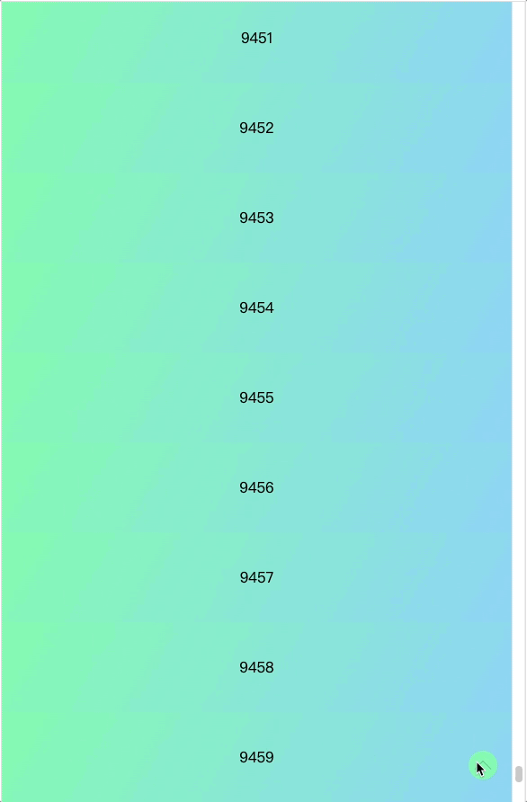
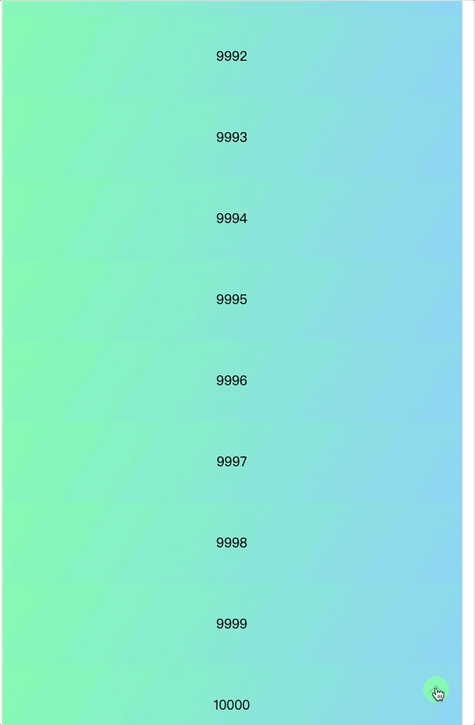
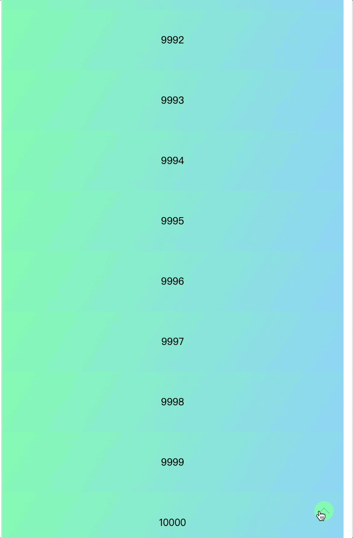
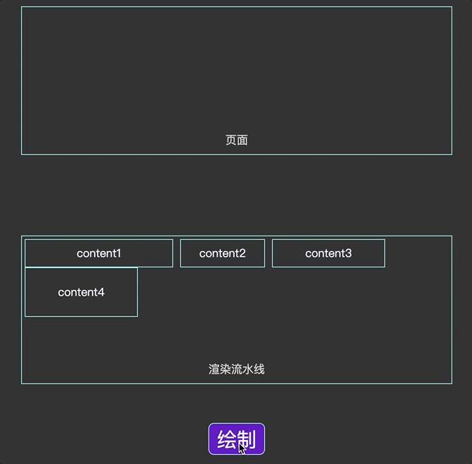
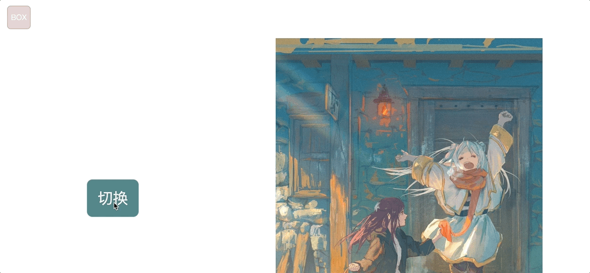

动画算是我最喜欢 CSS 的地方了，知道怎么写很简单，如何优化实现流畅 60fps 动画，涉及的方面很多，需要了解浏览器的渲染机制。在阅读学习别人代码，和自己尝试的过程中，也积累了一点点小小的个人体会，总结一下，常看常新。Lerp 和 FLIP 算是新手的救星吧，当你不知道怎么做一个动画时，都可以尝试下这两个技巧。

<!-- truncate -->

对于我来说，CSS 中最迷人的部分，当属动画了。看到一个元素，根据自己的想法动起来，会由衷觉得有趣且有成就感。动画有不同的实现方式，可以使用 keyframe animation，也可以使用 JS 计算修改属性。

不考虑实现效果，大部分动画都不难，无非改变一些属性。这是一句没用的话，展示给用户的东西一定要以最后呈现效果为准。动画的难点主要在于怎么实现的丝滑、自然，不出现丢帧。通常来说，操作 transform 是更好的选择，transform 只影响浏览器渲染的复合过程，浏览器可以开启一个单独线程处理。使用 JS 修改属性，可能引起页面的回流，重绘，增加开销。更大的问题则是，由于 JS 特性，定时器动画不能保证执行时机。JS 执行线程和渲染线程是互斥的，针对 DOM 的操作将被合并，只会渲染最后的结果。这就会导致，动画执行的卡顿（执行时机不确定），或者跳帧（操作被合并）。有些情况，必须通过计算实现效果，怎么保证动画的丝滑就值得思考了。

在学习过程中，遇到两个有意思的概念，一个是 Lerp（Linear Interpolation，线性插值方法），可以使动画更加自然。还有 FLIP，FLIP 是实现动画的一种方式，防止丢帧，效果也很棒，涉及概念比较多，后面详解。

## LERP

Lerp 用于动画状态计算，让动画过渡更自然。比如说，讲 Element 从 A 点移动到 B 点。假设在一次页面重绘中完成操作（例如，直接将 B 位置的 Top，Left 设置给 Element），用户会觉得 Element 出现了闪现。如果距离很远，看不到轨迹，用户可能找不到 Element。Lerp 的实现方式是，每次按百分比插值。比如说 A、B 间距离为 100，第一次插值取 95%，插值后 A、B 间距离还剩 95。下一次继续取 95%， A、B 间距离还剩 95 \* 0.95 = 90.25，一次类推知道结束。这样做的好处就是，整个动画按百分比移动，开始快，后面慢，很自然。

我用滚动举个例子，基本 DOM 解构如下：

```html
<!DOCTYPE html>
<html lang="en">
  <head>
    <meta charset="UTF-8" />
    <meta name="viewport" content="width=device-width, initial-scale=1.0" />
    <title>Lerp</title>
    <style>
      html,
      body {
        margin: 0;
        padding: 0;
      }
      .wrapper {
        position: relative;
        height: 100vh;
        width: 600px;
        margin: 0 auto;
        box-sizing: border-box;
        padding: 8px;
        overflow: hidden;
      }
      #container {
        border: 1px solid #e0dede;
        height: 100%;
        overflow-y: scroll;
      }
      .inner {
        height: 100px;
        line-height: 100px;
        text-align: center;
        background-image: linear-gradient(120deg, #84fab0 0%, #8fd3f4 100%);
      }
      #anchor {
        width: 32px;
        height: 32px;
        border-radius: 32px;
        cursor: pointer;
        background-color: #84fab0;
        position: absolute;
        right: 40px;
        bottom: 60px;
      }
      .icons {
        width: 32px;
        height: 32px;
      }
    </style>
  </head>
  <body>
    <div class="wrapper">
      <div id="container"></div>
      <div id="anchor">
        <svg class="icons">
          <use xlink:href="#arrow"></use>
        </svg>
      </div>
    </div>
    <!-- svg 绘制箭头 -->
    <svg style="display: none">
      <symbol
        id="arrow"
        xmlns="http://www.w3.org/2000/svg"
        viewBox="0 0 512 512"
      >
        <path
          d="M112 328L256 184L400 328"
          style="
            stroke: black;
            fill: transparent;
            stroke-linecap: round;
            stroke-linejoin: round;
            stroke-width: 4px;
          "
        />
      </symbol>
    </svg>
  </body>
</html>
```

这里使用 svg 绘制了一个箭头，很简单，使用 path 绘制路径。`viewBox="0 0 512 512"` 指定了 svg 画布区域的宽高都是 512。`path` 用来绘制路径，`d="M112 328L256 184L400 328"` 是绘制的指令。指令中涉及两个命令，M 是 Move to 的缩写，移动画笔位置。`M112 328` 即将画笔移动到 (112, 328) 位置，作为开始。L 是 Line to 的缩写，可以移动画笔到一个新位置，并画一条线，L256 184 也就是从当前位置 (112, 328) 移动到 (256, 184) ，画一条线，下一个 L400 328 同理。这样就能画一个箭头了。style 中指定的图案的样式，重点是 stroke（线条颜色），fill（图形中间的填充颜色），stroke-width（线条宽度）这三个属性，剩下属性是用来指定圆角效果的。

为了使元素能滚动起来，给 `div#container` 添加点元素：

```js
const scrollEl = document.getElementById("container");
// 循环添加元素
for (let i = 1; i < 10001; i++) {
  const div = document.createElement("div");
  div.textContent = i;
  div.className = "inner";
  scrollEl.appendChild(div);
}
```

接下来给 anchor 添加点击事件，先看不用 lerp 的效果：

```js
const anchor = document.getElementById("anchor");
anchor.onclick = () => {
  scrollEl.scrollTo(0, 0);
};
```

可以看到一下就闪过去了。



接下来实现 lerp 配合 requestAnimationFrame API（很重要）的实现效果：

```js
let state = 0;
anchor.onclick = () => {
  // 滚动开始位置
  state = scrollEl.scrollTop;
  loop();
};
// 循环进行动画的方法
function loop() {
  const next = lerp(0, state, 0.95);
  // 小于 1 px 结束动画
  state = next > 1 ? next : 0;
  // 滚动
  scrollEl.scrollTo(0, state);
  // requestAnimationFrame 控制动画频率
  state > 0 && requestAnimationFrame(loop);
}
// lerp 方法，start end 为开始结束状态
// factor 控制变化快慢的参数
function lerp(start, end, factor) {
  return start + (end - start) * factor;
}
```

代码很简单，就是根据 factor 控制变化快慢，效果能看到有一个先快后慢的过程。



只是这样的效果，看起来没什么大用。`scrollTo` 也可以指定 `behavior`，实现平滑过渡。在动画中，也可以通过 animation-timing-function 调整动画的过渡模式。真正适用 lerp 的地方是，当你有一套 "combo" 的时候。

比如说，这里的 anchor 在触发滚动效果后就没有额外的行为了，滚动中也不应该重复触发点击。最好在 anchor 上增加一个反馈，就好像在说，congrats，你已经点击成功，静待结果吧，不需要再次点击了。

反馈的动画和滚动行为有逻辑上的联系，让两者间形成搭配就是自然的想法。假设分别写了两个动画，使用 animation-timing-function 指定同样的 mode，添加动画的时机和动画实现的计算不同，可能会导致两个动画没有办法完全同步。这种情况，我们更希望自己手动控制。

加一个旋转收缩的效果看一下：

```js
let state = 0,
  origin = null;
anchor.onclick = () => {
  // 滚动开始位置
  state = scrollEl.scrollTop;
  if (state === 0) return;
  origin = state; // 保存原始值
  loop();
};

function loop() {
  const next = lerp(0, state, 0.95);
  state = next > 1 ? next : 0;
  scrollEl.scrollTo(0, state);
  const factor = state / origin; // 缩放旋转比例
  const rotateDeg = factor * 360;
  anchor.style.transform = `scale(${factor}) rotate(${rotateDeg}deg)`;
  state > 0 && requestAnimationFrame(loop);
}
```

滚动是从最大值到 0，和缩小到 0 一致，保存下开始滚动位置即可。



实现一套作用于不同元素的动画，就可以使用 lerp 手动计算。效果还是很不错的，改变 factor 参数可以控制变化的效果。具体效果可以自己去尝试，我这套动画其实很简陋，可以去看看 Paul Lewis 的这个[视频](https://www.youtube.com/watch?v=YdvQPkJd0gc)。

Lerp 通常会搭配 `requestAnimationFrame` 使用，可以说 `requestAnimationFrame` 才是重点。Lerp 只是一种计算方式，保证动画流畅的关键是 `requestAnimationFrame`。就像上面开头说的，JS 控制动画的最大问题是，没办法保证执行时间。`requestAnimationFrame` 提供了一种稳定的动画执行方式，由浏览器严格控制执行频率，在下一次 repaint 前执行。这个时间间隔依赖于屏幕的刷新频率，现在大多数屏幕是 60hz，也就是说每隔 16.67ms 会刷新一次屏幕，做一次 repaint。更高刷新率的屏幕下，这个间隔会更短。

相比定时器，`requestAnimationFrame` 的 callback 执行更加稳定。注意这里稳定的只是执行频率，假设执行了一个耗时久或不稳定的操作，还是没有办法保证实现效果。`requestAnimationFrame` 的回调函数接受一个 timeStamp 的参数，代表执行时刻的时间戳。这个参数很有用，就像上面说的，`requestAnimationFrame` 执行频率依赖于屏幕刷新率，在不同的设备上，动画会快慢不一。在计算时，融合时间戳能统一动画时长。

## FLIP

FLIP 的概念更复杂一点，首先思考一下实现动画中，最重的部分在哪里。想明白这一点，就不会觉得 FLIP 有些多此一举了。

总所周知，浏览器渲染主要可以分为以下几步，这几个步骤会依次执行，页面改动后的更新也是如此：

1. **样式**：计算应用于元素的样式。
2. **布局**：为每个元素生成几何图形和位置。
3. **绘制**：将每个元素的像素填充到[层](https://web.dev/articles/animations-overview?hl=zh-cn#layers)中。
4. **合成**：将图层绘制到屏幕上。

每个元素有默认样式、CSS 样式，JS 也可能做一些修改，这个过程走完就可以得到单个元素的样式。

有了元素本身的样式，加上相互之间的关系，就可以计算布局。布局计算同样很复杂，比如说没有设置高度的元素，需要根据内容计算高度。同时还需要增删元素，比如 `display: none` 无需渲染可以从布局中移除，一些伪类需要添加进去。布局计算完成可以得到整个 DOM 的地图（Layout），重点是整个。

截止到这里，流程都是很快的，除非你的 DOM 结构非常非常复杂。

有了布局，依旧不足以显示整个页面，不用的元素间还会有层叠，层叠后最终的效果还需要计算，这就是绘制。绘制是整个流程中消耗最大的一步，需要计算整个影响区域的效果。

接下来是合成，合成是现代浏览器针对绘制过程的优化。合成过程中，会将绘制得到的页面分层，每层使用一个线程单独处理，再将每层效果组合到一起就可以得到最终效果。并行处理，可以很好地提高效率。这个也很好理解，就像拼模型一样，多找几个人，一个负责腿部，一个负责头部...，每个人工作完成再拼接到一起就可以了。当然图层复合要复杂的多，可能有层叠等问题。这不是重点，重点是每个图层是单独的线程，处理后存储的数据也是单独的。每次变动图层后，需要重新合成一个新帧。

其实所有的动画都是类似的，如果只是计算是很快，重点绘制。浏览器展示内容，并不像拼图、或者我们往桌子上摆东西一样，有了元素，往响应的位置放就行了。浏览器绘制最终需要操作的是像素，通过每个位置的像素发出不用颜色的光，来展示图案。



注：不是这样一个个往上摆的，这个动画其实也是用 FLIP 做的，我也不会别的 😮‍💨。

计算位置很快，绘制可能很慢。很自然可以想到，利用浏览器强大的计算能力，获取动画的起止状态，接着单独开启一个线程做动画。这样触发布局更新的操作，只会发生在一帧时间内，剩下的动画操作不回触发布局更新，也就会更流畅。

这就是 FLIP 了，正式介绍下。F 代表 First，也就是动画的开始状态。L 代表 Last，代表动画结束状态。I 代表 Invert，也就是状态反转，使用 transform 创建单独的图层，并将元素状态反转回去。P 代表 Play，播放动画。

下面是一个简单例子：

```html
<!DOCTYPE html>
<html lang="en">
  <head>
    <meta charset="UTF-8" />
    <meta name="viewport" content="width=device-width, initial-scale=1.0" />
    <title>Flip</title>
    <style>
      html,
      body {
        padding: 0;
        margin: 0;
        width: 100%;
      }
      #old-container {
        height: 100vh;
        padding: 30px;
        border: 1px solid #96b6c1;
      }
      #new-container {
        width: 600px;
        height: 800px;
        background-image: url(./assests/bg-migong.jpg);
        background-size: contain;
        background-repeat: no-repeat;
        position: absolute;
        top: 100px;
        left: 600px;
        /* transform: rotate(-45deg); */
        transform-origin: top right;
      }
      .box {
        height: 50px;
        width: 50px;
        line-height: 50px;
        text-align: center;
        background-color: #e5d3d3;
        color: aliceblue;
        border-radius: 8px;
        box-shadow: inset 0px 0px 1px 1px rgba(0, 0, 0, 0.2);
      }
      .action-button {
        position: absolute;
        top: 400px;
        left: 200px;
        height: 80px;
        width: 110px;
        border: none;
        box-shadow: inset 0px 0px 0px 1px #c4e3de50;
        background-color: #55888b;
        border-radius: 12px;
        font-size: 32px;
        color: #f3f3f3;
      }
    </style>
  </head>
  <body>
    <div id="old-container">
      <div id="new-container"></div>
    </div>
    <button class="action-button" onclick="handleClick()">切换</button>
  </body>
  <script>
    const box = document.createElement("div");
    box.textContent = "BOX";
    box.classList.add("box");

    const oldEl = document.getElementById("old-container");
    const newEl = document.getElementById("new-container");

    const handleClick = () => {
      Flip(box, () =>
        (box.parentNode === newEl ? oldEl : newEl).appendChild(box)
      );
    };

    // Flip
    function Flip(el, action) {
      // 获取开始状态
      const startState = el.getBoundingClientRect();
      action();
      // 获取结束状态
      const endState = el.getBoundingClientRect();
      // 开始位置的反方向
      // 0 -> 1
      // 需要从 1 回到 0，也就是开始位置 1 结束位置 0
      // 结束位置减开始位置
      // transform (0 - 1)
      // 计算位置大小
      // 开始状态减去结束状态
      const deltaY = startState.top - endState.top;
      const deltaX = startState.left - endState.left;
      const deltaW = startState.width / endState.width;
      const deltaH = startState.height / endState.height;
      // 进行动画
      el.animate(
        [
          {
            transformOrigin: "top left",
            transform: `
            translate(${deltaX}px, ${deltaY}px)
            scale(${deltaW}, ${deltaH})`,
          },
          {
            transformOrigin: "top left",
            transform: "none",
          },
        ],
        {
          duration: 300,
          easing: "ease-in-out",
          fill: "both",
        }
      );
    }
  </script>
</html>
```

在 action 中，我切换了 box 元素的父节点。这个很明显会改变布局，引发页面重新计算布局。假设我们自己计算，不经占据了主线程，还需要考虑很多问题，例如不同的屏幕大小怎么计算移动距离。直接调用 getBoundingClientRect， 浏览器高效地计算了动画所需状态，大大减少了我们自己计算的负担。随后，触发动画，浏览器会在下一帧渲染时，变动布局，接着使用单独的图层操作动画。由于实在一帧中完成的操作，浏览器会将变动合并，这样用户不会看到元素移动到结束位置，再反转回来的过程，只有我们自己知道已经偷偷做了这么多事。

看下效果，[背景图片](https://twitter.com/101Neg/status/1726111080823562506)是我随便放的，为了区分区域：



参考资料：

[Creating a circular reveal animation with JavaScript and CSS!](https://www.youtube.com/watch?v=YdvQPkJd0gc)

[深入了解现代网络浏览器（第 3 部分）](https://developer.chrome.com/blog/inside-browser-part3?hl=zh-cn#paint)

[FLIP Your Animations](https://aerotwist.com/blog/flip-your-animations/)

[FLIP 技术给 Web 布局带来的变化](https://fedev.cn/javascript/animating-layouts-with-the-flip-technique.html)
