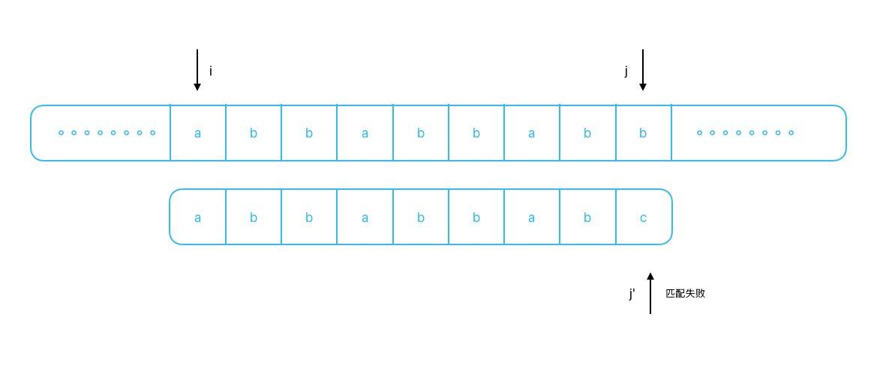
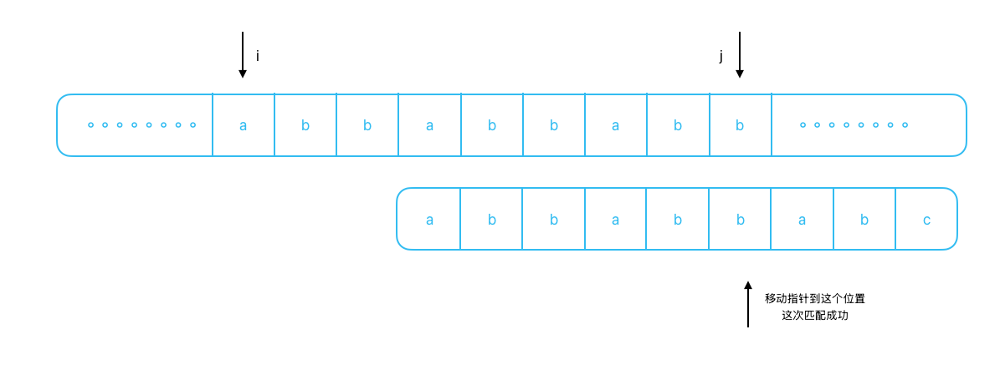

一搞就很久没更新了，其实这段时间学习了很多东西。主要是 leetcode 刷了一些题，还是很有趣的。KMP 很早就学过了，重新写老是会忘记。既然常忘，那就记下来吧。算法内容也是常看常新，过段时间可能又会有新的体会，到时候再更新一下。KMP 的思路很简单，借助最长公共前后缀，减少指针跳转次数。容易迷糊的是前缀跳转逻辑。注意指针跳转时，当前位置匹配失败，所以不能使用当前位置信息！！！

<!-- truncate -->

KMP 主要是为了解决字符匹配问题。先看暴力匹配逻辑：

```js
function march(str, word) {
  for (let i = 0; i < str.length; i++) {
    for (let j = 0; j < word.length; j++) {
      // 位置不匹配，返回
      if (str[i + j] !== word[j]) {
        break;
      }
      // 判断长度，长度不够不能算匹配成功
      if (j === word.length - 1) return i;
    }
  }
  return -1;
}
```

很简单的两重循环，第一层决定匹配开始位置，第二层循环确定匹配字符串的长度。注意第二层循环的判断，`if (str[i + j] !== word[j])`，这个判断相当于同时将外层指针和内层指针从 i 位置一起向后移动。如果匹配失败，外层指针又会回到 i 位置，再次向后移动。在暴力解法中，存在外层指针的频繁往返移动。KMP 优化的也是这部分。

假设 i 位置的循环，匹配到 j 位置失败，i 到 j 的信息已经知道，如果能利用这部分信息，外层指针也就无需回退。更进一步，相比于母串 str，子串 word 更短，预处理子串，比反复记录 i 到 j 位置消耗要小。

KMP 的优化思路如下，仍以匹配到 i 到 j 位置为例，假设 j 位置匹配失败(i 到 j 位置映射到 word 上对应 0 到 j')。若 word 上 0 - j' 中间有一点 z，使得 `word[0..z] === word[j'-1-z, j'-1]`，也就是 word 前 z 个字符，和 word j' 位置前的 z 个字符相同。例如 `word[0..j'] === 'abbabbabc'`，`str[i..j]==='abbabbabb'`，最后一位 c 匹配失败，此时不跳转到开头，可以看到，开头前五位字符串是 abbab，从 index === 3 位置开始又有 abbab。可以尝试跳转到重复位置继续比较。

图示如下：


匹配失败不直接跳转开头，查找前后重复位置，移动结果如下：


在这个过程中，外层循环指针没有移动，只是调整了内层指针。重要一点，这里的相同区域是可以叠加的，并且不包含当前位置信息。例如当前比较失败的是 c，我们要检测的是 c 之前的字符串信息，不包含 c。如上图，匹配失败时，`j' === 8`，跳转后调整 `j' === 5`，我们利用的是 `[0, 4]` 和 `[3, 7]` 区间字符相同。调整后依旧比较 `str[j] === word[j']`，相同就可以继续向后匹配。

方便描述，引入前缀和后缀概念。对与字符串 s（l = s.length），前缀即为字符的前 n 个字符组成的子串，后缀同理，为字符串的后 n 个字符组成的子串。注意这两种子串都不包含字符串本身，这很重要！！！预处理中，需要找到当前位置最长的相同前缀和后缀，如果前缀、后缀包含自身一定相等，这种情况没有意义。

多对于这样的一个字符串 `aaabaaa`，相同的前后缀有多个，`a`、`aa`、`aaa` 都是，取最大的。当前位置匹配失败，就去跳转到最大前缀的后一个位置，继续匹配。

主题代码实现如下：

```js
function march(str, word) {
  const n = str.length;
  const m = word.length;
  if (n < m) return null;
  // 预处理子串，获取 next 信息
  const next = getNext(word);
  let i = (j = 0);
  while (i < n && j < m) {
    if (str[i] === word[j]) {
      // 相同向后匹配
      i++;
      j++;
    } else if (j === 0) {
      // j 已接近跳转到开头
      // 全都匹配不上，向后继续
      i++;
    } else {
      // 获取最长前缀
      j = next[j - 1];
    }
  }
  // 可能匹配到后面不够用
  return j < m ? -1 : i - j;
}
```

需要注意的点，j 向前跳时，转移规则获取的是 `next[j-1]`。j 位置匹配失败，跳转位置是由 [0..j-1] 子串的最长公共前后缀。也好理解，j 位置匹配失败了，当然不应该包含 j 位置。从母串来看， i 位置当前指向字符不同，需要保证跳转后，i 位置之前的字符是相同的，再次匹配那个不同的字符。

重点来了，如果获取 next 数组。

```js
function getNext(s) {
  const next = Array(s.length).fill(0);
  let arm = 0; // 最长公共前后缀臂长
  for (let i = 1; i < s.length; i++) {
    if (s[arm] === s[i]) {
      // 如果相同，臂长增加
      arm++;
      next[i] = arm;
    } else {
      // 如果不同需要跳转到前一个位置
      // 这里逻辑和匹配相同，无非是头部子串和自身匹配
      // 所以是跳转到开头或者跳转到上一个相同位置
      while (arm !== 0 && s[arm] !== s[i]) {
        arm = next[arm - 1];
      }
      // 判断是否相同，相同需要增加
      if (s[arm] === s[i]) arm++;
      next[i] = arm;
    }
  }
  return next;
}
```

整个函数就是一个动态规划过程，需要厘清几个点。首先是为什么初始 arm = 0，循环为什么从 1 开始。根据我们对最长公共前后缀要求不能包含自身，0 位置字符串只有自身，所以跳转到头部就应该算作匹配失败，需要从新向后匹配。这种情况相当于 `next[0]` 已经规定好就是 0，所以循环从 1 位置开始。初始条件确定，接下来是状态转移过程。对于 i 位置，假设 i - 1 位置存在最长公共前后缀长度为 n，下一步需要判断 `s[n] === s[i]`，如果成立那么最长公共前后缀应该是 i - 1 位置的最长公共前后缀加上 i 位置字符。不成立，就是匹配失败的逻辑，向前跳转公共前缀，继续重复匹配，直到到达 0 位置，都没办法找到，最长公共前后缀为 0。

这里有一个问题，`s[n] === s[i]` 一定会有 `next[i] = next[i-1] + 1` 吗？会不会有更长的公共前后缀？反证，假设 i 位置存在 x 长度的公共前后缀， x - 1 > (n === next[i-1])。更具前后缀定义，对于 i - 1 位置，必定存在 x - 1 长度的公共前后缀（x - 1，也就是 x 长度的前后缀一起移除 i 位置字符，字符相同，移除最后一位，自然也相同），那么 n 就不是 i - 1 位置的公共最长前后缀长度。前后矛盾，不成立。

接下来是优化，可以看到判断中存在重复情况。首先判断了 `if (s[arm] === s[i])，在跳转完成后还需要判断。下面是优化过的结果：

```js
function getNext(s) {
  const next = Array(s.length).fill(0);
  let arm = 0; // 最长公共前后缀臂长
  for (let i = 1; i < s.length; i++) {
    // 这里集合了两个判断
    // 是否到达开头，是否跳转到相同
    while (arm !== 0 && s[arm] !== s[i]) {
      arm = next[arm - 1];
    }
    // 通过判断是否相同，区分两种情况
    // 如果相同，臂长增加
    if (s[arm] === s[i]) arm++;
    next[i] = arm;
  }
  return next;
}
```

总结：这里容易搞迷糊是 next 数组性质和跳转逻辑。注意 next 数组中 i 位置最长公共前后缀是包括了 i 位置的字符串。比如说字符串开头是 'aa'，next[1] 计算的是包含 1 位置，也就是 'aa' 字符串的最长公共前后缀，也就是前后两个 a 字符，`next[1] = 1`。匹配失败的跳转逻辑则不同，包括两种情况的跳转，一个是主流程中的跳转，第二个是获取 next 数组中匹配失败的跳转。跳转逻辑是，当前位置匹配失败，自然跳转时候不能使用当前位置信息！！！所以我们需要跳转的信息，是由 i - 1 位置决定的。
