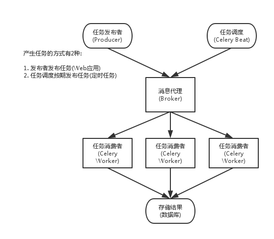

我想从头写一个 RAG 系统，把相关概念串起来，也做个自己用的知识库助手。这次先搭上传流程，记录实现中遇到的问题。

<!-- truncate -->

RAG（Retrieval-augmented Generation，检索增强生成）先查问题相关的资料，再把资料传给模型，辅助它回答。

我选了文档切片入库、多路召回（向量 + BM25 + 关键词），Redis 管短期记忆，mem0 管长期记忆，Langfuse 收集链路数据。api 提供接口，services 编排业务。

向量召回找语义相关的内容，关键词照顾精确匹配。比如哲学著作里，熟悉的词可能有专门定义，只按日常语义搜索容易偏。两种方式配合，减少遗漏。

## 文档切片上传

上传后要解析、切片、向量化和入库。向量化需要调用模型，耗时较长，我放到 worker 处理，让上传接口先返回。Redis 存任务队列，MinIO 保存原文件。后台读取文件处理，失败后也能重新取文件重试，不必再上传。

代码如下：

```python
# api 接口
router = APIRouter(prefix="/knowledge-bases/{kb_id}/documents", tags=["documents"])

@router.post(
    "",
    response_model=DocumentResponse,
    status_code=status.HTTP_202_ACCEPTED,
    dependencies=[Depends(require_permission("kb:write"))],
)
async def upload_document(
    kb_id: UUID,
    file: UploadFile,
    user: Annotated[User, Depends(get_current_user)],
    service: Annotated[DocumentService, Depends(get_document_service)],
) -> DocumentResponse:
    """Accept a file, store it and enqueue the async ingestion pipeline."""
    data = await file.read()
    # 调用 service 完成实际业务
    document = await service.upload_document(
        kb_id=kb_id, # 知识库 id
        filename=file.filename or "unnamed",
        content_type=file.content_type or "application/octet-stream",
        data=data,
        actor=user,
    )
    return DocumentResponse.model_validate(document)

# service 逻辑
async def upload_document(
    self,
    *,
    kb_id: UUID,
    filename: str,
    content_type: str,
    data: bytes,
    actor: User,
) -> Document:
    """Store the raw file, create the tracking record and enqueue processing.

    Raises:
        NotFoundError: If the knowledge base does not exist in this tenant.
        ValidationError: If the file type is unsupported.
    """

    # 异常拦截
    kb = await self._kb_repo.get_by_id(kb_id, tenant_id=actor.tenant_id)
    if kb is None:
        raise NotFoundError("knowledge_base", str(kb_id))

    media_type = media_type_for_filename(filename)
    if media_type is None:
        raise ValidationError(f"unsupported file type: {filename}")

    content_hash = hashlib.sha256(data).hexdigest()  # 计算文件内容的哈希值
    duplicate = await self._document_repo.get_by_hash(
        content_hash,
        tenant_id=actor.tenant_id,
        kb_id=kb_id,  # 检查是否存在重复的文档
    )
    if (
        duplicate is not None
        and DocumentStatus(duplicate.status) != DocumentStatus.FAILED
    ):
        logger.info("document_dedup_hit", document_id=str(duplicate.id))
        return duplicate

    # 构建文件对象的key
    object_key = ObjectStorageRepository.build_object_key(
        actor.tenant_id, kb_id, filename
    )
    # 文件保存进 minio
    await self._object_storage.upload(object_key, data, content_type)

    # 文档信息入库
    document = await self._document_repo.create(
        kb_id=kb_id,  # 知识库ID
        tenant_id=actor.tenant_id,
        filename=filename,
        content_type=content_type,
        media_type=media_type,
        object_key=object_key,
        content_hash=content_hash,  # 文件内容的哈希值
        created_by=actor.id,
    )
    # 入库操作需要审核，不合格内容不可用
    await self._audit_repo.append(
        tenant_id=actor.tenant_id,
        user_id=actor.id,
        action="document.upload",
        resource_type="document",
        resource_id=str(document.id),
        payload={"filename": filename, "media_type": media_type},
    )
    #  通知 worker 有新任务
    self._enqueue_ingestion(document.id, media_type)
    return document
```

worker 中的实现：

```python
@celery_app.task(
    name="ingestion.process_text_document",
    acks_late=True,
    max_retries=3,
    autoretry_for=(ConnectionError, TimeoutError),
    retry_backoff=True,
)
def process_text_document_task(document_id: str) -> None:
    """Parse/chunk/embed/index a text document (pdf/docx/pptx/...)."""
    run_async(_process(UUID(document_id)))


@celery_app.task(
    name="ingestion.process_media_document",
    acks_late=True,
    max_retries=2,
    autoretry_for=(ConnectionError, TimeoutError),
    retry_backoff=True,
)
def process_media_document_task(document_id: str) -> None:
    """ASR-transcribe and index an audio/video document."""
    run_async(_process(UUID(document_id)))

async def _process(document_id: UUID) -> None:
    async with task_context() as ctx:
      	# 创建数据库
        await ctx.milvus_repo.ensure_collection()
        await ctx.es_repo.ensure_index()
        # 切片处理
        await ctx.ingestion_service.process_document(document_id)

```

两种 task 都交给 ingestion_service：

```python
async def process_document(self, document_id: UUID) -> None:
      """Run the full pipeline; on failure the document is marked FAILED with the reason.

      Raises:
          NotFoundError: If the document record is gone.
      """

      # 获取文档
      document = await self._document_repo.get_for_worker(document_id)
      if document is None:
          raise NotFoundError("document", str(document_id))

      status = DocumentStatus(document.status)
      if status not in (DocumentStatus.PENDING, DocumentStatus.FAILED):
          logger.info(
              "ingestion_skip_not_pending",
              document_id=str(document_id),
              status=status,
          )
          return

      log = logger.bind(document_id=str(document_id), filename=document.filename)
      try:
          await self._commit_status(document, DocumentStatus.PARSING)
          with tempfile.TemporaryDirectory(prefix="welkin-ingest-") as tmp_dir:
              local_path = Path(tmp_dir) / document.filename
              await self._object_storage.download_to_path(
                  document.object_key, local_path
              )
              # 解析文档，提取文本
              elements = await self._parsing_service.parse(
                  local_path, MediaType(document.media_type)
              )
          log.info("ingestion_parsed", elements=len(elements))

          await self._commit_status(document, DocumentStatus.CHUNKING)
          # 分块
          chunks = self._chunking_service.chunk(
              elements,
              document_id=document.id,
              knowledge_base_id=document.knowledge_base_id,
              tenant_id=document.tenant_id,
          )
          log.info("ingestion_chunked", chunks=len(chunks))

          await self._commit_status(document, DocumentStatus.EMBEDDING)
          vectors = await self._embedding_provider.embed_batch(
              [chunk.content for chunk in chunks]
          )
          # 把原来失败任务的残留溢出
          await self._milvus_repo.delete_by_document(
              document.id, tenant_id=document.tenant_id
          )
          await self._es_repo.delete_by_document(
              document.id, tenant_id=document.tenant_id
          )
          # 新增
          await self._milvus_repo.upsert_chunks(chunks, vectors)
          await self._es_repo.bulk_upsert(chunks)

          await self._commit_status(
              document, DocumentStatus.READY, chunk_count=len(chunks)
          )
          log.info("ingestion_ready", chunks=len(chunks))
      except WelkinError as exc:
          await self._commit_status(
              document, DocumentStatus.FAILED, error_message=exc.message
          )
          log.error("ingestion_failed", error=exc.message)
      except Exception as exc:
          await self._commit_status(
              document, DocumentStatus.FAILED, error_message=str(exc)[:2000]
          )
          log.error("ingestion_failed_unexpected", exc_info=True)
          raise
```

上传任务串起来了，下一篇处理文档解析和切片。

## Python 中的异步

这里用到了 Python 异步，和我熟悉的 JS 有些区别，单独记一下。

### async 函数

JS 的 async 函数调用后就开始执行，遇到 await 时暂停，后续再继续。先看例子：

```js
async function main() {
  console.log("starting");
  await setTimeout(() => {
    console.log("waiting 3s");
  }, 3000);
}

main();
// 会立即执行，打印 starting，返回一个 Promise，3s后打印 waiting 3s
```

Python 调用 async 函数只返回 coroutine，不会执行函数体。在异步函数内用 `await main(...)`，同步入口用 `asyncio.run(main(...))`。

```python
async def main(...):
    print("这里不会打印")  # 这一行永远不会运行！
    await asyncio.sleep(3)
    print("waiting 3s")

# 直接调用（没有 await）不会执行
result = main(...)

# 想要执行
await result
# 或者
asyncio.run(result)
# 注意 coroutine 是一次性的，再次调用会有语法错误
asyncio.run(result) # 报错，result 被消费过了
```

### Celery

async 解决等待时的任务切换，耗时工作还得放到后台。这里用 Celery，把解析和向量化交给 worker，避免长时间占着 Web 请求。

```bash
Web

↓

Broker（Redis / RabbitMQ）

↓

Worker1

Worker2

Worker3
```

Web 服务把任务交给 Broker，返回响应。Worker 从队列领取任务，处理后完成入库。多个 Worker 可以并行处理。

这里用 Redis 做 broker：

```python
# broker 接受任务地址，backend 结果返回地址
celery_app = Celery(
    "welkin", broker=_settings.celery_broker_url, backend=_settings.celery_broker_url
)

celery_app.conf.update(
    # 通讯的序列化方式使用 json
    task_serializer="json",
    accept_content=["json"],
    result_serializer="json",
    # 强制使用 UTC 时区。这对于分布式系统非常重要，
    # 可以避免因为多台服务器系统时区不一致导致的定时任务（Celery Beat）触发时间错乱。
    timezone="UTC",
    enable_utc=True,

    # reliability
    task_acks_late=True,
    worker_prefetch_multiplier=1,
    task_reject_on_worker_lost=True,
    result_expires=3600,
    # queues: cpu = text parsing/chunking; media = ASR/video (schedule on GPU-capable nodes)
    task_routes={
        "ingestion.process_text_document": {"queue": "cpu"},
        "ingestion.process_media_document": {"queue": "media"},
    },
    include=["app.workers.tasks.ingestion"],
)

celery_app.autodiscover_tasks(["app.workers.tasks"])

```

几个重要配置项：

`task_acks_late=True`：任务处理后再发送 ACK，避免刚领取就从队列确认。

`worker_prefetch_multiplier=1`：限制预取数量。解析任务耗时长，我不想让单个 Worker 提前囤太多任务，其他 Worker 却闲着。

`task_reject_on_worker_lost=True`：Worker 进程异常退出时，让任务重新入队。

`result_expires=3600`：任务结果在 Redis 保留一小时，过期删除，避免历史结果长期积压、占用内存。

`task_routes` 指定队列。启动时用 `celery -A welkin worker -Q media`，只消费 media 队列。

`include` 指定额外加载的任务模块。这里也用 `autodiscover_tasks` 查找指定目录的 `tasks.py`。

Celery 工作示意图


