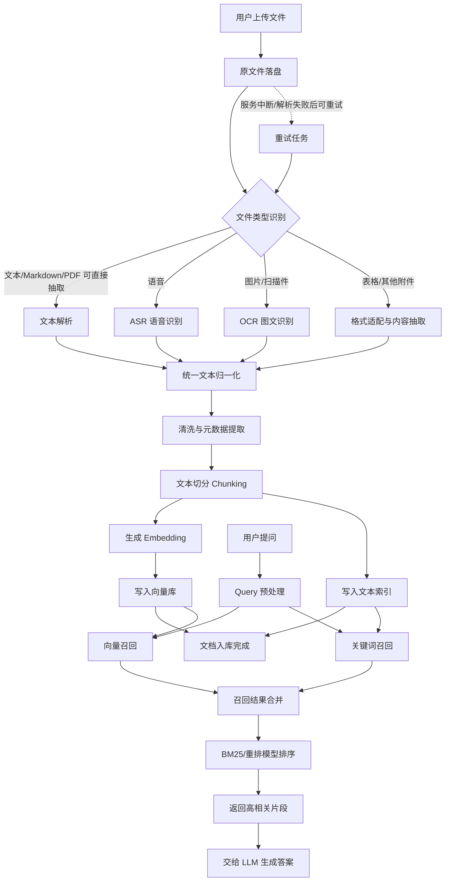

import Mermaid from "@theme/Mermaid";

上传文件的基本链路已经走通，接下来就是看处理了。项目是双路召回，根据向量和关键字精确匹配搜索问题相关内容。为什么需要精确匹配？想象你在阅读一部哲学著作，其中很多名词都很熟悉，但是和日常使用截然不同，语义理解可能出现偏差。这种情况，使用精确匹配，更能保证内容不丢失。得到召回结果，对结果进行去重（重复一方面来着双路召回，另一方面，后续可能需要对问题进行拆分，细分问题也可能得到重复结果），利用BM25计算衡量相关性。这一章，我们先看入库。上面讲了那么多，只是为了方面理解后续入库为什么要这么处理。

<!-- truncate -->

LLM 大语言模型，顾名思义，我们需要把内容描述为语言，喂给模型。无论什么形式的文件，都应转换成语义。那么第一步就是解析文本，所有类型文件都应还原成可表达语义的文本，语音通过ASR识别，图片可以用OCR。识别完成后，进入拆分流程。拆分可以使单个文本块的语义更加清晰。如果给大模型整本的《百年孤独》，它只能总结这是一本优秀的魔幻现实主义小说。拆分后，大模型就可以告诉你，多年以后，面对行刑队，奥雷里亚诺·布恩迪亚上校将会回想起父亲带他去见识冰块的那个遥远的下午，这个开头有多妙。拆分后，需要进行向量化，把每块向量化入库，检索时根据向量搜索，找到最合适的块。同时，文本块也入库，可以对内容进行关键字搜索。

除了正常流程外，我们还需要考虑异常流程，例如服务异常关闭，需要重新解析，这样原文件就需要落盘，失败后获取原文件，再次进行解析。落盘是很重要的一步，开发中容易出现各种异常，如果不落盘，就需要重跑整个流水线，无论是生产还是开发，都是灾难般的体验。

## 主体流程

把这条链路再整理一下，其实可以拆成两段：一段是入库，一段是检索。入库负责把任何格式的文件转成可检索的结构化语义；检索负责在用户提问时，同时走向量召回和关键词召回，再做融合排序，最后把最相关的上下文交给大模型。



## 解析

在启动之前，首先要做几个常规过滤，比如已处理过的文档、损坏或无效文档，这文档重复处理没有必要。任务要加最大尝试次数，这种情况在 Agent 中也一样，不做处理就会有幽灵任务反复尝试。这部分代码就不展示了，快进到解析部分：

我现在手中资料以pdf居多，先走pdf流程，其他的后续会添加：

```python
async def _parse_pdf(
    self,
    file_path: Path,
    *,
    document_id: UUID,
    tenant_id: UUID,
    knowledge_base_id: UUID,
    asset_dir: Path,
) -> ParseResult:
    """PDF via PyMuPDF: page text + embedded images, OCR descriptions, markdown."""

    def _extract_pages() -> list[tuple[int, str, list[tuple[int, Path, str, str]]]]:
        """Return (page_number, text, [(image_index, local_path, content_type, object_key)])."""
        import fitz # 引入 PyMuPDF，处理 PDF

        asset_dir.mkdir(parents=True, exist_ok=True)
        doc = fitz.open(str(file_path))
        try:
            pages: list[tuple[int, str, list[tuple[int, Path, str, str]]]] = []
            image_index = 0
            
            for page_index, page in enumerate(doc):
                text = (page.get_text("text") or "").strip() # 获取文本
                images: list[tuple[int, Path, str, str]] = []
                seen_xrefs: set[int] = set()
                for img in page.get_images(full=True):
                  	# 遍历当前页所有图片 
                    # xref 是图片在当前 pdf 的引用编号，pdf 内唯一
                    xref = int(img[0])
                    # 跳过重复
                    if xref in seen_xrefs:
                        continue
                    seen_xrefs.add(xref)
                    width = int(img[2]) if len(img) > 2 else 0
                    height = int(img[3]) if len(img) > 3 else 0
                    if width < _MIN_IMAGE_EDGE or height < _MIN_IMAGE_EDGE:
                        # 太小的图片跳过
                        continue
                    try:
                        extracted = doc.extract_image(xref)
                    except Exception:
                        logger.warning(
                            "pdf_image_extract_failed",
                            xref=xref,
                            page=page_index + 1,
                        )
                        continue
                    # 获取提取后的图片信息和拓展名
                    image_bytes = extracted.get("image") or b""
                    ext = str(extracted.get("ext") or "png").lower()
                    if not image_bytes:
                        continue
                    image_index += 1
                     # 本地存储图片
                    safe_ext = ext if ext in _CONTENT_TYPES else "png"
                    content_type = _CONTENT_TYPES.get(safe_ext, "image/png")
                    local_path = asset_dir / f"img-{image_index:04d}.{safe_ext}"
                    local_path.write_bytes(image_bytes)
                    object_key = ObjectStorageRepository.build_asset_key(
                        tenant_id,
                        knowledge_base_id,
                        document_id,
                        image_index,
                        ext=safe_ext,
                    )
                    images.append(
                        (image_index, local_path, content_type, object_key)
                    )
                pages.append((page_index + 1, text, images))
            return pages
        finally:
            doc.close()

    pages = await anyio.to_thread.run_sync(_extract_pages)

    md_parts: list[str] = []
    elements: list[ParsedElement] = []
    assets: list[ExtractedAsset] = []

    for page_number, text, images in pages:
        if text:
            md_parts.append(text)
            elements.append(
                ParsedElement(
                    text=text,
                    source="document",
                    metadata={"page": str(page_number)},
                )
            )
        for image_index, local_path, content_type, object_key in images:
          	# 图片进行 ocr 识别
            ocr_text = (await self._ocr_provider.recognize(local_path)).strip()
            description = ocr_text or "未能识别文字"
            # 识别内容转换成 md
            figure_md = (
                f"### 图 {image_index}（第 {page_number} 页）\n\n"
                f"\n\n"
                f"> 识别内容：{description}"
            )
            md_parts.append(figure_md)
            elements.append(
                ParsedElement(
                    text=figure_md,
                    source="document",
                    metadata={
                        "page": str(page_number),
                        "image_index": str(image_index),
                        "image_object_key": object_key,
                    },
                )
            )
            # 图片保存为静态文件
            assets.append(
                ExtractedAsset(
                    index=image_index,
                    local_path=local_path,
                    content_type=content_type,
                    page=str(page_number),
                    object_key=object_key,
                )
            )

    markdown = "\n\n".join(md_parts).strip()
    return ParseResult(
        elements=elements,
        markdown=markdown,
        assets=tuple(assets),
    )
```

可以看到，pdf 处理涉及两部分。普通文本直接写入结果，图片需要经过 ocr 识别，提取图片信息，图片保存为静态文件，两部分总结为 md 格式写入结果。注意，简单 ocr 可能满足不了需求，后续可以升级为支持多模态的 llm 识别。

## 切片入库

解析后就要切片入库了：

```python
class ChunkingService:
    """Groups parsed elements and splits them into indexable chunks."""

    def __init__(self, settings: Settings) -> None:
        self._splitter = RecursiveCharacterTextSplitter(
            chunk_size=settings.chunk_size,
            chunk_overlap=settings.chunk_overlap,
            separators=["\n\n", "\n", "。", "！", "？", ". ", " ", ""],
        )

    def chunk(
        self,
        elements: list[ParsedElement],
        *,
        document_id: UUID,
        knowledge_base_id: UUID,
        tenant_id: UUID,
    ) -> list[ChunkPayload]:
        """切片处理"""
        blocks: list[tuple[str, str, dict[str, str]]] = []  # (text, source, metadata)
        current_text: list[str] = []
        current_source = ""
        current_metadata: dict[str, str] = {}
        # 需要将处理的文本拼接到一起，这样 splitter 才能看到全文，进行处理
        for element in elements:
            # 类型转换，说明上个文件解析完成
            # 已解析的文件，自己变成一个 block
            if element.source != current_source and current_text:
                blocks.append(("\n".join(current_text), current_source, current_metadata))
                current_text = []
            if not current_text:
                current_source = element.source
                # 把第一个 element 的 metadata 作为当前 block 的 metadata
                current_metadata = element.metadata
            # 正常拼接文件内容
            current_text.append(element.text)
        if current_text:
            blocks.append(("\n".join(current_text), current_source, current_metadata))

        chunks: list[ChunkPayload] = []
        sequence = 0 # chunk index
        for text, source, metadata in blocks:
            for piece in self._splitter.split_text(text):
              	# 构造 chunks
                chunks.append(
                    ChunkPayload.build(
                        document_id=document_id,
                        knowledge_base_id=knowledge_base_id,
                        tenant_id=tenant_id,
                        sequence=sequence,
                        content=piece,
                        source=source,
                        metadata=metadata,
                    )
                )
                sequence += 1
        return chunks
```

接着是向量化操作：

```python
async def embed_batch(self, texts: list[str]) -> list[list[float]]:
    vectors: list[list[float]] = []
    for start in range(0, len(texts), self._batch_size):
        # 按照 _batch_size 分批向量化
        batch = texts[start : start + self._batch_size]
        try:
            response = await self._client.embeddings.create(model=self._model, input=batch)
        except APIError as exc:
            raise ExternalServiceError("embedding", str(exc)) from exc
        # 结果按照传入顺序返回
        vectors.extend([item.embedding for item in response.data])
    return vectors
```

接着就是入库：

```python
# 删除异常情况导致的孤立切片数据
await self._milvus_repo.delete_by_document(
    document.id, tenant_id=document.tenant_id
)
await self._es_repo.delete_by_document(
    document.id, tenant_id=document.tenant_id
)
# 完整存入数据
await self._milvus_repo.upsert_chunks(chunks, vectors)
await self._es_repo.bulk_upsert(chunks)
```

入库流程到这里就跑通了，当然，真正跑起来还需要增加重试机制，数据也要做进一步清洗。先把主体跑通，慢慢打磨细节。接下来就是对话流程了。
