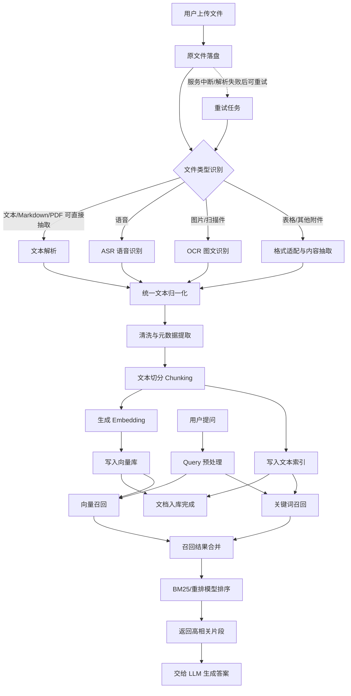

import Mermaid from "@theme/Mermaid";

上传链路走通了，接下来解析文档，切片后存入文本库和向量库。

<!-- truncate -->

先把文件转成文本。语音用 ASR，图片用 OCR，再处理识别结果。

切片让检索定位到更具体的内容。拿《百年孤独》举例，问开头那段回忆，应该找到对应段落，整本书的概括不够用。

我把文本块向量化，做语义检索；同时保存原始文本，做关键词搜索。

原文件保存在上一篇的 MinIO 流程里，解析失败后可以重新读取。

## 主体流程

[上一篇](./2026-07-14.md)定了召回方案，这里准备它需要的数据：解析文件，整理文本，生成向量，再入库。


```mermaid
flowchart TD
	A[用户上传文件] --> B[原文件落盘]
	B --> C{文件类型识别}

	C -->|文本/Markdown/PDF 可直接抽取| D[文本解析]
	C -->|语音| E[ASR 语音识别]
	C -->|图片/扫描件| F[OCR 图文识别]
	C -->|表格/其他附件| G[格式适配与内容抽取]

	E --> H[统一文本归一化]
	F --> H
	G --> H
	D --> H

	H --> I[清洗与元数据提取]
	I --> J[文本切分 Chunking]
	J --> K[生成 Embedding]
	J --> L[写入文本索引]
	K --> M[写入向量库]

	L --> N[文档入库完成]
	M --> N

	O[用户提问] --> P[Query 预处理]
	P --> Q[向量召回]
	P --> R[关键词召回]
	M --> Q
	L --> R
	Q --> S[召回结果合并]
	R --> S
	S --> T[BM25/重排模型排序]
	T --> U[返回高相关片段]
	U --> V[交给 LLM 生成答案]

	B -. 服务中断/解析失败后可重试 .-> W[重试任务]
	W --> C
```

## 解析

先跳过已处理、损坏或无效的文档，重试次数也设上限，避免失败任务一直循环。直接看解析代码：

我手里的资料主要是 PDF，先处理 PDF：

```python
async def _parse_pdf(
    self,
    file_path: Path,
    *,
    document_id: UUID,
    tenant_id: UUID,
    knowledge_base_id: UUID,
    asset_dir: Path,
) -> ParseResult:
    """PDF via PyMuPDF: page text + embedded images, OCR descriptions, markdown."""

    def _extract_pages() -> list[tuple[int, str, list[tuple[int, Path, str, str]]]]:
        """Return (page_number, text, [(image_index, local_path, content_type, object_key)])."""
        import fitz # 引入 PyMuPDF，处理 PDF

        asset_dir.mkdir(parents=True, exist_ok=True)
        doc = fitz.open(str(file_path))
        try:
            pages: list[tuple[int, str, list[tuple[int, Path, str, str]]]] = []
            image_index = 0
            
            for page_index, page in enumerate(doc):
                text = (page.get_text("text") or "").strip() # 获取文本
                images: list[tuple[int, Path, str, str]] = []
                seen_xrefs: set[int] = set()
                for img in page.get_images(full=True):
                  	# 遍历当前页所有图片 
                    # xref 是图片在当前 pdf 的引用编号，pdf 内唯一
                    xref = int(img[0])
                    # 跳过重复
                    if xref in seen_xrefs:
                        continue
                    seen_xrefs.add(xref)
                    width = int(img[2]) if len(img) > 2 else 0
                    height = int(img[3]) if len(img) > 3 else 0
                    if width < _MIN_IMAGE_EDGE or height < _MIN_IMAGE_EDGE:
                        # 太小的图片跳过
                        continue
                    try:
                        extracted = doc.extract_image(xref)
                    except Exception:
                        logger.warning(
                            "pdf_image_extract_failed",
                            xref=xref,
                            page=page_index + 1,
                        )
                        continue
                    # 获取提取后的图片信息和拓展名
                    image_bytes = extracted.get("image") or b""
                    ext = str(extracted.get("ext") or "png").lower()
                    if not image_bytes:
                        continue
                    image_index += 1
                     # 本地存储图片
                    safe_ext = ext if ext in _CONTENT_TYPES else "png"
                    content_type = _CONTENT_TYPES.get(safe_ext, "image/png")
                    local_path = asset_dir / f"img-{image_index:04d}.{safe_ext}"
                    local_path.write_bytes(image_bytes)
                    object_key = ObjectStorageRepository.build_asset_key(
                        tenant_id,
                        knowledge_base_id,
                        document_id,
                        image_index,
                        ext=safe_ext,
                    )
                    images.append(
                        (image_index, local_path, content_type, object_key)
                    )
                pages.append((page_index + 1, text, images))
            return pages
        finally:
            doc.close()

    pages = await anyio.to_thread.run_sync(_extract_pages)

    md_parts: list[str] = []
    elements: list[ParsedElement] = []
    assets: list[ExtractedAsset] = []

    for page_number, text, images in pages:
        if text:
            md_parts.append(text)
            elements.append(
                ParsedElement(
                    text=text,
                    source="document",
                    metadata={"page": str(page_number)},
                )
            )
        for image_index, local_path, content_type, object_key in images:
          	# 图片进行 ocr 识别
            ocr_text = (await self._ocr_provider.recognize(local_path)).strip()
            description = ocr_text or "未能识别文字"
            # 识别内容转换成 md
            figure_md = (
                f"### 图 {image_index}（第 {page_number} 页）\n\n"
                f"\n\n"
                f"> 识别内容：{description}"
            )
            md_parts.append(figure_md)
            elements.append(
                ParsedElement(
                    text=figure_md,
                    source="document",
                    metadata={
                        "page": str(page_number),
                        "image_index": str(image_index),
                        "image_object_key": object_key,
                    },
                )
            )
            # 图片保存为静态文件
            assets.append(
                ExtractedAsset(
                    index=image_index,
                    local_path=local_path,
                    content_type=content_type,
                    page=str(page_number),
                    object_key=object_key,
                )
            )

    markdown = "\n\n".join(md_parts).strip()
    return ParseResult(
        elements=elements,
        markdown=markdown,
        assets=tuple(assets),
    )
```

普通文本直接提取，图片做 OCR 后保存成静态文件，两部分整理成 Markdown。后续再考虑多模态模型。

## 切片入库

这里用 `RecursiveCharacterTextSplitter`，按分隔符递归拆分。默认顺序是 `["\n\n", "\n", " ", ""]`，项目里另外加了中文标点。

`chunk_size` 控制块大小，小段可以合并，长段继续拆。`chunk_overlap` 控制相邻块的重叠长度，保留一部分前后文。下面把解析出的内容按来源拼起来，再交给 splitter：

```python
class ChunkingService:
    """Groups parsed elements and splits them into indexable chunks."""

    def __init__(self, settings: Settings) -> None:
        self._splitter = RecursiveCharacterTextSplitter(
            chunk_size=settings.chunk_size,
            chunk_overlap=settings.chunk_overlap,
            separators=["\n\n", "\n", "。", "！", "？", ". ", " ", ""],
        )

    def chunk(
        self,
        elements: list[ParsedElement],
        *,
        document_id: UUID,
        knowledge_base_id: UUID,
        tenant_id: UUID,
    ) -> list[ChunkPayload]:
        """切片处理"""
        blocks: list[tuple[str, str, dict[str, str]]] = []  # (text, source, metadata)
        current_text: list[str] = []
        current_source = ""
        current_metadata: dict[str, str] = {}
        # 需要将处理的文本拼接到一起，这样 splitter 才能看到全文，进行处理
        for element in elements:
            # 类型转换，说明上个文件解析完成
            # 已解析的文件，自己变成一个 block
            if element.source != current_source and current_text:
                blocks.append(("\n".join(current_text), current_source, current_metadata))
                current_text = []
            if not current_text:
                current_source = element.source
                # 把第一个 element 的 metadata 作为当前 block 的 metadata
                current_metadata = element.metadata
            # 正常拼接文件内容
            current_text.append(element.text)
        if current_text:
            blocks.append(("\n".join(current_text), current_source, current_metadata))

        chunks: list[ChunkPayload] = []
        sequence = 0 # chunk index
        for text, source, metadata in blocks:
            for piece in self._splitter.split_text(text):
              	# 构造 chunks
                chunks.append(
                    ChunkPayload.build(
                        document_id=document_id,
                        knowledge_base_id=knowledge_base_id,
                        tenant_id=tenant_id,
                        sequence=sequence,
                        content=piece,
                        source=source,
                        metadata=metadata,
                    )
                )
                sequence += 1
        return chunks
```

单独试一下 splitter，方便观察 chunk_size 和 chunk_overlap 的作用：

```python
from langchain_text_splitters import RecursiveCharacterTextSplitter

# Load example document
with open("state_of_the_union.txt") as f:
    state_of_the_union = f.read()

text_splitter = RecursiveCharacterTextSplitter(
    # Set a really small chunk size, just to show.
    chunk_size=100,
    chunk_overlap=20,
    length_function=len, # 长度计算方法，也可以使用 token 计算
    is_separator_regex=False,
)
texts = text_splitter.create_documents([state_of_the_union])
print(texts[0])
print(texts[1])
```

文本切好后，分批生成向量：

```python
async def embed_batch(self, texts: list[str]) -> list[list[float]]:
    vectors: list[list[float]] = []
    for start in range(0, len(texts), self._batch_size):
        # 按照 _batch_size 分批向量化
        batch = texts[start : start + self._batch_size]
        try:
            response = await self._client.embeddings.create(model=self._model, input=batch)
        except APIError as exc:
            raise ExternalServiceError("embedding", str(exc)) from exc
        # 结果按照传入顺序返回
        vectors.extend([item.embedding for item in response.data])
    return vectors
```

写入数据库：

```python
# 删除异常情况导致的孤立切片数据
await self._milvus_repo.delete_by_document(
    document.id, tenant_id=document.tenant_id
)
await self._es_repo.delete_by_document(
    document.id, tenant_id=document.tenant_id
)
# 完整存入数据
await self._milvus_repo.upsert_chunks(chunks, vectors)
await self._es_repo.bulk_upsert(chunks)
```

解析和入库跑通了。下一篇接对话流程。
