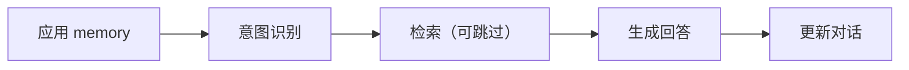

基础概念铺垫完成，接下来开始 chat 功能。先从简单的线性流程开始，完成一个基础功能，接着优化。目前逻辑如下，第一步应用 memory，把对话历史等加入流程，第二步进行意图识别，简单问题不走检索流程，第三步检索信息（可跳过），第四步请求模型，最后更新对话信息。

<!-- truncate -->

import Mermaid from "@theme/Mermaid";

# 基本功能

LangGraph 官网有一篇 [Thinking in LangGraph](https://docs.langchain.com/oss/python/langgraph/thinking-in-langgraph#step-1-map-out-your-workflow-as-discrete-steps)，可以参考其中给出的步骤，设计我们的 Graph。

## 拆分步骤

一个 RAG 系统，主要解决的痛点是，模型数据有滞后性，和在垂类领域知识不足。简单说，需要补充信息，搭配模型推理能力，强化回答。用户可能提问各种问题，有些问题不需要检索，比如早上好这种闲聊，直接调用简单模型给出回复即可。我们现在走线性流程就行，现跑通再优化。



### 区分节点类型

有四种节点类型：LLM 节点、数据节点、Action节点、用户交互节点。当前流程没有交互节点，流程进行后没有增加审核、打断等功能，后续添加，先看其他节点。

意图识别很明显需要 llm 介入，要判断是否需要检索、拆分检索步骤，生成回答也是。应用 Memory/检索节点是数据节点。 更新对话是 action 节点。

### 定义共享状态

共享状态是需要在整个流程中共享的信息。应用 memory，我们就需要根据用户信息，获取对话历史等。针对意图识别来看，我们不仅需要当前用户问题，还需要历史记录。比如说，用户提问深圳有什么好吃的？接着提问，那广州呢？根据上下文，明显在提问，广州有什么好吃的。所有，用户输入和历史会话信息都需要。那这两部分信息是不是只在意图识别用到呢？并不是，生成回答时还需要，应该放在 State 里。检索需要根据意图检索相关内容，检索可以跳过，还需要一个标识位，也就是 `intent` 和 `need_retrieval`。这两个字段由上一个节点生成，需要共享。生成回答，和意图识别虽然都需要调用，各自使用提示词、工具、和模型都应该不同。意图识别的功能更简单，小模型就够了，生成回答面临的问题会更复杂，模型也要能力更强。这样 llm 相关信息就不该共享。更新对话，需要对话信息，这部分在整个链路都有用。

```python
class ChatState:
  conversation: Conversation  # 对话
  actor: User
  user_message: str  # 用户消息
  trace_id: str  # trace_id 是用于跟踪单轮对话的唯一标识符，用于 Langfuse 追踪 + 消息落库 + 反馈/评测回溯

  intent: str | None = None
  need_retrieval: bool = False
  memories: list[str] = field(default_factory=list)
  history: list[BaseMessage] = field(default_factory=list)
```

接下来就该实现节点和连接节点了。连接节点很简单，就是上一篇说过的 LangGraph 基本使用，线性连接即可，不再赘述。节点构造就比较复杂，牵扯内容比较多，需要单独讲解。


