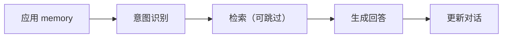

开始写 chat。我先跑通线性流程：加载 memory、判断意图、按需检索、生成回答、保存对话。

<!-- truncate -->

import Mermaid from "@theme/Mermaid";

# 基本功能

我参考 LangGraph 的 [Thinking in LangGraph](https://docs.langchain.com/oss/python/langgraph/thinking-in-langgraph#step-1-map-out-your-workflow-as-discrete-steps)，拆分步骤和状态。

## 拆分步骤

意图识别决定是否检索。闲聊直接回复，业务问题查知识库。


```mermaid
flowchart LR
	A[应用 memory] --> B[意图识别]--> C[检索（可跳过）] --> D[生成回答] --> E[更新对话]
```

### 区分节点类型

节点按职责分成 LLM、数据、Action 和用户交互四类。当前还没加审核和打断，先写前三类。

意图识别和生成回答调用 LLM，Memory 和检索获取数据，persist 保存对话。

### 定义共享状态

我把多个节点都要用的数据放进 State。用户问完“深圳有什么好吃的”，接着问“那广州呢”，意图识别需要结合前文，生成回答也一样。当前输入和历史对话都要共享。

意图识别生成 `intent` 和 `need_retrieval`，检索节点据此决定查什么、要不要查，也放进 State。

模型配置留在各自节点里。意图识别任务简单，生成回答更复杂，提示词、工具和模型分别选择。

```python
class ChatState:
  conversation: Conversation  # 对话
  actor: User
  user_message: str  # 用户消息
  trace_id: str  # trace_id 是用于跟踪单轮对话的唯一标识符，用于 Langfuse 追踪 + 消息落库 + 反馈/评测回溯

  intent: str | None = None
  need_retrieval: bool = False
  memories: list[str] = field(default_factory=list)
  history: list[BaseMessage] = field(default_factory=list)
```

节点按顺序连接，方法见上一篇的[LangGraph 部分](./2026-08-03.md#langgraph)。下一篇开始写节点内部逻辑。

