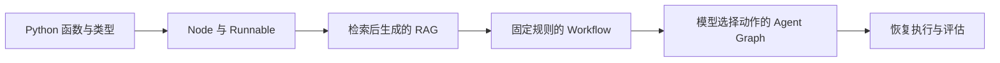

# LangChain 生态：从 Node 到 Agent Graph

学完 Python 的函数、字典、类型标注和模块组织后，我们就可以进行实践开发了。

想象这样一个场景：我们为团队做了一个知识库问答助手，让它根据项目文档回答问题。后来，项目的部署流程变了，我们也更新了知识库里的部署说明，但再次询问部署步骤时，助手仍然引用旧说明，给出原来的操作步骤。

这种情况是怎么来的？知识库问答程序可以先把文件内容整理成可检索的资料，再在用户提问时查找相关片段，交给模型生成答案。如果只修改了源文件，却没有同步更新用于检索的资料，模型拿到的就可能仍是旧内容。这样一来，就出现了“文件已经更新，回答却还在引用旧内容”的情况。

接下来的文章会以搭建一个 RAG 知识库问答程序为主题，用这个场景贯穿学习过程。我们先写处理数据的节点，再接上检索与生成，把这些步骤组织成 Workflow，最后让 Agent 调用检索工具。每一步都复用前面的代码，逐步理解程序如何执行、数据如何流动，以及什么时候需要引入更复杂的流程。

这里的 Node 指 LangGraph 的计算节点，通常就是一个 Python 函数。示例全部使用 Python。部分纯 Python 函数、Runnable 与 LCEL 示例带有浏览器 Playground，可以直接试跑；首次运行时会下载 Python 运行环境，执行过程不调用 API。Node、Graph 和 checkpoint 示例的完整代码可下载后在本地运行。

<details>
<summary>补充说明：LangChain 生态分层（选读）</summary>

`langchain-core` 提供 `Document`、消息、提示模板、Runnable 等基础接口；`langchain-openai` 等独立集成包连接模型服务。`langchain-text-splitters` 负责文本切分，后面会用它把资料整理成可检索的片段。安装方式以 [官方安装文档](https://docs.langchain.com/oss/python/langchain/install) 为准。

LangChain 的 `create_agent` 用于快速组织模型与工具。需要自己安排状态、分支、循环和暂停点时，再使用 LangGraph。两者可以一起用：LangChain 的 Agent 本身就构建在 LangGraph 上。[官方生态说明](https://docs.langchain.com/oss/python/langchain/overview)

LangSmith 用来查看调用轨迹和做评估，它是可选服务，不影响这里的本地运行。Deep Agents 则在 LangChain 之上提供更多预设能力。

</details>

## 阅读顺序

1. [Node 与 Runnable](./02-nodes.md)：从一个处理输入的函数开始，了解 Node 与 Runnable，并把简单步骤接起来。
2. [RAG](./03-rag.md)：接着从知识库中找出相关资料，交给模型，让它根据资料回答问题。
3. [Workflow](./04-workflow.md)：把处理问题、查资料和生成回答组织成流程，规定查不到资料时怎样重试或结束。
4. [Agent Graph](./05-agent-graph.md)：再把检索做成工具，让模型根据问题和已有结果，决定查什么、是否继续查。
5. [运行与评估](./06-runtime-and-evaluation.md)：最后观察程序每一步的执行情况，学习暂停和恢复，并检查找到的资料与生成的回答。



这是一条学习顺序，不意味着每个项目都必须走到 Agent。知识库问答若只需要先查资料再回答，固定 RAG 往往已经够用。

## 运行环境

### 初始化环境

推荐使用 Python 3.12。下载 [完整示例包](/examples/langchain/examples.zip)，解压后进入包含 `requirements.txt` 的目录，创建虚拟环境并安装依赖：

```bash
python3.12 -m venv .venv
source .venv/bin/activate
python -m pip install -r requirements.txt
```

Windows PowerShell 用 `py -3.12 -m venv .venv` 创建环境，用 `.venv\Scripts\Activate.ps1` 激活。

### 运行示例

节点和状态恢复示例可直接运行，无需模型密钥：

```bash
python nodes.py
python checkpoints.py
```

RAG、Workflow 和 Agent 示例需要模型服务。设置 OpenAI API Key、账号可用的聊天模型和 embedding 模型后运行，Agent 示例的聊天模型还需支持工具调用：

```bash
export OPENAI_API_KEY="你的 API Key"
export CHAT_MODEL="你的聊天模型 ID"
export EMBEDDING_MODEL="text-embedding-3-small"

python rag.py
python workflow.py
python agent_graph.py
python agent_graph.py --explicit
```

以上环境变量使用 macOS / Linux 写法，PowerShell 使用 `$env:变量名 = "值"`。模型调用需要网络，费用按服务商规则计算。示例使用三份内置资料，每次启动 RAG 脚本都会重新生成文档向量。

### 手动配置要求

- Python 3.10 及以上。
- `langchain`、`langchain-core`、`langgraph`、`langchain-openai`、`langchain-text-splitters` 使用 1.x 版本，范围为 `>=1,<2`。
- NumPy 版本范围为 `>=1.26,<3`。

完整依赖见 [requirements.txt](/examples/langchain/requirements.txt)。

:::note[说明]

各篇文章只展示和解释当前主题涉及的代码，完整代码见 [完整示例包](/examples/langchain/examples.zip)。`rag_common.py` 保存共用的资料、检索器和模型配置，运行示例时与其他脚本放在同一目录。

<details>
<summary>示例文件（选读）</summary>

```text
examples/
├── README.md         # 解压后的运行说明
├── requirements.txt
├── nodes.py          # Runnable 与单节点图
├── rag_common.py     # 文档、检索器、提示模板与模型配置
├── rag.py            # 先检索，再生成
├── workflow.py       # 固定规则与有限重试
├── agent_graph.py    # 同一个工具，两种 Agent 组织方式
└── checkpoints.py    # 独立的暂停 / 恢复练习
```

</details>

:::

开始阅读：[Node 与 Runnable](./02-nodes.md)。需要补 Python 基础时，可以回到 [Python 学习笔记](/docs/python/intro)。
