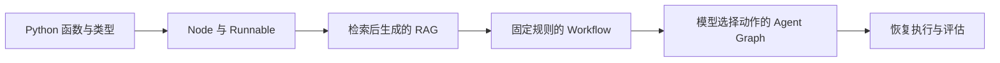

# LangChain 生态：从 Node 到 Agent Graph

学完 Python 的函数、字典、类型标注和模块组织后，可以拿一个小问题把它们用起来：**知识库文件已经更新，为什么回答还引用旧内容？**

这一组文章围绕这个问题，先写处理数据的节点，再接上检索与生成，把它们组织成 Workflow，最后把检索交给 Agent 调用。每一步都复用前面的代码，关注的是程序如何执行、数据如何流动，以及什么时候值得增加复杂度。

这里的 Node 指 LangGraph 的计算节点，通常就是一个 Python 函数。示例全部使用 Python；Node.js 不在这条学习路线中。

## 先分清生态里的几层

`langchain-core` 提供 `Document`、消息、提示模板、Runnable 等基础接口；`langchain-openai` 等独立集成包连接模型服务。`langchain-text-splitters` 负责文本切分，后面会用它把资料整理成可检索的片段。安装方式以 [官方安装文档](https://docs.langchain.com/oss/python/langchain/install) 为准。

LangChain 的 `create_agent` 用于快速组织模型与工具。需要自己安排状态、分支、循环和暂停点时，再使用 LangGraph。两者可以一起用：LangChain 的 Agent 本身就构建在 LangGraph 上。[官方生态说明](https://docs.langchain.com/oss/python/langchain/overview)

LangSmith 用来查看调用轨迹和做评估，它是可选服务，不影响这里的本地运行。Deep Agents 则在 LangChain 之上提供更多预设能力；本组先把底层控制流讲清楚，暂不扩展文件系统、任务规划等主题。

## 阅读顺序

1. [Node 与 Runnable：先把一步写清楚](./02-nodes.md)：用一个清理查询的函数理解节点输入、状态更新与组合接口。
2. [RAG：把文档变成可检索的证据](./03-rag.md)：构建共享知识库，完成检索后生成答案的最小闭环。
3. [Workflow：让 RAG 按规则执行](./04-workflow.md)：将闭环拆成节点，用条件边实现有限重试与拒答。
4. [Agent Graph：让模型选择检索动作](./05-agent-graph.md)：复用同一个检索器，先用 `create_agent`，再展开模型与工具之间的循环。
5. [运行与评估：流式输出、恢复和质量检查](./06-runtime-and-evaluation.md)：观察执行轨迹，暂停审核答案，并区分检索质量与回答质量。



这是一条学习顺序，不意味着每个项目都必须走到 Agent。知识库问答若只需要先查资料再回答，固定 RAG 往往已经够用。

## 版本与运行准备

本文于 **2026-10-07** 按官方当前文档核对，示例采用 LangChain / LangGraph **1.x 稳定 API**。依赖约束为 `>=1,<2`，安装时不主动选择预发布版本；这不是某个补丁版本的锁文件。需要复现具体环境时，安装成功后保存 `pip freeze` 的结果。

新 Agent 使用 `langchain.agents.create_agent`。旧教程中的 `langgraph.prebuilt.create_react_agent` 已被弃用；传统链相关的旧命名空间也不应直接套进新示例。[LangChain v1 说明](https://docs.langchain.com/oss/python/releases/langchain-v1)、[LangGraph v1 说明](https://docs.langchain.com/oss/python/releases/langgraph-v1)

需要 Python 3.10 及以上，建议使用独立的 Python 3.11+ 环境。下载 [完整示例包](/examples/langchain/examples.zip)，解压后进入目录运行：

```bash
python3 -m venv .venv
source .venv/bin/activate
python -m pip install -r requirements.txt

# 这两项无需模型密钥，也不会调用外部模型。
python nodes.py
python checkpoints.py
```

Windows PowerShell 用 `.venv\Scripts\Activate.ps1` 激活环境。以下环境变量写法针对 macOS / Linux 的 shell；PowerShell 需要改成 `$env:变量名 = "值"`。

真正的 RAG 需要调用 embedding 和聊天模型。示例使用 OpenAI 集成包，密钥放在运行环境中；`CHAT_MODEL` 填你账号当前可用的模型 ID，Agent 篇还要求模型支持工具调用。这里不把模型名称绑定到框架版本。

```bash
export OPENAI_API_KEY="你的 API Key"
export CHAT_MODEL="你的聊天模型 ID"
export EMBEDDING_MODEL="text-embedding-3-small"

python rag.py
python workflow.py
python agent_graph.py
python agent_graph.py --explicit
```

这些脚本使用三份内置短资料，不读取私人文件。每次启动 RAG 脚本都会重新生成文档向量；embedding 和模型调用需要网络，并可能按服务商规则计费。后续文章会说明如何把这个练习替换为实际知识库。

## 示例之间如何复用

```text
examples/
├── requirements.txt
├── nodes.py          # Runnable 与单节点图
├── rag_common.py     # 文档、检索器、提示模板与模型配置
├── rag.py            # 先检索，再生成
├── workflow.py       # 固定规则与有限重试
├── agent_graph.py    # 同一个工具，两种 Agent 组织方式
└── checkpoints.py    # 独立的暂停 / 恢复练习
```

文章只展开当前步骤最需要的代码，其余内容放在完整示例文件中。把相关文件保存在同一目录，避免只复制片段后出现缺少 `rag_common` 的错误。

开始阅读：[Node 与 Runnable：先把一步写清楚](./02-nodes.md)。需要补 Python 基础时，可以回到 [Python 学习笔记](/docs/python/intro)。
