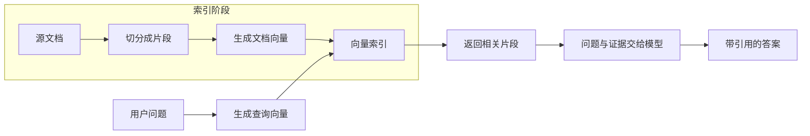

# RAG：把文档变成可检索的证据

上一篇把查询处理成了独立步骤。现在需要解决下一个问题：模型回答“知识库更新”时，依据的是哪几段资料？先拿到证据，再生成答案，这就是这里采用的两阶段 RAG。

## 索引与问答分开看



实际系统通常在资料变化时维护索引，在每次问答时查询索引。示例为了便于运行，将两部分放在同一个进程中；这不代表每次用户提问都应该重新构建知识库。[官方检索说明](https://docs.langchain.com/oss/python/deepagents/retrieval)

## Document 保存内容，也保存来源

本系列使用三份短资料，分别讨论索引更新、版本一致性和缓存。完整定义在 [rag_common.py](/examples/langchain/rag_common.py)。其中一份如下：

```python
from langchain_core.documents import Document

doc = Document(
    page_content=(
        "RAG 在回答前检索知识库，把相关片段提供给模型。"
        "更新源文件后需要重新切分和生成 embedding，"
        "替换索引中的旧片段；只修改源文件不会自动更新向量索引。"
    ),
    metadata={"source": "index.md", "section": "索引更新"},
)
```

`page_content` 是待检索的文本；`metadata` 是来源等附加信息。这里的 `index.md` 是演示资料的标签，完整内容已内置在 Python 文件里，不需要另找这个文件。

换成真实项目时，可以用 loader 读取文件，也可以自己把读取结果转换为 `Document`。来源标识应能定位到真实文档，必要时再补上版本、段落或页码。[Document API](https://reference.langchain.com/python/langchain-core/documents/)

## 切分不是随便每隔 N 个字截一刀

递归切分器先尝试较大的分隔单位，太长时再细分。中文资料可以补上句号和逗号，减少只有英文空格导致的生硬断句：

```python
from langchain_text_splitters import RecursiveCharacterTextSplitter

splitter = RecursiveCharacterTextSplitter(
    chunk_size=180,
    chunk_overlap=30,
    separators=["\n\n", "\n", "。", "；", "，", " ", ""],
)
chunks = splitter.split_documents([doc])
```

默认长度计算使用 `len()`，这里的 180 表示字符长度，不是 token 数；30 是目标重叠长度，实际边界取决于分隔符。内置资料很短，可能保持为整块；换成长文时才更容易观察到切分和重叠。[递归切分器说明](https://docs.langchain.com/oss/python/integrations/splitters/recursive_text_splitter)

片段过小可能丢掉条件和结论，过大则容易把无关内容一起带进上下文。练习中先看 `page_content` 和来源是否完整，再根据实际问题集调整大小。

## embedding 与检索器

接下来把片段写入内存向量索引。下面承接前面的 `chunks`，完整示例会处理全部三份资料：

```python
from langchain_core.vectorstores import InMemoryVectorStore
from langchain_openai import OpenAIEmbeddings

embeddings = OpenAIEmbeddings(model="text-embedding-3-small")
store = InMemoryVectorStore(embeddings)
store.add_documents(chunks)
retriever = store.as_retriever(search_kwargs={"k": 3})

docs = retriever.invoke("知识库更新后，为什么回答还可能引用旧内容？")
```

写入时生成文档向量，检索时生成查询向量。两边必须使用兼容的 embedding 模型和维度；更换模型后应重新索引文档。聊天模型负责生成答案，embedding 模型负责把文本表示为向量，这是两种不同的调用。[OpenAI embedding 集成](https://docs.langchain.com/oss/python/integrations/embeddings/openai)、[内存向量索引 API](https://reference.langchain.com/python/langchain-core/vectorstores/in_memory/)

`k=3` 表示最多取三个相似候选，不保证它们足以回答问题。内存索引在进程结束后消失；真实项目需要按持久化、过滤和更新需求选择向量存储。

## 把证据交给模型

共享模块中的 `format_docs()` 给每段资料加上来源，`build_answer_chain()` 使用 `prompt | model | StrOutputParser()` 得到字符串答案。提示模板要求依据资料回答、引用 `[source]`，资料不足时明确说明。

调用端只保留这个闭环：

```python
from rag_common import QUESTION, build_answer_chain, build_retriever, format_docs

retriever = build_retriever()
docs = retriever.invoke(QUESTION)
if not docs:
    print("知识库没有返回资料，暂时无法回答。")
else:
    answer = build_answer_chain().invoke({
        "question": QUESTION,
        "context": format_docs(docs),
    })
    print(answer)
    print(sorted({doc.metadata["source"] for doc in docs}))
```

完整的 [rag.py](/examples/langchain/rag.py) 返回 `answer` 与检索候选的 `sources`。这份来源列表表示“交给模型的证据来自哪里”，不等于模型已经正确引用了每一项。引用和具体结论的对应关系还需要检查。

对本系列的问题，合理的回答应沿着“源文件 → 索引 → 缓存”排查，说明修改文件后仍需更新索引、清理旧片段，并使有关缓存失效。这是验证方向，不是每次运行固定输出的字符串。

## 这一步的边界

当前闭环只有空结果拒答。相似度检索通常总会找出几个最近邻，问一个资料之外的问题也可能返回不相关的片段。“返回了文档”不能等同于“有足够证据”。

下一步先把控制流显式拆开，再讨论检索失败时怎么结束：[Workflow：让 RAG 按规则执行](./04-workflow.md)。
