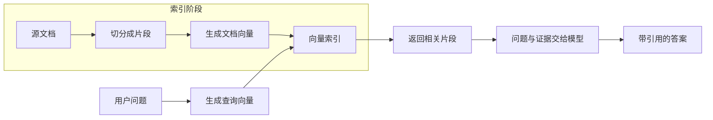

# RAG

上一篇从获取用户输入开始，整理了问题文本，并了解了怎样连接处理步骤。接下来要让模型根据知识库回答，就需要先准备可检索的资料，再用问题查找相关片段，把这些片段和问题一起交给模型。本篇沿着资料准备、检索和回答生成，继续完善 RAG 问答流程。

## 准备知识库

文档需要先切分、生成向量并写入索引。用户提问时，再查询索引，把找到的资料交给模型。这是准备资料和回答问题的两个阶段：



示例把两个阶段放在同一个进程中，启动时构建索引，再处理问题。实际项目通常在资料变化时更新索引，在每次问答时查询索引，避免每次提问都重新整理全部资料。[官方检索说明](https://docs.langchain.com/oss/python/deepagents/retrieval)

## 保存内容与来源

检索需要用到文档内容，回答中的引用也需要能找到资料来源。LangChain 用 Document 保存这两类信息。本系列使用三份短资料，分别讨论索引更新、版本一致性和缓存。完整定义在 [rag_common.py](/examples/langchain/rag_common.py)，其中一份如下：

```python
from langchain_core.documents import Document

doc = Document(
    page_content=(
        "RAG 在回答前检索知识库，把相关片段提供给模型。"
        "更新源文件后需要重新切分和生成 embedding，"
        "替换索引中的旧片段；只修改源文件不会自动更新向量索引。"
    ),
    metadata={"source": "index.md", "section": "索引更新"},
)
```

`page_content` 保存待检索的文本，`metadata` 保存来源等附加信息。`index.md` 是这份演示资料的来源标签，内容已经定义在 Python 文件中。

换成真实项目时，可以用 loader 读取文件，也可以自己把读取结果转换为 `Document`。来源标识应能定位到真实文档，必要时再补上版本、段落或页码。[Document API](https://reference.langchain.com/python/langchain-core/documents/)

## 切分文档

文档可能很长，把它切成片段后，检索时就能找出与问题有关的部分。递归切分器先按段落等较大的单位切分，片段仍然太长时再继续细分。中文资料可以补上句号和逗号作为分隔符，让切分更贴近原文的句子：

```python
from langchain_text_splitters import RecursiveCharacterTextSplitter

splitter = RecursiveCharacterTextSplitter(
    chunk_size=180,
    chunk_overlap=30,
    separators=["\n\n", "\n", "。", "；", "，", " ", ""],
)
chunks = splitter.split_documents([doc])
```

切分器默认用 `len()` 计算长度，因此 `chunk_size=180` 表示 180 个字符，并非 180 个 token。`chunk_overlap=30` 表示目标重叠长度，实际边界取决于分隔符。内置资料较短，可能仍是一个完整片段，换成长文后更容易看出切分和重叠的效果。[递归切分器说明](https://docs.langchain.com/oss/python/integrations/splitters/recursive_text_splitter)

片段过小可能丢掉条件和结论，过大则容易把无关内容一起带进上下文。练习中先看 `page_content` 和来源是否完整，再根据实际问题集调整大小。

## 检索相关资料

文档切分后，我们需要从这些片段中找到与问题相关的内容。embedding 模型把文本转换成向量，检索器再根据问题与文档向量的相似程度查找资料。下面用内存向量索引保存前面的 `chunks`，然后查询相关片段。完整示例会处理全部三份资料：

```python
from langchain_core.vectorstores import InMemoryVectorStore
from langchain_openai import OpenAIEmbeddings

embeddings = OpenAIEmbeddings(model="text-embedding-3-small")
store = InMemoryVectorStore(embeddings)
store.add_documents(chunks)
retriever = store.as_retriever(search_kwargs={"k": 3})

docs = retriever.invoke("知识库更新后，为什么回答还可能引用旧内容？")
```

写入时生成文档向量，检索时生成查询向量。文档和查询必须使用兼容的 embedding 模型及向量维度，更换模型后需要重新生成文档向量并更新索引。聊天模型负责生成答案，embedding 模型负责把文本表示为向量，这是两种不同的调用。[OpenAI embedding 集成](https://docs.langchain.com/oss/python/integrations/embeddings/openai)、[内存向量索引 API](https://reference.langchain.com/python/langchain-core/vectorstores/in_memory/)

`k=3` 表示最多取三个相似候选，不保证它们足以回答问题。内存索引在进程结束后消失，实际项目可以根据持久化、过滤和更新需求选择向量存储。

## 根据资料回答

检索到资料后，把问题和相关片段一起传给模型。共享模块中的 `format_docs()` 给每段资料加上来源，`build_answer_chain()` 使用 `prompt | model | StrOutputParser()` 得到字符串答案。提示模板要求依据资料回答、引用 `[source]`，资料不足时明确说明。

下面依次执行检索、整理资料和生成回答：

```python
from rag_common import QUESTION, build_answer_chain, build_retriever, format_docs

retriever = build_retriever()
docs = retriever.invoke(QUESTION)
if not docs:
    print("知识库没有返回资料，暂时无法回答。")
else:
    answer = build_answer_chain().invoke({
        "question": QUESTION,
        "context": format_docs(docs),
    })
    print(answer)
    print(sorted({doc.metadata["source"] for doc in docs}))
```

完整的 [rag.py](/examples/langchain/rag.py) 返回 `answer` 与检索候选的 `sources`。这份列表记录交给模型的资料来自哪里。模型是否正确引用，以及引用能否支持对应结论，还需要检查。

对于“知识库更新后还引用旧内容”，回答需要说明源文件、索引和缓存之间的关系：修改文件后还要更新索引、清理旧片段，并让相关缓存失效。运行时可以据此检查回答是否完整，具体措辞会随模型输出变化。

## 检查资料相关性

示例在没有检索结果时直接结束问答。但相似度检索通常会返回最接近的几个片段，即使问题超出了知识库范围，也可能找到不相关的内容。因此，拿到检索结果后，还需要判断这些资料能否回答当前问题。

现在已经能先查资料、再生成回答。下一篇 [Workflow](./04-workflow.md) 会把这些步骤拆成节点，安排检索失败后的重试和结束条件。
