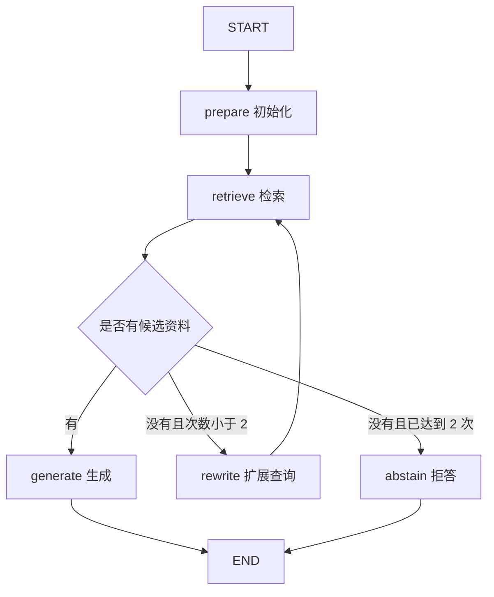

# Workflow：让 RAG 按规则执行

上一篇已经能先检索、再回答。现在希望执行过程更清楚：检索没有资料时再试一次；第二次仍没有资料就结束。把这些步骤展开成图，便于观察每一步状态，也为后面的 Agent 循环打基础。

## 先把规则画出来



这里的路径由我们写的规则决定，因此称为 Workflow。流程中可以调用 LLM，例如让模型生成答案或判断证据，但是否重试、最多重试几次，仍由应用控制。[官方 Workflow 与 Agent 区分](https://docs.langchain.com/oss/python/langgraph/workflows-agents)

## 用 state 连接步骤

完整实现位于 [workflow.py](/examples/langchain/workflow.py)，复用上一篇的 `rag_common.py`。状态把“用户究竟问了什么”和“现在拿什么去检索”分开：

```python
from typing import TypedDict
from langchain_core.documents import Document


class RagState(TypedDict):
    question: str
    query: str
    docs: list[Document]
    attempts: int
    answer: str
```

`question` 保留原意，`query` 允许调整；`docs` 保存最新候选；`attempts` 记录检索次数。它们都使用覆盖更新。不要给 `docs` 加累积 reducer，否则第二轮检索可能继续带着第一轮的无关资料。

首次只传 `question`，`prepare` 初始化其余字段。这个明确的初始化也让同一个图对象可以处理不同问题，不靠上一次运行的临时变量。

## 节点做事，路由选下一步

以下函数定义在 `build_workflow(retriever, answer_chain)` 内部，因此可以访问传入的检索器和生成链：

```python
from typing import Literal


def retrieve(state: RagState) -> dict:
    return {
        "docs": retriever.invoke(state["query"]),
        "attempts": state["attempts"] + 1,
    }


def route(state: RagState) -> Literal["generate", "rewrite", "abstain"]:
    if state["docs"]:
        return "generate"
    if state["attempts"] < 2:
        return "rewrite"
    return "abstain"


def rewrite(state: RagState) -> dict:
    return {"query": state["query"] + " 索引更新 旧版本 缓存失效"}
```

`retrieve` 返回字段更新，`route` 返回目标节点名。路由运行在检索更新应用之后，所以读到的是新 `docs` 和新次数。这里的 `rewrite` 只是针对本系列问题的固定关键词扩展，不是通用的语义改写模型。

两个失败要分开处理。资料为空属于业务结果，可以扩展查询；网络超时或认证失败属于外部调用错误。示例让这类异常抛出，并在共享模型配置中设置超时与有限请求重试，不会把认证失败伪装成“没有资料”。

## 连接固定边与条件边

注册节点后，按图中的规则连接：

```python
from langgraph.graph import END, START, StateGraph

# prepare / retrieve / rewrite / generate / abstain
# 都已在完整示例的 build_workflow() 中定义。
builder = StateGraph(RagState)
for name, node in [
    ("prepare", prepare), ("retrieve", retrieve), ("rewrite", rewrite),
    ("generate", generate), ("abstain", abstain),
]:
    builder.add_node(name, node)

builder.add_edge(START, "prepare")
builder.add_edge("prepare", "retrieve")
builder.add_conditional_edges("retrieve", route)
builder.add_edge("rewrite", "retrieve")
builder.add_edge("generate", END)
builder.add_edge("abstain", END)
graph = builder.compile()
```

从 `retrieve` 出发只设置条件边。如果又添加一条直达 `generate` 的普通边，它也会调度生成，可能破坏“资料为空时拒答”的设计。普通边和条件边的语义可在 [Graph API](https://docs.langchain.com/oss/python/langgraph/graph-api) 中核对。

## 跑一遍，观察状态更新

```python
from rag_common import QUESTION, build_answer_chain, build_retriever
from workflow import build_workflow

graph = build_workflow(build_retriever(), build_answer_chain())
for update in graph.stream({"question": QUESTION}, stream_mode="updates"):
    print(update)
```

内置知识库通常会返回候选，因此主路径是 `prepare → retrieve → generate`。输出会按节点名展示本步新增字段。若注入一个始终返回 `[]` 的检索器，就能观察到 `prepare → retrieve → rewrite → retrieve → abstain`，最终 `attempts == 2`。

有限重试必须体现在业务规则里。图运行时的 `recursion_limit` 可以作为额外保护，它限制的是 super-step 数，并不直接等于检索次数。

## 有候选，还不代表有证据

这个练习只判断候选是否为空。第三篇已经提过，Top-K 检索可能返回相近但无用的资料，所以代码展示的是控制流，不能把它描述成已完成可靠的相关性验证。

下一阶段可以在 `retrieve` 后加入独立的 `grade` 节点：检查资料是否覆盖问题，必要时拒答或继续扩展查询。若使用相似度阈值，要先确认存储的分数定义与方向，再根据自己的评估集设定；不要把某个固定数值当成所有向量库通用的标准。

到这里，即使加入模型做证据检查，路径仍可以由我们明确安排。若下一步检索什么、是否继续检索都由模型选择，就进入 [Agent Graph：让模型选择检索动作](./05-agent-graph.md)。
