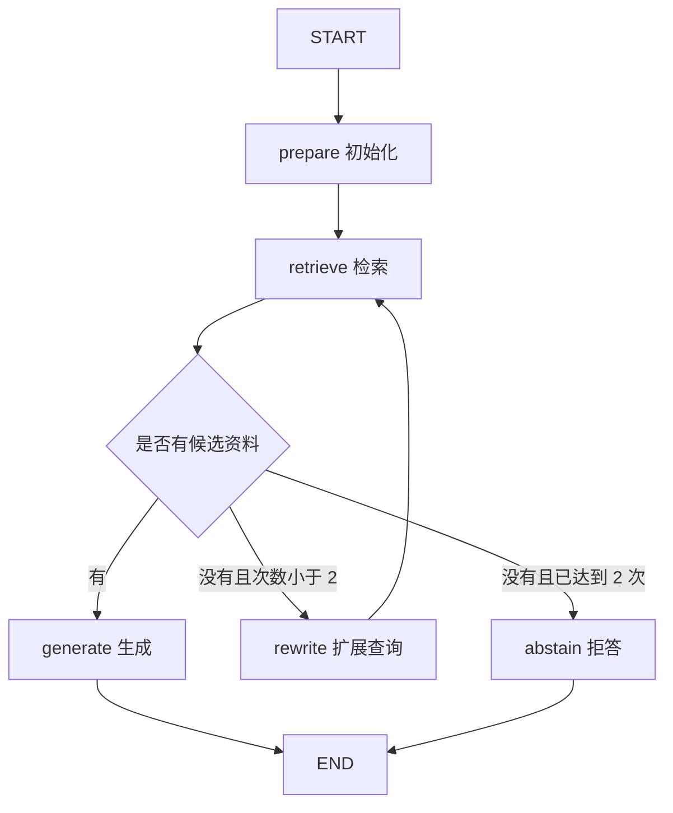

# Workflow

上一篇把检索到的资料交给模型，已经能完成一次问答。如果没有找到资料，我们还希望换一组检索词再试一次，两次都没有结果时就结束。本篇用 Workflow 把输入处理、检索、重试和回答组织成明确的执行流程。

## 设计问答流程

这次问答需要根据检索结果选择下一步：有资料时生成回答，没有资料时补充检索词再查一次，两次都没有结果时拒答。完整流程如下：



这里的路径由我们写的规则决定，因此称为 Workflow。流程中可以调用 LLM，例如让模型生成答案或判断证据，但是否重试、最多重试几次，仍由应用控制。[官方 Workflow 与 Agent 区分](https://docs.langchain.com/oss/python/langgraph/workflows-agents)

## 保存问答数据

重试时，检索词和检索结果会变化，我们还需要记录已经查了几次。这些数据通过共享状态在节点之间传递，原始问题也单独保留。完整实现位于 [workflow.py](/examples/langchain/workflow.py)，继续使用上一篇的 `rag_common.py`：

```python
from typing import TypedDict
from langchain_core.documents import Document


class RagState(TypedDict):
    question: str
    query: str
    docs: list[Document]
    attempts: int
    answer: str
```

`question` 保存原始问题，`query` 保存可以调整的检索词，`docs` 保存最新找到的资料，`attempts` 记录检索次数。这些字段都使用覆盖更新，让新一轮检索替换旧资料。如果给 `docs` 添加累积 reducer，第一轮的无关片段也可能留到下一轮。

首次调用只传 `question`，其余字段由 `prepare` 初始化。每次处理新问题时重新设置状态，同一个图对象就可以用于多次问答。

## 检索与重试

检索完成后，我们需要判断是否找到了资料，以及是否还有重试机会。检索节点负责更新资料和次数，路由根据这些结果选择下一步。需要重试时，再由 `rewrite` 补充检索词。以下函数定义在 `build_workflow(retriever, answer_chain)` 内部，可以访问传入的检索器：

```python
from typing import Literal


def retrieve(state: RagState) -> dict:
    return {
        "docs": retriever.invoke(state["query"]),
        "attempts": state["attempts"] + 1,
    }


def route(state: RagState) -> Literal["generate", "rewrite", "abstain"]:
    if state["docs"]:
        return "generate"
    if state["attempts"] < 2:
        return "rewrite"
    return "abstain"


def rewrite(state: RagState) -> dict:
    return {"query": state["query"] + " 索引更新 旧版本 缓存失效"}
```

`retrieve` 返回字段更新，`route` 返回目标节点名。路由运行在检索更新应用之后，所以读到的是新 `docs` 和新次数。`rewrite` 在原检索词后补上与本系列问题有关的固定关键词。用于其他问题时，需要根据资料内容调整这一步。

没有找到资料时，可以调整检索词再查。网络超时或认证失败则表示调用出了问题，需要按异常处理。共享模型配置设置了超时与有限请求重试，超过限制后抛出异常，便于区分调用失败和空检索结果。

## 连接执行分支

输入处理完成后一定进入检索，这样的顺序用固定边连接。检索之后可能生成回答、重试或拒答，需要用条件边根据状态选择分支。前面的流程可以这样连接：

```python
from langgraph.graph import END, START, StateGraph

# prepare / retrieve / rewrite / generate / abstain
# 都已在完整示例的 build_workflow() 中定义。
builder = StateGraph(RagState)
for name, node in [
    ("prepare", prepare), ("retrieve", retrieve), ("rewrite", rewrite),
    ("generate", generate), ("abstain", abstain),
]:
    builder.add_node(name, node)

builder.add_edge(START, "prepare")
builder.add_edge("prepare", "retrieve")
builder.add_conditional_edges("retrieve", route)
builder.add_edge("rewrite", "retrieve")
builder.add_edge("generate", END)
builder.add_edge("abstain", END)
graph = builder.compile()
```

从 `retrieve` 出发只设置条件边。如果又添加一条直达 `generate` 的普通边，它也会调度生成，可能破坏“资料为空时拒答”的设计。两种边的执行规则见 [Graph API](https://docs.langchain.com/oss/python/langgraph/graph-api)。

## 检查运行结果

流程连接好后，我们需要检查实际执行的路径：找到资料时是否生成回答，没有资料时是否按次数限制重试并结束。使用 `stream_mode="updates"` 可以查看各节点返回的字段更新：

```python
from rag_common import QUESTION, build_answer_chain, build_retriever
from workflow import build_workflow

graph = build_workflow(build_retriever(), build_answer_chain())
for update in graph.stream({"question": QUESTION}, stream_mode="updates"):
    print(update)
```

内置知识库通常会返回候选，因此主路径是 `prepare → retrieve → generate`。输出会按节点名展示本步新增字段。若注入一个始终返回 `[]` 的检索器，就能观察到 `prepare → retrieve → rewrite → retrieve → abstain`，最终 `attempts == 2`。

有限重试必须体现在业务规则里。图运行时的 `recursion_limit` 可以作为额外保护，它限制的是 super-step 数，并不直接等于检索次数。

## 判断资料是否可用

当前流程根据检索结果是否为空选择分支。上一篇提到，相似度较高的片段也可能与问题无关，因此还需要检查资料是否覆盖了回答所需的信息。

可以在 `retrieve` 后增加一个 `grade` 节点，判断资料是否足够，再决定回答、继续检索或结束。如果使用相似度阈值，需要先确认向量存储的分数含义，以及高分还是低分表示更相似，再用自己的问题集确定阈值。不同向量库的分数定义可能不同。

即使由模型检查资料，下一步怎样执行仍然可以由程序规定。下一篇 [Agent Graph](./05-agent-graph.md) 会把检索作为工具交给模型，让它决定检索词，以及是否需要继续查找资料。
