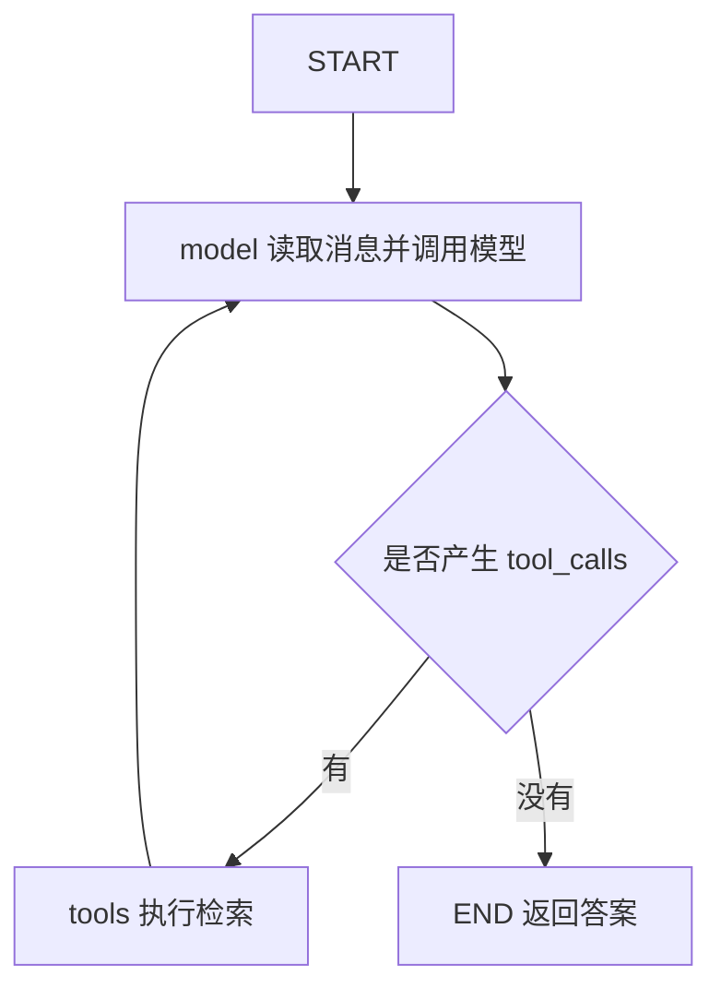

# Agent Graph

上一篇由程序规定检索顺序和重试条件。本篇继续使用同一份资料和检索器，把检索包装成工具，让模型根据问题选择检索词，并在看过结果后决定是否继续查。先用 `create_agent` 组织问答，再用 LangGraph 展示模型与工具之间的执行过程。

## 提供检索工具

要让模型自己决定查什么，我们需要把检索功能提供给它，并说明这份知识库能查到哪些内容。用 `@tool` 注册检索函数后，模型就可以传入检索词，请求调用它。完整示例见 [agent_graph.py](/examples/langchain/agent_graph.py)：

```python
from langchain.tools import tool
from rag_common import format_docs


def make_search_tool(retriever):
    @tool
    def search_docs(query: str) -> str:
        """检索知识库中有关 RAG 索引更新、文档版本与缓存的资料。"""
        docs = retriever.invoke(query)
        return format_docs(docs) if docs else "未检索到资料。"

    return search_docs
```

`make_search_tool()` 接收前面构建的检索器，返回 `search_docs` 工具。参数类型说明工具需要怎样的输入，docstring 说明它能查找什么资料。工具描述要与知识库内容一致，让模型知道什么问题适合交给它处理。返回内容继续包含 `[source]`，便于生成有依据的答案。[官方工具说明](https://docs.langchain.com/oss/python/langchain/tools)

模型负责生成工具调用请求，框架中的工具执行节点负责运行对应的 Python 函数，再把结果交回模型。

## 创建问答 Agent

检索工具准备好后，我们需要让模型能选择调用它，并在收到工具返回的资料后继续回答。把模型和工具一起传给 `create_agent`，就可以创建处理这些步骤的 Agent。下面继续使用前面的知识库问题，所需的共享文件放在同一目录中：

```python
from langchain.agents import create_agent
from agent_graph import SYSTEM_PROMPT, make_search_tool
from rag_common import QUESTION, build_model, build_retriever

tools = [make_search_tool(build_retriever())]
agent = create_agent(
    model=build_model(),
    tools=tools,
    system_prompt=SYSTEM_PROMPT,
)
result = agent.invoke(
    {"messages": [{"role": "user", "content": QUESTION}]},
    {"recursion_limit": 12},
)
print(result["messages"][-1].content)
```

共享提示要求涉及知识库的问题先检索，必要时换关键词继续查，并引用来源。不过提示是对模型的要求，不是强制执行的控制规则。若产品要求每个问题一定先检索，应该用固定 Workflow、外层预检索或应用层校验来保证。[官方 Agent 文档](https://docs.langchain.com/oss/python/langchain/agents)

这里继续使用原来的检索器。Agent 增加的是选择工具和检索词的方式，多轮检索可能补充更多资料，也会增加耗时。回答是否更准确，仍需要检查实际检索结果和引用。

## 安排工具调用

一次检索可能不足以回答问题，模型需要看过返回的资料后，再决定继续检索还是生成答案。因此，工具执行后还要把结果交回模型，形成下面的调用流程：



用户消息进入图后，模型返回包含 `tool_calls` 的 `AIMessage`，工具执行后产生对应的 `ToolMessage`，模型读取工具结果继续判断。最后模型返回没有工具调用的答案，图结束。

工具结果需要通过调用 ID 与请求对应。`ToolNode` 负责执行调用并生成对应的结果消息，模型才能区分每次工具调用返回了什么。普通用户消息无法替代这种对应关系。[LangGraph 工具循环示例](https://docs.langchain.com/oss/python/langgraph/quickstart)

## 保留消息记录

模型再次判断时，需要知道用户问了什么、之前查过什么，以及工具返回了哪些资料。因此，Agent 在模型与工具之间多次往返时，需要保留消息历史。前面的固定 RAG 分别保存 `question`、`docs` 和 `answer`，这里则使用 `MessagesState` 保存消息。它为 `messages` 配置了 `add_messages` reducer，用来合并新消息，并更新具有相同 ID 的消息。

模型节点因此只返回本次产生的消息：

```python
from langchain_core.messages import SystemMessage
from langgraph.graph import MessagesState

model_with_tools = model.bind_tools(tools)


def call_model(state: MessagesState) -> dict:
    response = model_with_tools.invoke([
        SystemMessage(content=SYSTEM_PROMPT), *state["messages"],
    ])
    return {"messages": [response]}
```

这段代码位于 `build_agent_graph(model, tools)` 内部，`model`、`tools` 和提示由完整文件提供。节点只返回 `[response]`，由 reducer 合并到已有历史中。返回 `state["messages"] + [response]` 会把旧历史再次提交给 reducer。系统提示在调用模型时加入，不会在每轮循环里重复写入图状态。[消息状态与合并方式](https://docs.langchain.com/oss/python/langgraph/use-graph-api)

## 连接检索循环

模型产生工具调用时进入工具节点，工具返回结果后再回到模型。没有新的工具调用时，图结束：

```python
from langgraph.graph import END, START, MessagesState, StateGraph
from langgraph.prebuilt import ToolNode, tools_condition

builder = StateGraph(MessagesState)
builder.add_node("model", call_model)
builder.add_node("tools", ToolNode(tools))
builder.add_edge(START, "model")
builder.add_conditional_edges("model", tools_condition, {
    "tools": "tools",
    END: END,
})
builder.add_edge("tools", "model")
graph = builder.compile()
```

`bind_tools()` 向模型提供工具定义，`ToolNode` 执行工具，`tools_condition` 根据最新消息中的工具调用选择下一步。

这份图展示模型调用、工具执行和消息传递。`create_agent` 还提供中间件等运行能力，常见问答可以直接使用它，需要自己安排图中的步骤时再使用 StateGraph。

<details>
<summary>版本说明（选读）</summary>

旧接口 `create_react_agent` 已弃用，`ToolNode` 和 `tools_condition` 仍可用于自定义工具调用图。已有代码的迁移方式见 [LangGraph v1 迁移说明](https://docs.langchain.com/oss/python/releases/langgraph-v1)。

</details>

## 检查运行结果

流程准备好后，我们需要检查模型怎样查找资料，以及最终答案是否使用了工具返回的内容。两条命令分别运行 `create_agent` 和自定义图，可以用同一个问题比较执行过程：

```bash
python agent_graph.py
python agent_graph.py --explicit
```

对同一个问题，观察模型是否调用了 `search_docs`、使用了什么检索词、调用了几轮，以及最终引用是否来自工具结果。这些信息可以帮助判断两种写法怎样完成检索和回答。

`recursion_limit=12` 设置运行步数上限，超出时抛出 `GraphRecursionError`，需要由应用处理这个异常。生产应用还需要单独约束工具次数、总耗时和 token 预算。步骤明确的问答适合使用固定 Workflow，需要动态选择信息来源和查询方式时，可以使用 Agent。

程序已经能让模型选择检索动作。下一篇 [运行与评估](./06-runtime-and-evaluation.md) 会继续查看执行过程，处理暂停与恢复，并检查资料和回答是否可靠。
