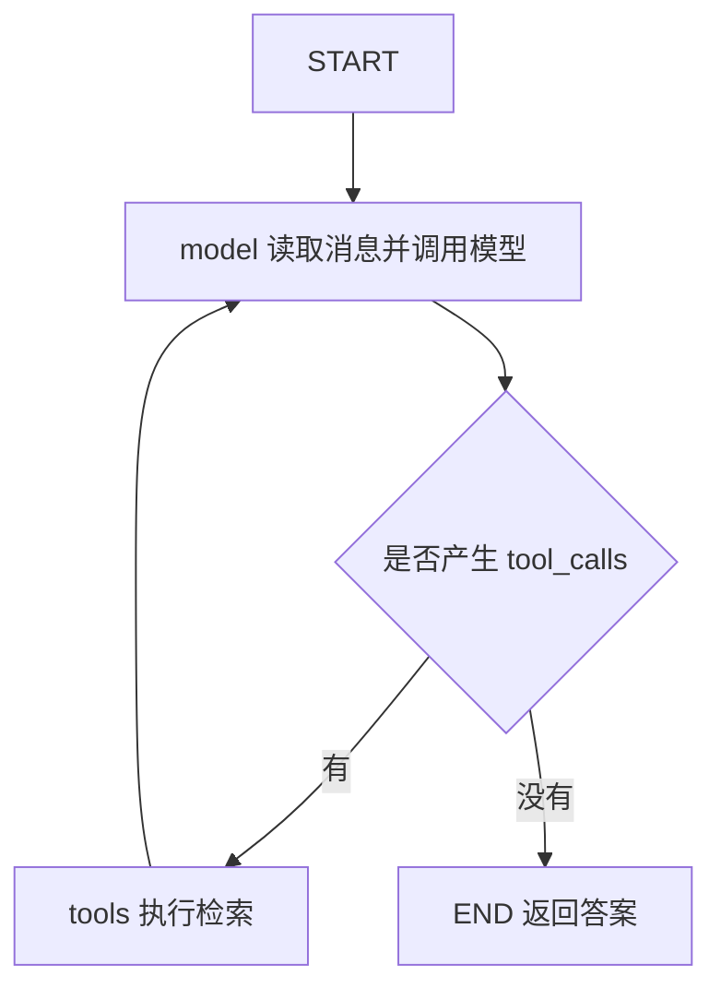

# Agent Graph：让模型选择检索动作

上一篇的 Workflow 规定了检索顺序和重试条件。现在把检索包装成工具，让模型决定检索词，以及看过一次结果后是否还需要继续查。资料和检索器都不变，变化发生在控制流上。

## 先把检索能力变成工具

完整示例在 [agent_graph.py](/examples/langchain/agent_graph.py)。其中 `make_search_tool()` 接收前面构建的检索器，返回一个工具：

```python
from langchain.tools import tool
from rag_common import format_docs


def make_search_tool(retriever):
    @tool
    def search_docs(query: str) -> str:
        """检索知识库中有关 RAG 索引更新、文档版本与缓存的资料。"""
        docs = retriever.invoke(query)
        return format_docs(docs) if docs else "未检索到资料。"

    return search_docs
```

参数类型让工具输入有明确结构，docstring 告诉模型这项能力用于什么。不要只写“搜索”，而应让描述与实际知识库范围一致。返回内容继续包含 `[source]`，便于生成有依据的答案。[官方工具说明](https://docs.langchain.com/oss/python/langchain/tools)

模型会生成工具调用请求。真正执行 Python 函数的是框架中的工具执行节点，模型不会因为知道函数名就直接操作 Python 进程。

## 先用 create_agent 完成同一个问答

LangChain 1.x 使用 `create_agent` 创建常见 Agent 循环。下面是可运行的调用片段，依赖同目录中的共享文件：

```python
from langchain.agents import create_agent
from agent_graph import SYSTEM_PROMPT, make_search_tool
from rag_common import QUESTION, build_model, build_retriever

tools = [make_search_tool(build_retriever())]
agent = create_agent(
    model=build_model(),
    tools=tools,
    system_prompt=SYSTEM_PROMPT,
)
result = agent.invoke(
    {"messages": [{"role": "user", "content": QUESTION}]},
    {"recursion_limit": 12},
)
print(result["messages"][-1].content)
```

共享提示要求涉及知识库的问题先检索，必要时换关键词继续查，并引用来源。不过提示是对模型的要求，不是强制执行的控制规则。若产品要求每个问题一定先检索，应该用固定 Workflow、外层预检索或应用层校验来保证。[官方 Agent 文档](https://docs.langchain.com/oss/python/langchain/agents)

这一点很容易混淆：换成 Agent 后，检索器没有变得更准确。它只是允许模型动态选择工具和参数，有时会带来多轮检索，也会增加耗时和不确定性。

## 展开 Agent Graph 的循环



先看消息顺序：用户消息进入图，模型返回包含 `tool_calls` 的 `AIMessage`，工具执行后产生对应的 `ToolMessage`，模型读取工具结果继续判断。最后模型返回没有工具调用的答案，图结束。

工具结果必须匹配调用 ID。`ToolNode` 帮我们处理工具调用执行及结果消息；不要自己随便拼一条“查到了这些资料”的用户消息替代工具结果。[LangGraph 工具循环示例](https://docs.langchain.com/oss/python/langgraph/quickstart)

## MessagesState 保留上下文

固定 RAG 使用 `question`、`docs` 和 `answer` 字段；这个循环需要保存消息历史。`MessagesState` 已给 `messages` 配置 `add_messages` reducer：新消息会合并进去，相同 ID 的消息可以更新。

模型节点因此只返回本次产生的消息：

```python
from langchain_core.messages import SystemMessage
from langgraph.graph import MessagesState

model_with_tools = model.bind_tools(tools)


def call_model(state: MessagesState) -> dict:
    response = model_with_tools.invoke([
        SystemMessage(content=SYSTEM_PROMPT), *state["messages"],
    ])
    return {"messages": [response]}
```

这是 `build_agent_graph(model, tools)` 内部的片段，`model`、`tools` 和提示均由完整文件提供。不要返回 `state["messages"] + [response]`，把旧历史再次作为新增内容。系统提示在调用模型时加入，不会在每轮循环里重复写入图状态。[消息状态与合并方式](https://docs.langchain.com/oss/python/langgraph/use-graph-api)

## ToolNode 与条件边连接模型和工具

```python
from langgraph.graph import END, START, MessagesState, StateGraph
from langgraph.prebuilt import ToolNode, tools_condition

builder = StateGraph(MessagesState)
builder.add_node("model", call_model)
builder.add_node("tools", ToolNode(tools))
builder.add_edge(START, "model")
builder.add_conditional_edges("model", tools_condition, {
    "tools": "tools",
    END: END,
})
builder.add_edge("tools", "model")
graph = builder.compile()
```

`bind_tools()` 告诉模型有哪些工具；`ToolNode` 执行它们；`tools_condition` 检查最新消息是否包含工具调用。三者分别负责声明、执行和路由。

这个手写图是用于理解机制的最小实现，没有复制 `create_agent` 的全部中间件与运行策略。一般应用先使用官方高层入口；需要自定义图时再展开。旧 `create_react_agent` 已弃用，但这里的 `ToolNode` 和 `tools_condition` 仍是有效的工具组件。[LangGraph v1 迁移说明](https://docs.langchain.com/oss/python/releases/langgraph-v1)

## 用同一个问题比较执行过程

```bash
python agent_graph.py
python agent_graph.py --explicit
```

第一项走 `create_agent`，第二项走显式图。比较模型实际是否调用了 `search_docs`、传入什么检索词、调用了几轮，以及最终引用是否来自工具结果。不要只比较两段答案的措辞。

`recursion_limit=12` 是运行步数上限，超出时会抛出 `GraphRecursionError`，并不会自动变成一段得体的拒答。生产应用还需要单独约束工具次数、总耗时和 token 预算。固定 Workflow 更适合步骤明确的问答；Agent 更适合需要动态选择信息来源和查询方式的任务。

最后还有两个问题：执行到一半如何恢复，答案是否真的被证据支持？继续阅读 [运行与评估：流式输出、恢复和质量检查](./06-runtime-and-evaluation.md)。
