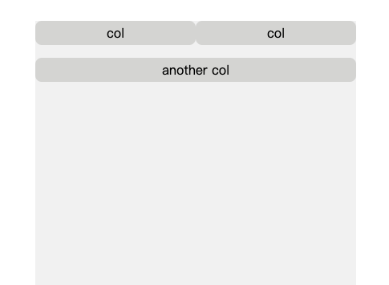
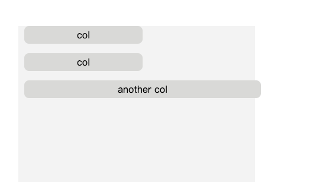

import Tabs from "@theme/Tabs";
import TabItem from "@theme/TabItem";

# 布局组件

分栏响应式布局是很常见的需求，比如说，某个元素需要占父级宽度的 25%。这种百分比，样式中写死宽度是有点呆的做法。感谢伟大的 flex 布局，现在这种需求实现起来很简单。

首先我们需要一个容器元素，使得容器内部某些元素可以按比例分配容器宽度。容器元素本身只需要提供 flex 布局，内部放什么内容由用户决定。具体是什么内容无从知晓，也不需要做任何限制，通过默认 slot 获取即可。

## Row 组件

先来展示下组件结构：

```bash
├── index.ts
└── src
    ├── row.ts
    └── row.vue
```

组件的目录结构如上，`index.ts` 负责总的导出操作，如果组件需要做额外的处理，也会在这里处理。比如说组件如果需要支持，按需导入全局注册。src 下面就是组件的内容了，`row.ts` 包括各种类型，以及实现不同功能的函数。`row.vue` 是组件主题，体现主体脉络，每个小的功能模块从 `row.ts` 导入。组件结构都是这样，功能会一点点填充。

### 补充组件注册和 Plugin 相关

全局注册需要调用 `app.component(name, component)` 方法，其中 `name` 是后续使用 tag，component 就是我们编写的组件。

如果是全部导入，一般作为插件（Plugin） 使用。Vue 的插件需要提供一个 `install` 方法，方法接受两个参数 app 和 options。app 就是 createApp 生成的 Vue 实例，options 是传递给实例的参数。代码示例如下：

```js
// 基本的插件结构
const myPlugin = {
  install(app, options) {
    // do something
  },
};

import { createApp } from "vue";

const app = createApp({});
// 使用插件，第二个参数是传递给 install 的 options
// use 方法使用时会调用插件的 install 方法
app.use(myPlugin, {
  /* config options */
});
```

为了保证两种使用方式的统一性，可以给组件也提供一个 install 方法，install 方法内可以获取 app，自然也可以使用 `app.component()` 注册全局组件。实际上插件常做的是就包括注册全局组件，以下是可以考虑使用插件的场景：

1. 通过 `app.component()` 和 `app.directive()` 注册全局组件或指令。
2. 通过 `app.provide()` 提供一个顶层注入的资源。
3. 向 `app.config.globalProperties` 添加全局属性。

实际上第二点是非常好用的，注册组件和指令功能实际上有些局限。`app.provide()` 就很灵活了，你可以随意定制自己想要注入的内容。其实 vue-router 的 `useRoute` 和 `useRouter` 就是使用的这种方法。第三种情况，需要慎重考虑，不是和 Vue 相关的功能不建议挂在全局，怎么取舍就见仁见智了。

容器组件叫做 Row，也就是行的意思。结构很简单，如下：

```html
<template>
  <div class="row">
    <slot />
  </div>
</template>

<style>
  .row {
    display: flex;
    /* 宽度不够换行 */
    flex-wrap: wrap;
  }
</style>
```

### Slot 补充

提到 **slot（插槽）**，就补充一下，为什么需要插槽。

假设有一个通用的页面布局，由三部分组成，头部、左侧侧边栏、和右侧内容区域。每个页面三部分内容均不相同，唯一相同的就是布局。复制粘贴当然可以解决问题，更好的办法就是使用插槽。

一般的组件，内容样式固定，通过数据的切换实现内容的变换。本质上，所有的内容已经聚合到组件内部。

插槽可以更好地客制化组件。例如说，上述的 Row 组件，使用时可以传入一些定制内容：

```html
<Row>12335</Row>
<!-- 最终渲染结果如下 -->
<div class="row">12335</div>
```

写在组件标签内部的内容，最后会统统放在 slot 位置，如果没有定义 slot 这部分内容就会丢失。

`<slot />` 是默认插槽，上述情况，所有标签内部内容都会当作默认 slot 渲染。

仅仅是这样还是不能满足上面的布局组件需求，默认内容没有办法区分头部，侧边栏和内容区。这样就有了具名 slot。像这样（假设组件为 Content）：

```html
<div class="container">
  <div class="header">
    <slot name="header"></slot>
  </header>
  <div class="left">
    <slot name="left"></slot>
  </main>
  <div  class="content">
    <slot></slot>
  </footer>
</div>
```

使用时就可以通过 name，找到对应的 slot。使用了具名插槽，其余没有指定的都被视作默认插槽，但是最好还是写上 default 来区分。

```html
<content>
  <template #header>Header</template>
  <template #left>Left</template>
  <template #default>Content</template>
</content>
```

## Col 组件

接下来是子元素组件，这里叫 Col，是 column 缩写，列的意思。

首先思考怎么确定组件占的比例。简单的想法就是百分比嘛，比如占 1/4，就给个 25。这样也能实现，就是写起来比较麻烦。怎么配置这里可以参考 Bootstrap 和 Element-plus。Bootstrap 的 grid 布局默认一行被分成 12 份，用户只需要思考元素占整体的十二分之多少。Element-plus 使用的 24 等分。我们这里就选 24 吧，多就是好 LOL。这两种库，都是通过 class 控制宽度的。我这里没有引入 sass，每一个 class 定义一边就很麻烦，就写到 js 中。

首先定义计算的基准值是 24，组件接受一个 prop base：

```typescript
export interface Props {
  base?: number;
}

export const TOTAL_WIDTH_BASE = 24;
```

接下来计算样式，根据传入的 base 计算宽度。根据 flex 布局的特性，没有设置宽度，会根据内容收缩，会导致长度变短。一般的布局使用 div，大多数人对 div 的认识是宽度撑满父级，所以 base 默认值应该是 24。下面是完成的代码：

```html
<script setup lang="ts">
  import { computed } from "vue";
  import { Props, TOTAL_WIDTH_BASE } from "./col.ts";

  import type { CSSProperties } from "vue";

  // 定义 props
  // setup 中对 ts 做了增强，可以通过 interface 定义 props
  const props = defineProps<Props>();

  // 计算宽度
  const style = computed(() => {
    const cssStyles: CSSProperties = {};
    // 判断 props 是否传入 base
    // 这种方法比较蠢，后续会使用默认值方式
    if (props.base == undefined) {
      // flex 是简写属性
      // 三个数字分别对应
      // flex-grow 宽度不够情况，自动伸长的比例
      // flex-shrink 宽度不够情况，收缩比例
      // flex-basis 基准宽度
      cssStyles.flex = "0 0 100%";
    } else {
      cssStyles.flex = `0 0 ${(props.base / TOTAL_WIDTH_BASE) * 100}%`;
    }
    return cssStyles;
  });
</script>

<template>
  <!-- 绑定样式，这里使用对象的方式 -->
  <div class="col" :style="style">
    <slot />
  </div>
</template>
```

### props

Props 类似 HTML 标签中的 attribute，可以在使用组件时，可以通过 props 给组件传递参数。Props 是单向数据流，父级可以修改传递的 props，子组件中不能直接修改 props。

子组件接受 props，除了不能直接修改 props，可以随意使用。Props 的属性，可以被当作全局属性直接在 template 中使用，script 中不能直接使用，举个例子：

```html
<script setup lang="ts">
  // 定义 props
  const props = defineProps({
    name: "", // 这样定义的 props 代默认值，默认 ''，父级如果有传入，使用传入值
  });
  console.log(props.name); // js 中使用需要通过 props 获取
</script>

<template>
  <!-- template 可以直接使用，注意命名冲突 -->
  <div>{{ name }}</div>
</template>
```

定义 props 时，可以对于有预期的 props 添加默认值，假使没有传递对应 prop，可以使用默认值。下面是[官网例子](https://vuejs.org/guide/components/props.html)：

```js
defineProps({
  // Basic type check
  //  (`null` and `undefined` values will allow any type)
  propA: Number,
  // Multiple possible types
  propB: [String, Number],
  // Required string
  propC: {
    type: String,
    required: true,
  },
  // Number with a default value
  propD: {
    type: Number,
    default: 100,
  },
  // Object with a default value
  propE: {
    type: Object,
    // Object or array defaults must be returned from
    // a factory function. The function receives the raw
    // props received by the component as the argument.
    default(rawProps) {
      return { message: "hello" };
    },
  },
  // Custom validator function
  // full props passed as 2nd argument in 3.4+
  propF: {
    validator(value, props) {
      // The value must match one of these strings
      return ["success", "warning", "danger"].includes(value);
    },
  },
  // Function with a default value
  propG: {
    type: Function,
    // Unlike object or array default, this is not a factory
    // function - this is a function to serve as a default value
    default() {
      return "Default function";
    },
  },
});
```

TypeScript 组件可以使用下面的方式，给默认值：

```typescript
export interface Props {
  msg?: string;
  labels?: string[];
}
// 使用 withDefaults 方法
const props = withDefaults(defineProps<Props>(), {
  msg: "hello",
  labels: () => ["one", "two"],
});
```

### Computed Properties

Computed 用来生成一个计算属性，顾名思义，根据依赖属性的变化自动生成另一个值。例如上面的 style，假如依赖的 `props.base` 发生变化，自动计算新的 style。Computed 还可以接受 getter 和 setter，这种方法在二次封装组件时很常用，例如：

```js
import { computed } from "vue";
const props = defineProps({
  modelValue: {
    type: Boolean,
    default: false,
  },
});
// 自定义事件
const emits = defineEmits(["update:modelValue"]);

const bindValue = computed({
  // getter 获取值时触发
  // 返回 props 对应值
  get() {
    return props.modelValue;
  },
  // setter 设置时触发
  // 自动触发事件，通知父级更新 props
  set(val: boolean) {
    emits("update:modelValue", val);
  },
});
```

### Watchers

与计算属性类似的，还有一个 wathcers 的概念。Watchers 同样是侦听依赖数据的变化，但是 watchers 不直接生成一个新值，更像处理一些副作用。假设有一个秒表组件，会开启一个定时器，如果关闭定时器会切换秒表样式，并且需要移除定时器。这种情况就不大适用计算属性了，需要额外处理定时器逻辑，最好使用 Watchers。下面是示例：

```ts
// stop 控制关闭秒表
// newStatus 最近状态
// oldStatus 上一次状态
watch(
  () => props.stop,
  (newStatus, oldStatus) => {
    removeTimer(); // 移除定时器
    changeView(); // 改变样式
  }
);
```

## 初步效果

接下来，看一下效果，在 play 中导入使用组件：

```html
<template>
  <div class="wrapper">
    <newRow class="container">
      <newCol class="inner" :base="12">col</newCol>
      <newCol class="inner" :base="12">col</newCol>
      <newCol class="inner">another col</newCol>
    </newRow>
  </div>
</template>

<script lang="ts" setup>
  import { newRow, newCol } from "@welkin-ui/components";
</script>
<style scoped>
  .wrapper {
    margin: 100px auto 0;
    height: 800px;
    width: 400px;
    background-color: #f3f3f3;
  }
  .container {
    border-radius: 8px;
  }
  .inner {
    height: 30px;
    line-height: 30px;
    border-radius: 8px;
    margin-bottom: 16px;
    background-color: #d9d9d7;
    text-align: center;
  }
</style>
```

效果如下，基本功能实现了：



## 优化

经常遇到的需求就是，布局组件间需要平均留白。在宽度固定的情况，子元素加个 margin-left 也可以实现。问题是上面的布局中，已经把分配了父元素的宽度，增加 margin 会影响到宽度计算。更麻烦的问题是，这里元素会自动换行，某个元素在新的一行行首位置，左侧会因为 margin 出现空白。

看一下直接添加 margin 的问题（这里给子元素添加了 `margin-left: 10px;`）：



如果改成 padding 也会影响到宽度计算。既然要固定宽度，自然想到 `border-box`，宽度计算是加上 padding 不改变整体宽度。假设中间需要留 10px 的宽度，那么两个 Col 组件之间需要各自收缩 5px，这样中间缝隙就有 10px。子元素头尾都收缩了 5px，容器就需要收尾伸长 5px，保证总体宽度不变。

<Tabs>
  <TabItem value="row-ts" label="row.ts">

```typescript
// row.ts 增加 props
export interface Props {
  gap?: number;
}
```

  </TabItem>
  <TabItem value="row-vue" label="row.vue">

    ```html
    <script setup lang="ts">
    import { computed, provide } from "vue";
    import { Props } from "./row.ts";
    import type { CSSProperties } from "vue";
    import { ROW_GAP } from "@welkin-ui/utils";
    // 定义 props
    const props = defineProps<Props>();
    // 添加样式
    const style = computed(() => {
      const cssStyles: CSSProperties = {};
      if (props.gap !== undefined) {
        // 属性多单词使用驼峰
        cssStyles.marginLeft = `-${props.gap / 2}px`;
        cssStyles.marginRight = `-${props.gap / 2}px`;
      }
      return cssStyles;
    });

    const gap = computed(() => props.gap);
    // 向下提供收缩距离
    provide(ROW_GAP, gap);
    </script>

    <template>
      <div :style="style" class="row">
        <slot />
      </div>
    </template>
    ```

  </TabItem>
  <TabItem value="col-vue" label="col.vue">

    ```typescript
    import { computed, inject } from "vue";

    import type { ComputedRef, CSSProperties } from "vue";
    import { ROW_GAP } from "@welkin-ui/utils";

    -- snip --

    const gap = inject(ROW_GAP) as ComputedRef<number>;
    const style = computed(() => {

      -- snip --

      if (gap.value) {
        cssStyles.paddingLeft = `${gap.value / 2}px`;
        cssStyles.paddingRight = `${gap.value / 2}px`;
      }

      return cssStyles;
    });
    ```

  </TabItem>
</Tabs>

这样基本就完成了，使用时候需要把内容放到布局组件内部，Col 本身有 gap 时还是超出内容区的。

```html title="play 中修改使用方式"
<newRow class="container" :gap="10">
  <newCol :base="12">
    <div class="inner">col</div>
  </newCol>
  <newCol :base="12"><div class="inner">col</div></newCol>
  <newCol><div class="inner">another col</div></newCol>
</newRow>
```

OK，完成。Vue 中大部分常用功能都有用到，这个布局方式也很巧妙，通过子元素 padding，父元素负的 margin 来创造一个元素间隔。后续写什么组件需要思考一下，尽量覆盖掉 Vue 中常用的功能。
