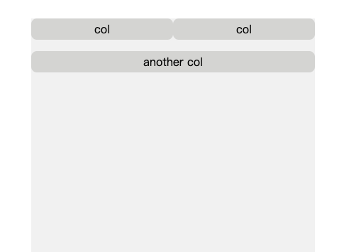
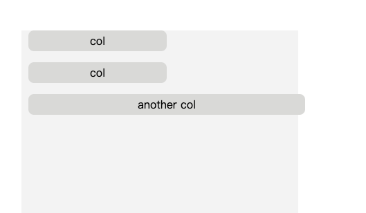

import Tabs from "@theme/Tabs";
import TabItem from "@theme/TabItem";

# 布局组件

分栏布局常需要把容器按比例分配给子元素，例如四列各占 25%。本文用 flex 实现一个 24 等分的 Row / Col，再加入列间距，借此练习 Vue 3.5 的 props、插槽、computed 和 provide / inject。

这里的宽度随容器变化，并支持换行；尚未实现按屏幕断点切换列数。末尾给出完整版本，前面的片段用于逐步说明。

首先我们需要一个容器元素，使得容器内部某些元素可以按比例分配容器宽度。容器元素本身只需要提供 flex 布局，内部放什么内容由用户决定。具体是什么内容无从知晓，也不需要做任何限制，通过默认 slot 获取即可。

## Row 组件

先来展示下组件结构：

```bash
├── index.ts
└── src
    ├── row.ts
    └── row.vue
```

组件的目录结构如上，`index.ts` 负责总的导出操作，如果组件需要做额外的处理，也会在这里处理。比如说组件如果需要支持，按需导入全局注册。src 下面就是组件的内容了，`row.ts` 包括各种类型，以及实现不同功能的函数。`row.vue` 是组件主体，体现主体脉络，每个小的功能模块从 `row.ts` 导入。组件结构都是这样，功能会一点点填充。

### 补充组件注册和 Plugin 相关

全局注册需要调用 `app.component(name, component)` 方法，其中 `name` 是后续使用 tag，component 就是我们编写的组件。

如果是全部导入，一般作为插件（Plugin） 使用。Vue 的插件需要提供一个 `install` 方法，方法接受两个参数 app 和 options。app 是 createApp 创建的应用实例，options 是调用 app.use 时传给插件的参数。代码示例如下：

```js
// 基本的插件结构
const myPlugin = {
  install(app, options) {
    // do something
  },
};

import { createApp } from "vue";

const app = createApp({});
// 使用插件，第二个参数是传递给 install 的 options
// use 方法使用时会调用插件的 install 方法
app.use(myPlugin, {
  /* config options */
});
```

为了保证两种使用方式的统一性，可以给组件也提供一个 install 方法，install 方法内可以获取 app，自然也可以使用 `app.component()` 注册全局组件。实际上插件常做的是就包括注册全局组件，以下是可以考虑使用插件的场景：

1. 通过 `app.component()` 和 `app.directive()` 注册全局组件或指令。
2. 通过 `app.provide()` 提供一个顶层注入的资源。
3. 向 `app.config.globalProperties` 添加全局属性。

实际上第二点是非常好用的，注册组件和指令功能实际上有些局限。`app.provide()` 就很灵活了，你可以随意定制自己想要注入的内容。其实 vue-router 的 `useRoute` 和 `useRouter` 就是使用的这种方法。第三种情况，需要慎重考虑，不是和 Vue 相关的功能不建议挂在全局，怎么取舍就见仁见智了。

容器组件叫做 Row，也就是行的意思。结构很简单，如下：

```html
<template>
  <div class="row">
    <slot />
  </div>
</template>

<style>
  .row {
    display: flex;
    /* 宽度不够换行 */
    flex-wrap: wrap;
  }
</style>
```

### Slot 补充

提到 **slot（插槽）**，就补充一下，为什么需要插槽。

假设有一个通用的页面布局，由三部分组成，头部、左侧侧边栏、和右侧内容区域。每个页面三部分内容均不相同，唯一相同的就是布局。复制粘贴当然可以解决问题，更好的办法就是使用插槽。

一般的组件，内容样式固定，通过数据的切换实现内容的变换。本质上，所有的内容已经聚合到组件内部。

插槽可以更好地客制化组件。例如说，上述的 Row 组件，使用时可以传入一些定制内容：

```html
<Row>12335</Row>
<!-- 最终渲染结果如下 -->
<div class="row">12335</div>
```

写在组件标签内部的内容，最后会统统放在 slot 位置，如果没有定义 slot 这部分内容就会丢失。

`<slot />` 是默认插槽，上述情况，所有标签内部内容都会当作默认 slot 渲染。

仅仅是这样还是不能满足上面的布局组件需求，默认内容没有办法区分头部，侧边栏和内容区。这样就有了具名 slot。像这样（假设组件为 Content）：

```html
<div class="container">
  <div class="header">
    <slot name="header"></slot>
  </header>
  <div class="left">
    <slot name="left"></slot>
  </div>
  <div  class="content">
    <slot></slot>
  </div>
</div>
```

使用时就可以通过 name，找到对应的 slot。使用了具名插槽，其余没有指定的都被视作默认插槽，但是最好还是写上 default 来区分。

```html
<Content>
  <template #header>Header</template>
  <template #left>Left</template>
  <template #default>Content</template>
</Content>
```

## Col 组件

接下来是子元素组件，这里叫 Col，是 column 缩写，列的意思。

首先思考怎么确定组件占的比例。简单的想法就是百分比嘛，比如占 1/4，就给个 25。这样也能实现，就是写起来比较麻烦。怎么配置这里可以参考 Bootstrap 和 Element-plus。Bootstrap 的 grid 布局默认一行被分成 12 份，用户只需要思考元素占整体的十二分之多少。Element Plus 使用 24 等分。这里选择 24，便于表示二、三、四、六等分；通过 computed 生成行内样式，暂时不引入 Sass。

首先定义计算的基准值是 24，组件接受一个 prop base：

```typescript
export interface Props {
  base?: number;
}

export const TOTAL_WIDTH_BASE = 24;
```

接下来计算样式，根据传入的 base 计算宽度。根据 flex 布局的特性，没有设置宽度，会根据内容收缩，会导致长度变短。一般的布局使用 div，大多数人对 div 的认识是宽度撑满父级，所以 base 默认值应该是 24。下面是完成的代码：

```html
<script setup lang="ts">
  import { computed } from "vue";
  import { TOTAL_WIDTH_BASE } from "./col";
  import type { Props } from "./col";

  import type { CSSProperties } from "vue";

  // 定义 props
  // setup 中对 ts 做了增强，可以通过 interface 定义 props
  const props = defineProps<Props>();

  // 计算宽度
  const style = computed(() => {
    const cssStyles: CSSProperties = {};
    // 判断 props 是否传入 base
    // 这种方法比较蠢，后续会使用默认值方式
    if (props.base == undefined) {
      // flex 是简写属性
      // 三个数字分别对应
      // flex-grow 有剩余空间时，自动伸长的比例
      // flex-shrink 宽度不够情况，收缩比例
      // flex-basis 基准宽度
      cssStyles.flex = "0 0 100%";
    } else {
      cssStyles.flex = `0 0 ${(props.base / TOTAL_WIDTH_BASE) * 100}%`;
    }
    return cssStyles;
  });
</script>

<template>
  <!-- 绑定样式，这里使用对象的方式 -->
  <div class="col" :style="style">
    <slot />
  </div>
</template>
```

### props

Props 类似 HTML 标签中的 attribute，可以在使用组件时，可以通过 props 给组件传递参数。Props 是单向数据流，父级可以修改传递的 props，子组件中不能直接修改 props。

子组件接受 props，除了不能直接修改 props，可以随意使用。声明的 prop 可以在模板中直接访问，它并不是应用全局属性。在脚本中通常通过 props 对象读取：

```html
<script setup lang="ts">
  // 定义 props
  const props = defineProps({
    name: { type: String, default: "" }, // 声明类型与默认值
  });
  console.log(props.name); // js 中使用需要通过 props 获取
</script>

<template>
  <!-- template 可以直接使用，注意命名冲突 -->
  <div>{{ name }}</div>
</template>
```

运行时声明可以设置 `type`、`required`、`default` 和 `validator`。对象、数组的默认值使用工厂函数，避免多个实例共享可变数据。TypeScript 声明也可以通过 `withDefaults` 补默认值：

```typescript
interface Props {
  msg?: string;
  labels?: string[];
}

const props = withDefaults(defineProps<Props>(), {
  msg: "hello",
  labels: () => ["one", "two"],
});
```

Vue 3.5 支持在同一个 `<script setup>` 中保持 `defineProps` 解构变量的响应性，也可以直接写默认值：

```typescript
import { watch } from 'vue'

const { base = 24 } = defineProps<{ base?: number }>()
watch(() => base, value => console.log(value))
```

这种行为是编译器转换，不适用于普通 `reactive` 对象的解构。向 `watch` 或组合式函数传入解构 prop 时，仍应传 getter（例如 `() => base`），直接传 `base` 只会传当前数值。本文的完整组件使用 `props.base` 与 `withDefaults`，读起来更直观。详见 [props 文档](https://vuejs.org/guide/components/props.html)。

单向数据流限制的是子组件给 prop 重新赋值；对象和数组的内部成员仍可能被修改，因此组件设计也应避免在子组件中修改父级拥有的数据，改用事件通知父级。

### Computed Properties

Computed 用来生成一个计算属性，顾名思义，根据依赖属性的变化自动生成另一个值。例如上面的 style，假如依赖的 `props.base` 发生变化，自动计算新的 style。Computed 还可以接受 getter 和 setter，这种方法在二次封装组件时很常用，例如：

```ts
import { computed } from "vue";
const props = defineProps({
  modelValue: {
    type: Boolean,
    default: false,
  },
});
// 自定义事件
const emits = defineEmits(["update:modelValue"]);

const bindValue = computed({
  // getter 获取值时触发
  // 返回 props 对应值
  get() {
    return props.modelValue;
  },
  // setter 设置时触发
  // 自动触发事件，通知父级更新 props
  set(val: boolean) {
    emits("update:modelValue", val);
  },
});
```

Vue 3.4 起，可以用 `defineModel` 简化上面的双向绑定。它会声明对应的 prop 和更新事件，父组件仍拥有最终状态：

```html
<script setup lang="ts">
const model = defineModel<boolean>({ required: true })
</script>

<template>
  <input v-model="model" type="checkbox" />
</template>
```

父组件使用 `<Toggle v-model="enabled" />`，并把 `enabled` 初始化为布尔值。若只在子组件设置默认值、父组件传入 undefined，可能出现初始值不同步。详见[组件 v-model](https://vuejs.org/guide/components/v-model.html)。

### Watchers

computed 的 getter 应只推导并返回结果。需要开启计时器、发请求、清理订阅等副作用时，使用 watch。以下代码放在秒表组件的 `<script setup>` 中：

```ts
import { ref, watch } from 'vue'

const props = withDefaults(defineProps<{ stop?: boolean }>(), { stop: false })
const elapsed = ref(0)

watch(
  () => props.stop,
  (stopped, _oldValue, onCleanup) => {
    if (stopped) return
    const timer = setInterval(() => elapsed.value++, 1000)
    onCleanup(() => clearInterval(timer))
  },
  { immediate: true },
)
```

当 stop 改变时，先清理上一轮计时器；组件卸载时，同步创建的 watcher 停止，也会执行清理。样式可以从 stop 推导，不必在 watcher 中再维护一份相同含义的状态。若回调需要读更新后的 DOM，使用 `flush: 'post'`。详见[侦听器](https://vuejs.org/guide/essentials/watchers.html)。

## 初步效果

接下来，看一下效果，在 play 中导入使用组件：

```html
<template>
  <div class="wrapper">
    <newRow class="container">
      <newCol class="inner" :base="12">col</newCol>
      <newCol class="inner" :base="12">col</newCol>
      <newCol class="inner">another col</newCol>
    </newRow>
  </div>
</template>

<script lang="ts" setup>
  import { newRow, newCol } from "@welkin-ui/components";
</script>
<style scoped>
  .wrapper {
    margin: 100px auto 0;
    height: 800px;
    width: 400px;
    background-color: #f3f3f3;
  }
  .container {
    border-radius: 8px;
  }
  .inner {
    height: 30px;
    line-height: 30px;
    border-radius: 8px;
    margin-bottom: 16px;
    background-color: #d9d9d7;
    text-align: center;
  }
</style>
```

效果如下，基本功能实现了：



## 优化

经常遇到的需求就是，布局组件间需要平均留白。在宽度固定的情况，子元素加个 margin-left 也可以实现。问题是上面的布局中，已经把分配了父元素的宽度，增加 margin 会影响到宽度计算。更麻烦的问题是，这里元素会自动换行，某个元素在新的一行行首位置，左侧会因为 margin 出现空白。

看一下直接添加 margin 的问题（这里给子元素添加了 `margin-left: 10px;`）：



如果改成 padding 也会影响到宽度计算。既然要固定宽度，自然想到 `border-box`，宽度计算是加上 padding 不改变整体宽度。假设中间需要留 10px 的宽度，那么两个 Col 组件之间需要各自收缩 5px，这样中间缝隙就有 10px。子元素头尾都收缩了 5px，容器就需要收尾伸长 5px，保证总体宽度不变。

## 完整实现与注入边界

下面三个文件与[项目结构](./01-项目结构.md)对应。`base` 表示占 24 份中的几份：默认 24，0 隐藏，有限小数向下取整，结果限制在 0～24；非有限数回退到 24。`gap` 是非负的水平间距，非法值回退到 0。这些是本示例的接口约定。

<Tabs>
  <TabItem value="utils" label="utils/src/index.ts">

```typescript
import type { ComputedRef, InjectionKey } from 'vue'

export const TOTAL_WIDTH_BASE = 24
export const ROW_GAP: InjectionKey<ComputedRef<number>> = Symbol('row-gap')
```

  </TabItem>
  <TabItem value="row" label="components/src/Row.vue">

```html
<script setup lang="ts">
import { computed, provide } from 'vue'
import type { CSSProperties } from 'vue'
import { ROW_GAP } from '@welkin-ui/utils'

const props = withDefaults(defineProps<{ gap?: number }>(), { gap: 0 })
const gap = computed(() => Number.isFinite(props.gap) ? Math.max(0, props.gap) : 0)
const style = computed<CSSProperties>(() => ({
  marginLeft: `${-gap.value / 2}px`,
  marginRight: `${-gap.value / 2}px`,
}))

provide(ROW_GAP, gap)
</script>

<template>
  <div class="row" :style="style"><slot /></div>
</template>

<style scoped>
.row {
  display: flex;
  flex-wrap: wrap;
}
</style>
```

  </TabItem>
  <TabItem value="col" label="components/src/Col.vue">

```html
<script setup lang="ts">
import { computed, inject } from 'vue'
import type { CSSProperties } from 'vue'
import { ROW_GAP, TOTAL_WIDTH_BASE } from '@welkin-ui/utils'

const props = withDefaults(defineProps<{ base?: number }>(), { base: 24 })
// Col 也允许独立使用，缺少 Row 时提供响应式默认值。
const gap = inject(ROW_GAP, computed(() => 0))
const base = computed(() => Number.isFinite(props.base)
  ? Math.min(TOTAL_WIDTH_BASE, Math.max(0, Math.trunc(props.base)))
  : TOTAL_WIDTH_BASE)
const style = computed<CSSProperties>(() => ({
  display: base.value === 0 ? 'none' : undefined,
  flex: `0 0 ${(base.value / TOTAL_WIDTH_BASE) * 100}%`,
  maxWidth: `${(base.value / TOTAL_WIDTH_BASE) * 100}%`,
  paddingLeft: `${gap.value / 2}px`,
  paddingRight: `${gap.value / 2}px`,
}))
</script>

<template>
  <div class="col" :style="style"><slot /></div>
</template>

<style scoped>
.col {
  box-sizing: border-box;
  min-width: 0;
}
</style>
```

  </TabItem>
</Tabs>

`InjectionKey` 将注入键与值的类型关联起来，避免用 `as ComputedRef<number>` 隐藏缺少 provider 的情况。注入得到的 ref 不会自动解包，脚本中要读 `.value`。传递 `computed` 而不是 `props.gap` 的当前数值，才能在父级修改 gap 后继续更新。嵌套 Row 会使用最近祖先提供的间隔；后代只读它，由 Row 负责维护。详见 [provide / inject](https://vuejs.org/guide/components/provide-inject.html) 与[注入的类型标注](https://vuejs.org/guide/typescript/composition-api.html#typing-provide-inject)。

### 使用方式与宽度计算

背景和内容放在 Col 内部，这样列的 padding 才能形成可见的间隔：

```html title="play/src/App.vue"
<script setup lang="ts">
import { ref } from 'vue'
import { newRow, newCol } from '@welkin-ui/components'

const gap = ref(16)
</script>

<template>
  <div class="wrapper">
    <newRow :gap="gap">
      <newCol :base="12"><div class="inner">左侧</div></newCol>
      <newCol :base="12"><div class="inner">右侧</div></newCol>
      <newCol><div class="inner">下一行占满</div></newCol>
    </newRow>
  </div>
  <button @click="gap = gap === 16 ? 0 : 16">切换间隔</button>
</template>

<style scoped>
.wrapper {
  max-width: 400px;
  margin: 24px auto;
  padding-inline: 8px;
}
.inner {
  padding: 12px;
  margin-bottom: 16px;
  background: #d9d9d7;
  border-radius: 8px;
  overflow-wrap: anywhere;
}
</style>
```

假设父内容区宽 W、gap 为 g，Row 的左右 margin 均为 -g/2，自动宽度的 Row 实际占 W+g。两列各占 `(W+g)/2`，再由 border-box 内的左右 padding 留出间隔，首尾内容边缘仍与父内容区对齐。负 margin 会让 Row 的盒子向外延伸，父级必须预留空间，特别要检查窄屏下的水平溢出。

`box-sizing: border-box` 是这个方案成立的条件；缺少它，padding 会加在百分比宽度之外，两列可能被挤到不同的行。`min-width: 0` 允许 flex 子项收缩其内容区域，长文本和图片仍需要各自的换行或尺寸规则。

### 为什么不直接用 gap

原生 flex gap 会参与主轴占用。两个 `flex-basis: 50%` 的项目再加正 gap，会超过整行宽度，不能只把 padding 方案替换成 `gap` 就结束。可以重新计算 basis，也可以在等宽卡片场景使用 CSS Grid：

```css
.cards {
  display: grid;
  grid-template-columns: repeat(2, minmax(0, 1fr));
  gap: 16px;
}

@media (max-width: 40rem) {
  .cards { grid-template-columns: 1fr; }
}
```

Grid 更适合二维网格与等宽卡片；这里保留 Row / Col，是为了支持显式的 24 等分宽度，并观察组件间如何共享配置。

### 验证与后续扩展

先验证默认占满、两列各 12、三列各 8、总份数超过 24 时换行。再动态修改 gap 和 base，检查 0 隐藏、Col 单独使用、嵌套 Row，以及非法数值的回退。最后放入长文本、图片和带 padding 的父容器，确认不会产生意外水平滚动。

单根组件会把未声明的 class、style 等属性透传到根元素；父级 class 可用于定制外观，但布局所需的 flex、padding 不宜再被业务样式覆盖。需要更严格地控制透传时，可以使用 `inheritAttrs: false` 与 `v-bind="$attrs"`，详见[透传属性](https://vuejs.org/guide/components/attrs.html)。

本文覆盖了组件输入、插槽、派生状态和跨层级配置。后续可按实际需求加入断点、纵向间隔、对齐方式与事件；无须为了覆盖 API 把业务行为塞进布局组件。
