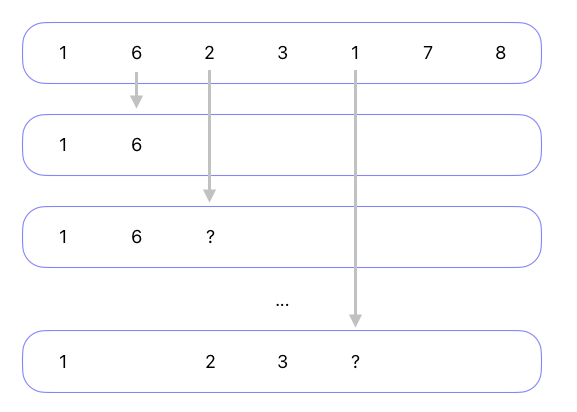
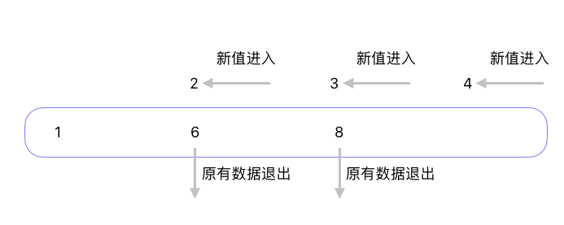

## Vue diff 加最长递增子序列

diff 这部分，准确说和 Vue 的关系不是很密切，单独看也可以，也有人面试遇到了，这就抽出来先写一下。

Virtual DOM diff 的作用是，对比 Virtual DOM，尽量复用老的 DOM，而不是直接创建新 DOM 进行删除替换，减少 DOM 操作消耗。复用的方式，包括移动位置、或者修改已有 DOM 的内容。之前其实粗略看了下 diff 怎么实现的，有点不求甚解的感觉。今天准备静下心，认真看一遍，了解其中的细节。

### diff 过程

主要看的是带 key 的 diff，原方法中已有一些注释，我没有删除。方法就是下面的方法：

```ts
// can be all-keyed or mixed
const patchKeyedChildren = (
  c1: VNode[],
  c2: VNodeArrayChildren,
  container: RendererElement,
  parentAnchor: RendererNode | null,
  parentComponent: ComponentInternalInstance | null,
  parentSuspense: SuspenseBoundary | null,
  isSVG: boolean,
  slotScopeIds: string[] | null,
  optimized: boolean
) => {
  let i = 0;
  const l2 = c2.length;
  let e1 = c1.length - 1; // prev ending index
  let e2 = l2 - 1; // next ending index

  // 1. sync from start
  // (a b) c
  // (a b) d e
  // 开始从头 diff
  // 假设存在不同，i 最后指向第一个不同节点
  while (i <= e1 && i <= e2) {
    const n1 = c1[i];
    const n2 = (c2[i] = optimized
      ? cloneIfMounted(c2[i] as VNode)
      : normalizeVNode(c2[i]));
    if (isSameVNodeType(n1, n2)) {
      patch(
        n1,
        n2,
        container,
        null,
        parentComponent,
        parentSuspense,
        isSVG,
        slotScopeIds,
        optimized
      );
    } else {
      break;
    }
    i++;
  }

  // 2. sync from end
  // a (b c)
  // d e (b c)
  // 尾部开始 diff
  // 最终会指向最后一个不同元素
  while (i <= e1 && i <= e2) {
    const n1 = c1[e1];
    const n2 = (c2[e2] = optimized
      ? cloneIfMounted(c2[e2] as VNode)
      : normalizeVNode(c2[e2]));
    if (isSameVNodeType(n1, n2)) {
      patch(
        n1,
        n2,
        container,
        null,
        parentComponent,
        parentSuspense,
        isSVG,
        slotScopeIds,
        optimized
      );
    } else {
      break;
    }
    e1--;
    e2--;
  }

  // 3. common sequence + mount
  // (a b)
  // (a b) c
  // i = 2, e1 = 1, e2 = 2
  // (a b)
  // c (a b)
  // i = 0, e1 = -1, e2 = 0
  // 没有变化也会进入这个判断
  // 没有变，最终 i = c2.length
  // 大于 e2 = c2.length - 1
  if (i > e1) {
    // 如果 i 小于等于 e2
    // 说明老队列已经遍历完成，新队列中仍有剩余
    // 此时 i 刚好未第一个新节点位置
    // e2 是最后一个新节点位置
    if (i <= e2) {
      const nextPos = e2 + 1;
      const anchor = nextPos < l2 ? (c2[nextPos] as VNode).el : parentAnchor;
      while (i <= e2) {
        patch(
          null,
          (c2[i] = optimized
            ? cloneIfMounted(c2[i] as VNode)
            : normalizeVNode(c2[i])),
          container,
          anchor,
          parentComponent,
          parentSuspense,
          isSVG,
          slotScopeIds,
          optimized
        );
        i++;
      }
    }
  }

  // 4. common sequence + unmount
  // (a b) c
  // (a b)
  // i = 2, e1 = 2, e2 = 1
  // a (b c)
  // (b c)
  // i = 0, e1 = 0, e2 = -1
  // 这种情况和上面刚好相反
  // 老队列中节点个数更多，需要将多余节点移除
  else if (i > e2) {
    while (i <= e1) {
      unmount(c1[i], parentComponent, parentSuspense, true);
      i++;
    }
  }

  // 5. unknown sequence
  // [i ... e1 + 1]: a b [c d e] f g
  // [i ... e2 + 1]: a b [e d c h] f g
  // i = 2, e1 = 4, e2 = 5
  else {
    const s1 = i; // prev starting index
    const s2 = i; // next starting index

    // 5.1 build key:index map for newChildren
    // 创建新节点对应位置索引
    const keyToNewIndexMap: Map<string | number | symbol, number> = new Map();
    for (i = s2; i <= e2; i++) {
      const nextChild = (c2[i] = optimized
        ? cloneIfMounted(c2[i] as VNode)
        : normalizeVNode(c2[i]));
      if (nextChild.key != null) {
        if (__DEV__ && keyToNewIndexMap.has(nextChild.key)) {
          warn(
            `Duplicate keys found during update:`,
            JSON.stringify(nextChild.key),
            `Make sure keys are unique.`
          );
        }
        // key 唯一，所以使用 key 做键
        keyToNewIndexMap.set(nextChild.key, i);
      }
    }

    // 5.2 loop through old children left to be patched and try to patch
    // matching nodes & remove nodes that are no longer present
    let j;
    let patched = 0; // 已比较次数
    const toBePatched = e2 - s2 + 1; // 待比较个数，从 s2 到 e2 包括 s2
    let moved = false;

    // used to track whether any node has moved
    let maxNewIndexSoFar = 0; // 最长递增位置
    // works as Map<newIndex, oldIndex>
    // Note that oldIndex is offset by +1
    // and oldIndex = 0 is a special value indicating the new node has
    // no corresponding old node.
    // used for determining longest stable subsequence

    // 记录新 index 对应的 老 index
    // newIndexToOldIndexMap 数组下标为新的 index
    // 值是老 index
    const newIndexToOldIndexMap = new Array(toBePatched);

    for (i = 0; i < toBePatched; i++) newIndexToOldIndexMap[i] = 0;

    for (i = s1; i <= e1; i++) {
      const prevChild = c1[i]; // 老节点
      if (patched >= toBePatched) {
        // all new children have been patched so this can only be a removal
        unmount(prevChild, parentComponent, parentSuspense, true);
        continue;
      }

      let newIndex; // 新节点中对应 index
      if (prevChild.key != null) {
        // 有 key 直接查找
        newIndex = keyToNewIndexMap.get(prevChild.key);
      } else {
        // key-less node, try to locate a key-less node of the same type
        // 部分没有 key，查找对应 index
        for (j = s2; j <= e2; j++) {
          // 重复拦截，判断是否相同节点
          if (
            newIndexToOldIndexMap[j - s2] === 0 &&
            isSameVNodeType(prevChild, c2[j] as VNode)
          ) {
            newIndex = j;
            break;
          }
        }
      }
      if (newIndex === undefined) {
        // 没有找到对应，移除
        unmount(prevChild, parentComponent, parentSuspense, true);
      } else {
        // 记录新 index 对应的 老 index
        // 由于默认值是 0，找到第一位，写入 0 就会有问题，统一加一处理
        newIndexToOldIndexMap[newIndex - s2] = i + 1;
        // maxNewIndexSoFar 也即是移动的最靠后的位置
        // 有这个不代表一定需要移动
        // old: a b c d
        // new: e g f a
        // 这种情况只需要移除不需要的老节点即可
        // move 只有在涉及到前后移动老节点才使用
        if (newIndex >= maxNewIndexSoFar) {
          maxNewIndexSoFar = newIndex;
        } else {
          moved = true;
        }

        patch(
          prevChild,
          c2[newIndex] as VNode,
          container,
          null,
          parentComponent,
          parentSuspense,
          isSVG,
          slotScopeIds,
          optimized
        );
        patched++;
      }
    }

    // 5.3 move and mount
    // generate longest stable subsequence only when nodes have moved
    const increasingNewIndexSequence = moved
      ? getSequence(newIndexToOldIndexMap)
      : EMPTY_ARR;
    j = increasingNewIndexSequence.length - 1;
    // looping backwards so that we can use last patched node as anchor
    for (i = toBePatched - 1; i >= 0; i--) {
      const nextIndex = s2 + i;
      const nextChild = c2[nextIndex] as VNode;
      const anchor =
        nextIndex + 1 < l2 ? (c2[nextIndex + 1] as VNode).el : parentAnchor;
      if (newIndexToOldIndexMap[i] === 0) {
        // mount new
        patch(
          null,
          nextChild,
          container,
          anchor,
          parentComponent,
          parentSuspense,
          isSVG,
          slotScopeIds,
          optimized
        );
      } else if (moved) {
        // move if:
        // There is no stable subsequence (e.g. a reverse)
        // OR current node is not among the stable sequence
        if (j < 0 || i !== increasingNewIndexSequence[j]) {
          move(nextChild, container, anchor, MoveType.REORDER);
        } else {
          j--;
        }
      }
    }
  }
};
```

#### 第一步，头头比较：

```ts
// 1. sync from start
// (a b) c
// (a b) d e
// 开始从头 diff
// 假设存在不同，i 最后指向第一个不同节点
while (i <= e1 && i <= e2) {
  const n1 = c1[i];
  const n2 = (c2[i] = optimized
    ? cloneIfMounted(c2[i] as VNode)
    : normalizeVNode(c2[i]));
  if (isSameVNodeType(n1, n2)) {
    patch(
      n1,
      n2,
      container,
      null,
      parentComponent,
      parentSuspense,
      isSVG,
      slotScopeIds,
      optimized
    );
  } else {
    break;
  }
  i++;
}
```

流程很简单，`isSameVNodeType` 判断是否相同类型（包括 node 的 type 和 key，全部相等才返回 true），如果相同，i ++ 继续往后找，如果不相同，直接 break，也就是说 i 此时指向第一个不相同的节点。例如注释中的例子，最终 `i = 2`。假设没有相同，保持 `i = 0` 进行下一步。

#### 第二步，尾尾比较：

```ts
// 2. sync from end
// a (b c)
// d e (b c)
// 尾部开始 diff
// 最终会指向最后一个不同元素
while (i <= e1 && i <= e2) {
  const n1 = c1[e1];
  const n2 = (c2[e2] = optimized
    ? cloneIfMounted(c2[e2] as VNode)
    : normalizeVNode(c2[e2]));
  if (isSameVNodeType(n1, n2)) {
    patch(
      n1,
      n2,
      container,
      null,
      parentComponent,
      parentSuspense,
      isSVG,
      slotScopeIds,
      optimized
    );
  } else {
    break;
  }
  e1--;
  e2--;
}
```

和第一步逻辑大体一致，需要注意的是新老 node list 长度未必相同，假设两个 list 分别是 [a, b, c, d, e] 和 [a, b, d, e]，遍历到 e1 指向 c、e2 指向 b 也就结束了。总之，结束时 e1 和 e2 指向尾部第一个不同的元素。

#### 第三步，新节点多，新增创建：

```ts
// 3. common sequence + mount
// (a b)
// (a b) c
// i = 2, e1 = 1, e2 = 2
// (a b)
// c (a b)
// i = 0, e1 = -1, e2 = 0
if (i > e1) {
  if (i <= e2) {
    const nextPos = e2 + 1;
    const anchor = nextPos < l2 ? (c2[nextPos] as VNode).el : parentAnchor;
    while (i <= e2) {
      patch(
        null,
        (c2[i] = optimized
          ? cloneIfMounted(c2[i] as VNode)
          : normalizeVNode(c2[i])),
        container,
        anchor,
        parentComponent,
        parentSuspense,
        isSVG,
        slotScopeIds,
        optimized
      );
      i++;
    }
  }
}
```

正如上面说的，存在某一个 list 遍历完成的情况，存在两种情况，需要新增节点或需要删除节点，第三种情况处理的是需要新增节点的情况。进入这种情况，i 指向头部开始第一个不同的元素，e2 指向尾部开始第一个不同的元素。l1 也就是老队列已经遍历完成，不用关心。接下来需要构建 i 到 e2 中间的元素。Vue 插入元素使用 `insertBefore` 方法，需要查找后一个元素，即上面的 `anchor`。

#### 第四步，老节点多，删除节点：

```ts
// 4. common sequence + unmount
// (a b) c
// (a b)
// i = 2, e1 = 2, e2 = 1
// a (b c)
// (b c)
// i = 0, e1 = 0, e2 = -1
// 这种情况和上面刚好相反
// 老队列中节点个数更多，需要将多余节点移除
else if (i > e2) {
  while (i <= e1) {
    unmount(c1[i], parentComponent, parentSuspense, true)
    i++
  }
}
```

如果新节点全部遍历完成，老节点有剩余，需要删除节点。这一步没什么好说的，删就完事了，没有多余的判断。

5. 没有队列遍历完成，比对中间部分，中间部分可能相同节点，也不确定：

这种情况比较复杂拆开单步看

新老节点判断是否同一节点，最重要的就是 key，第一步就是创建新节点 key:index map：

```ts
const s1 = i; // prev starting index
const s2 = i; // next starting index

// 5.1 build key:index map for newChildren
// 创建新节点对应位置索引
const keyToNewIndexMap: Map<string | number | symbol, number> = new Map();
for (i = s2; i <= e2; i++) {
  const nextChild = (c2[i] = optimized
    ? cloneIfMounted(c2[i] as VNode)
    : normalizeVNode(c2[i]));
  if (nextChild.key != null) {
    // 判断 key 是否重复
    if (__DEV__ && keyToNewIndexMap.has(nextChild.key)) {
      warn(
        `Duplicate keys found during update:`,
        JSON.stringify(nextChild.key),
        `Make sure keys are unique.`
      );
    }
    // key 唯一，所以使用 key 做键
    keyToNewIndexMap.set(nextChild.key, i);
  }
}
```

无论怎么操作，最终页面展示效果需以新的 node list 为准，创建新 node 和 key 的 map。可以看到，遍历时候判断了 key 是否重复。假设 key 重复，会导致有节点被覆盖，遍历出现异常。**`keyToNewIndexMap` 保存的状态是，key 作为主键，新 node 在队列中的 index 作为值。**已经比对过的头尾，不用处理，所以这里的 index 是以乱序队列为基准。

第二步是找到新老队列中，同一节点对应位置关系：

```ts
// 5.2 loop through old children left to be patched and try to patch
// matching nodes & remove nodes that are no longer present
let j;
let patched = 0; // 已比较次数
const toBePatched = e2 - s2 + 1; // 待比较个数，从 s2 到 e2 包括 s2
let moved = false;

// used to track whether any node has moved
let maxNewIndexSoFar = 0; // 最长递增位置
// works as Map<newIndex, oldIndex>
// Note that oldIndex is offset by +1
// and oldIndex = 0 is a special value indicating the new node has
// no corresponding old node.
// used for determining longest stable subsequence

// 记录新 index 对应的 老 index
// newIndexToOldIndexMap 数组下标为新的 index
// 值是老 index
const newIndexToOldIndexMap = new Array(toBePatched);

for (i = 0; i < toBePatched; i++) newIndexToOldIndexMap[i] = 0;

for (i = s1; i <= e1; i++) {
  const prevChild = c1[i]; // 老节点
  if (patched >= toBePatched) {
    // all new children have been patched so this can only be a removal
    unmount(prevChild, parentComponent, parentSuspense, true);
    continue;
  }

  let newIndex; // 新节点中对应 index
  if (prevChild.key != null) {
    // 有 key 直接查找
    newIndex = keyToNewIndexMap.get(prevChild.key);
  } else {
    // key-less node, try to locate a key-less node of the same type
    // 如果新老节点都没有 key
    // 节点类型相同也可以视作相同节点
    // 查找没有 key 的 index
    // 这种情况可以有多次
    for (j = s2; j <= e2; j++) {
      // newIndexToOldIndexMap[j - s2] === 0
      // 也就是当前位置没有建立映射关系
      // 找到就可以 break
      // 没找到，可能有多个没有 key 的节点
      // 需要继续往后找
      if (
        newIndexToOldIndexMap[j - s2] === 0 &&
        isSameVNodeType(prevChild, c2[j] as VNode)
      ) {
        newIndex = j;
        break;
      }
    }
  }
  if (newIndex === undefined) {
    // 没有找到，移除
    unmount(prevChild, parentComponent, parentSuspense, true);
  } else {
    // 记录新 index 对应的 老 index
    // 由于默认值是 0，找到第一位，写入 0 就会有问题，统一加一处理
    newIndexToOldIndexMap[newIndex - s2] = i + 1;
    // maxNewIndexSoFar 也即是移动的最靠后的位置
    // 有这个不代表一定需要移动
    // old: a b c d
    // new: e g f a
    // 这种情况只需要移除不需要的老节点即可
    // move 只有在涉及到前后移动老节点才使用
    if (newIndex >= maxNewIndexSoFar) {
      maxNewIndexSoFar = newIndex;
    } else {
      moved = true;
    }

    patch(
      prevChild,
      c2[newIndex] as VNode,
      container,
      null,
      parentComponent,
      parentSuspense,
      isSVG,
      slotScopeIds,
      optimized
    );
    patched++;
  }
}
```

`toBePatched` 是新节点队列长度。`newIndexToOldIndexMap` 用来标记新节点在老节点中的位置，数组的 index 和新节点数组一一对应，为了方便判断，newIndexToOldIndexMap 中的 index 都做了 `+1` 操作。举例说明，假设 `newIndexToOldIndexMap[i] = 2`，表示新节点的第 i 个节点（**i 从 0 开始**），和老节点的第 2 个节点 key 相同（**这里的 index 从 1 开始**），可以认为是同一节点。newIndexToOldIndexMap 默认值是 0，代表老节点中没有相同 key 的节点。

已经有了 `keyToNewIndexMap`（新节点队列的 key:index map），接下里遍历老节点队列就可以建立两者间关系。Vue 同时考虑了部分没有 key 节点的复用逻辑，两个没有 key 的节点，也可以认为 key 相同，如果节点 type 相同，也可以复用。

对于没有用到的老节点，直接移除就好。复用的节点涉及前后移动的情况，假设可以复用的节点，在新节点中顺序保持一致，则不需要移动。只需要插入，或删除其他的节点即可。`maxNewIndexSoFar` 保持单调递增，假设 newIndex 出现在 maxNewIndexSoFar 之前，证明发生了前后移动。出现前后移动就涉及到怎么移动，消耗最小的问题。

第三步，找到最长递增子序列，以及创建新节点：

```ts
// 5.3 move and mount
// generate longest stable subsequence only when nodes have moved
const increasingNewIndexSequence = moved
  ? getSequence(newIndexToOldIndexMap)
  : EMPTY_ARR;
j = increasingNewIndexSequence.length - 1;
// looping backwards so that we can use last patched node as anchor
for (i = toBePatched - 1; i >= 0; i--) {
  const nextIndex = s2 + i;
  const nextChild = c2[nextIndex] as VNode;
  const anchor =
    nextIndex + 1 < l2 ? (c2[nextIndex + 1] as VNode).el : parentAnchor;
  if (newIndexToOldIndexMap[i] === 0) {
    // mount new
    patch(
      null,
      nextChild,
      container,
      anchor,
      parentComponent,
      parentSuspense,
      isSVG,
      slotScopeIds,
      optimized
    );
  } else if (moved) {
    // move if:
    // There is no stable subsequence (e.g. a reverse)
    // OR current node is not among the stable sequence
    if (j < 0 || i !== increasingNewIndexSequence[j]) {
      move(nextChild, container, anchor, MoveType.REORDER);
    } else {
      j--;
    }
  }
}
```

newIndexToOldIndexMap 中放置老节点对应的 index，如果要找到挪动最少的方式，需要找到最长递增子序列。这样保持这个递增序列元素相对位置不动，其他节点相对序列中的节点移动、新增即可。遍历从后向前，这样可以使用上一次插入的节点，作为 insertBefore 的 anchor。moved 为 false，代表只需要 mount 节点，无需移动，也就是复用的新节点在老节点中 index 本就是递增的。

### diff 逻辑说完了，接下来是最长递增子序列算法的补充

#### 基础版

LeetCode 上有最长递增子序列的题，可以看[这里](https://leetcode.cn/problems/longest-increasing-subsequence/description/?envType=study-plan-v2&envId=top-100-liked)

简单描述就是，给定一个无序整数数组，求其中严格递增的最长子序列长度。子序列元素在数组中不用相邻，但是先后顺序一致。

例如，`[1, 6, 2, 3, 1, 7, 8]` 最长递增子序列为 `[1, 2, 3, 7, 8]`。

LeetCode 这道题相当于最长递增子序列的降阶版，只需要求长度，不需要查找序列，不过大体思路是一致。

算法优化的方向无非两种，要么是数据独特，要么是求解的问题独特，这个问题就是后者。

这样就应该把优化方向放在问题的独特性上，数据机构没有特殊性，就没有办法通过特殊结构过滤数据，通常意味着需要穷举。穷举的优化方向就是减少冗余计算，最好想到的就是减少冗余计算。这样就会想到动态规划，解决重叠子问题。

OK，首先来看那些部分是重叠的，可以保留。模拟上述例子，遍历的前几步，来看看有什么规律：



查找到 `index = 0` 位置，当前最长递增子序列一定包含首位，需要进行记录，当前递增子序列为 [1]。

接下来继续向后，遇到 6 大于当前记录的子序列最后一位，继续记录保持增长。

到 `index = 2`的位置，出现了第一个问题，遇到 2 小于当前标记序列的最后一位，怎么取舍？这样思考 6 和 2 的特点，`2 < 6`，也就是说，假设后续数字出现大于 6 的值，一定会大于 2，也即一个数对于 [1, 6] 递增，一定对于 [1, 2] 递增。反之，一个数大于 2，不能保证对于 [1, 6] 保持递增。当前两个子序列长度相等，舍去 6 很合理。

接下来，来到另一情况，当遍历到 `index = 4` 时，标记的最长递增子序列为 [1, 2, 3]。当前的 1 小于 2 和 3，这种情况却不该舍去后面的 2、3。当前位置 1 只是一个数，[1, 2, 3] 则为三位数，保留的收益明显要高。那么什么时候可以舍去前面呢？`index = 4` 开始，如果又会出现一个 [1, 2, 3]，前面的结果也就没有保留的必要了。

上面的例子，不明显，再举一个情况说明。假设遍历到 i 位置，标记的最长递增子序列是 [1, 6, 8]，长度为 3。如果 i 位置的值是 2。[1, 2] 构成递增子序列，那么 6、8 需不需要舍去呢？假设不需保留子序列值， 6 已经可以舍去了，因为 [1, 2] 和 [1, 6] 长度相等，和 `index = 2` 情况是相同的。需要保留子序列值，[1, 6, 8] 长度大于 [1, 2] ，所以还要标记保存这个序列。当前算法只求长度，就没有保留 6，这也是后续 Vue 算法中优化的一个点。接下来继续遍历，假设从 i 位置开始序列不再增长或是遍历结束，那么最长递增子序列长度就为 3。假设后续有 2 - 8 之间的值，[1, 2] 就会继续增长，此时舍去 8 理由就和之前讨论的情况一样。

总结规律，遍历过程中需要维护一个子序列结果，如果后续出现处于子序列数值区间内的值，不要覆盖掉原有值。至于合适更新长度呢，当插入位置开始的增长子序列，长度超过原有序列时更新。



直接看方法吧：

```js
function lengthOfLIS(arr) {
  const len = arr.length;
  if (len === 0) return 0; // 没有数据直接返沪
  let result = 1; // 长度结果，有数据最少长度 1

  const dp = [0]; // 递增序列标记 index 数组，第一位默认 0

  // index = 0 的情况已经被默认值涵盖这里跳过就行
  for (let i = 1; i < arr.length; i++) {
    const val = arr[i];
    const currentMaxIndex = dp[dp.length - 1];

    if (val > arr[currentMaxIndex]) {
      // 当前值大于保存的最长递增序列尾端值
      // 继续增长
      result++;
      dp.push(i);
      continue;
    }

    // 如果不大于，需要插入到序列中
    let left = 0,
      right = dp.length - 1;

    // 二分查找插入位置
    while (left < right) {
      const mid = left + ((right - left) >> 1); // dp 中一般位置对应 index，二分向下取整，防止溢出没有直接 (l + r) >> 1
      const dpIndex = dp[mid]; // 获取 dp 中对应 arr 中的 index
      if (arr[dpIndex] < val) {
        left = mid + 1; // 查找第一个大于等于的值，加一
      } else {
        right = mid;
      }
    }

    dp[left] = i; // 覆盖
  }

  return result;
}
```

上述代码还可以优化，加入 dp 中直接放入值，就不需要绕来绕去，返回拿 index 取值了，这里写 dp 保留 index 是为了下一步做铺垫。

#### Vue 的升级版

在获取最长递增子序列是怎么保存序列，重点在二分时，我们做了什么。二分过程中我们查找第一个大于等于当前值的位置，`left = mid + 1;` 反过来可以理解为 mid 位置是当前位置的前继。插入过程，也可以看作查找第一个前继节点的过程，把当前值插入这个前继节点后面。同理，`dp.push(i);`，可以看作在前继节点后直接插入节点。

这样如果我们能想办法把前继节点标记下来，dp 中保存了最长递增子序列的末尾节点，这样就可以通过前继找到序列中所有节点。

Vue 引入了一个标记数组，用来标记每个位置前继节点位置。

源码我加了注释放下面了，有了前面的基础应该可以看懂：

```ts
function getSequence(arr: number[]): number[] {
  const p = arr.slice(); // 前继节点标记数组
  const result = [0]; // 结果 index
  let i, j, u, v, c;
  const len = arr.length;
  for (i = 0; i < len; i++) {
    // 当前 index
    const arrI = arr[i];
    if (arrI !== 0) {
      // result 最后一位
      j = result[result.length - 1];

      // 如果当前值大于 result 最后一个值
      // 队列可以单调递增，直接增长
      if (arr[j] < arrI) {
        // 标记前继节点
        p[i] = j;
        result.push(i);
        continue;
      }

      // 二分查找插入位置
      u = 0; // 左指针
      v = result.length - 1; // 右指针
      while (u < v) {
        c = (u + v) >> 1; // 二分向下取整
        // 小于不要，所以查找第一个大于等于的值
        // result 保存的是数字在 arr 中的 index
        // arrI 是数值
        // 所以比较的就是 result 第 c 位置上的 index 在 arr 中的值
        // 和当前值大小
        if (arr[result[c]] < arrI) {
          u = c + 1;
        } else {
          v = c;
        }
      }

      // 找到后替换
      if (arrI < arr[result[u]]) {
        // 记录上一个位置
        // 有前继才记录没有不用记录
        // u = 0 代表最长递增只有一个，没必要记录
        if (u > 0) {
          p[i] = result[u - 1];
        }
        result[u] = i;
      }
    }
  }
  // 遍历完成后
  // p 中会保留一个链条
  // 每一个位置都指向上一个位置
  // 从最后一个位置开始，找到链条
  u = result.length;
  v = result[u - 1];
  while (u-- > 0) {
    result[u] = v;
    v = p[v];
  }
  return result;
}
```

大致就这样，其实二分才是难点，LOL。二分我经常迷糊，这里简单讲一下我对这里的二分怎么思考的。当左右指针重合时候，遍历结束，循环就应该结束了。`const mid = left + ((right - left) >> 1);`，向下取整，假设数组是这样的[left, right]，二分后 mid 和 left 重合。这样 right 和 mid 不用考虑重合问题，或者说 right 向后移动的操作，已经被向下取整自然完成了。这样就需要考虑 left 移动，需要手动移动，也就是 `left = mid + 1;`。
