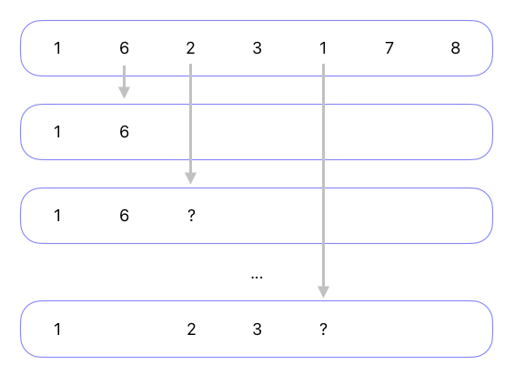
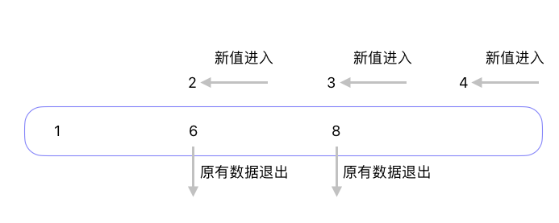

# Vue diff 与最长递增子序列

本文分析带 key 的数组子节点更新，沿用 Vue 3.2 系列片段，以 [v3.2.47 renderer.ts](https://github.com/vuejs/core/blob/v3.2.47/packages/runtime-core/src/renderer.ts) 为对照。Vue 3.5.43 仍保留头尾同步、中段映射和最长递增子序列这条主线，但参数与边界处理有变化，见[当前 renderer.ts](https://github.com/vuejs/core/blob/v3.5.43/packages/runtime-core/src/renderer.ts)。

Virtual DOM diff 的作用是，对比 Virtual DOM，尽量复用老的 DOM，而不是直接创建新 DOM 进行删除替换，减少 DOM 操作消耗。复用的方式，包括移动位置、或者修改已有 DOM 的内容。之前其实粗略看了下 diff 怎么实现的，有点不求甚解的感觉。今天准备静下心，认真看一遍，了解其中的细节。

## diff 过程

先记住五个阶段：同步相同前缀，同步相同后缀，旧片段耗尽时挂载剩余新节点，新片段耗尽时卸载剩余旧节点，两边均有剩余时处理中段映射与移动。

这里“相同”是 type 和 key 都相同，而不是文本、props 或对象引用完全相同。相同节点仍要执行 patch 更新内容；同 key 不同 type 也需要替换。带状态的列表使用稳定且同级唯一的业务 ID，避免随机 key；会重排的列表用数组下标作 key，容易让实例状态跟随位置而不是业务项。见[列表渲染](https://vuejs.org/guide/essentials/list.html#maintaining-state-with-key)。

下面保留整体代码，随后分段解释。

```ts
// can be all-keyed or mixed
const patchKeyedChildren = (
  c1: VNode[],
  c2: VNodeArrayChildren,
  container: RendererElement,
  parentAnchor: RendererNode | null,
  parentComponent: ComponentInternalInstance | null,
  parentSuspense: SuspenseBoundary | null,
  isSVG: boolean,
  slotScopeIds: string[] | null,
  optimized: boolean
) => {
  let i = 0;
  const l2 = c2.length;
  let e1 = c1.length - 1; // prev ending index
  let e2 = l2 - 1; // next ending index

  // 1. sync from start
  // (a b) c
  // (a b) d e
  // 开始从头 diff
  // 假设存在不同，i 最后指向第一个不同节点
  while (i <= e1 && i <= e2) {
    const n1 = c1[i];
    const n2 = (c2[i] = optimized
      ? cloneIfMounted(c2[i] as VNode)
      : normalizeVNode(c2[i]));
    if (isSameVNodeType(n1, n2)) {
      patch(
        n1,
        n2,
        container,
        null,
        parentComponent,
        parentSuspense,
        isSVG,
        slotScopeIds,
        optimized
      );
    } else {
      break;
    }
    i++;
  }

  // 2. sync from end
  // a (b c)
  // d e (b c)
  // 尾部开始 diff
  // 最终会指向最后一个不同元素
  while (i <= e1 && i <= e2) {
    const n1 = c1[e1];
    const n2 = (c2[e2] = optimized
      ? cloneIfMounted(c2[e2] as VNode)
      : normalizeVNode(c2[e2]));
    if (isSameVNodeType(n1, n2)) {
      patch(
        n1,
        n2,
        container,
        null,
        parentComponent,
        parentSuspense,
        isSVG,
        slotScopeIds,
        optimized
      );
    } else {
      break;
    }
    e1--;
    e2--;
  }

  // 3. common sequence + mount
  // (a b)
  // (a b) c
  // i = 2, e1 = 1, e2 = 2
  // (a b)
  // c (a b)
  // i = 0, e1 = -1, e2 = 0
  // 没有变化也会进入这个判断
  // 没有变，最终 i = c2.length
  // 大于 e2 = c2.length - 1
  if (i > e1) {
    // 如果 i 小于等于 e2
    // 说明老队列已经遍历完成，新队列中仍有剩余
    // 此时 i 刚好未第一个新节点位置
    // e2 是最后一个新节点位置
    if (i <= e2) {
      const nextPos = e2 + 1;
      const anchor = nextPos < l2 ? (c2[nextPos] as VNode).el : parentAnchor;
      while (i <= e2) {
        patch(
          null,
          (c2[i] = optimized
            ? cloneIfMounted(c2[i] as VNode)
            : normalizeVNode(c2[i])),
          container,
          anchor,
          parentComponent,
          parentSuspense,
          isSVG,
          slotScopeIds,
          optimized
        );
        i++;
      }
    }
  }

  // 4. common sequence + unmount
  // (a b) c
  // (a b)
  // i = 2, e1 = 2, e2 = 1
  // a (b c)
  // (b c)
  // i = 0, e1 = 0, e2 = -1
  // 这种情况和上面刚好相反
  // 老队列中节点个数更多，需要将多余节点移除
  else if (i > e2) {
    while (i <= e1) {
      unmount(c1[i], parentComponent, parentSuspense, true);
      i++;
    }
  }

  // 5. unknown sequence
  // [i ... e1 + 1]: a b [c d e] f g
  // [i ... e2 + 1]: a b [e d c h] f g
  // i = 2, e1 = 4, e2 = 5
  else {
    const s1 = i; // prev starting index
    const s2 = i; // next starting index

    // 5.1 build key:index map for newChildren
    // 创建新节点对应位置索引
    const keyToNewIndexMap: Map<string | number | symbol, number> = new Map();
    for (i = s2; i <= e2; i++) {
      const nextChild = (c2[i] = optimized
        ? cloneIfMounted(c2[i] as VNode)
        : normalizeVNode(c2[i]));
      if (nextChild.key != null) {
        if (__DEV__ && keyToNewIndexMap.has(nextChild.key)) {
          warn(
            `Duplicate keys found during update:`,
            JSON.stringify(nextChild.key),
            `Make sure keys are unique.`
          );
        }
        // key 唯一，所以使用 key 做键
        keyToNewIndexMap.set(nextChild.key, i);
      }
    }

    // 5.2 loop through old children left to be patched and try to patch
    // matching nodes & remove nodes that are no longer present
    let j;
    let patched = 0; // 已比较次数
    const toBePatched = e2 - s2 + 1; // 待比较个数，从 s2 到 e2 包括 s2
    let moved = false;

    // used to track whether any node has moved
    let maxNewIndexSoFar = 0; // 遍历旧片段时，目前遇到的最大新索引
    // works as Map<newIndex, oldIndex>
    // Note that oldIndex is offset by +1
    // and oldIndex = 0 is a special value indicating the new node has
    // no corresponding old node.
    // used for determining longest stable subsequence

    // 记录新 index 对应的 老 index
    // 下标为 newIndex - s2（新片段的相对下标）
    // 值是 oldIndex + 1，0 表示新增节点
    const newIndexToOldIndexMap = new Array(toBePatched);

    for (i = 0; i < toBePatched; i++) newIndexToOldIndexMap[i] = 0;

    for (i = s1; i <= e1; i++) {
      const prevChild = c1[i]; // 老节点
      if (patched >= toBePatched) {
        // all new children have been patched so this can only be a removal
        unmount(prevChild, parentComponent, parentSuspense, true);
        continue;
      }

      let newIndex; // 新节点中对应 index
      if (prevChild.key != null) {
        // 有 key 直接查找
        newIndex = keyToNewIndexMap.get(prevChild.key);
      } else {
        // key-less node, try to locate a key-less node of the same type
        // 部分没有 key，查找对应 index
        for (j = s2; j <= e2; j++) {
          // 重复拦截，判断是否相同节点
          if (
            newIndexToOldIndexMap[j - s2] === 0 &&
            isSameVNodeType(prevChild, c2[j] as VNode)
          ) {
            newIndex = j;
            break;
          }
        }
      }
      if (newIndex === undefined) {
        // 没有找到对应，移除
        unmount(prevChild, parentComponent, parentSuspense, true);
      } else {
        // 记录新 index 对应的 老 index
        // 由于默认值是 0，找到第一位，写入 0 就会有问题，统一加一处理
        newIndexToOldIndexMap[newIndex - s2] = i + 1;
        // maxNewIndexSoFar 是已遇到的最大新索引，不是移动目标
        // 有这个不代表一定需要移动
        // old: a b c d
        // new: e g f a
        // 这种情况只需要移除不需要的老节点即可
        // move 只有在涉及到前后移动老节点才使用
        if (newIndex >= maxNewIndexSoFar) {
          maxNewIndexSoFar = newIndex;
        } else {
          moved = true;
        }

        patch(
          prevChild,
          c2[newIndex] as VNode,
          container,
          null,
          parentComponent,
          parentSuspense,
          isSVG,
          slotScopeIds,
          optimized
        );
        patched++;
      }
    }

    // 5.3 move and mount
    // generate longest stable subsequence only when nodes have moved
    const increasingNewIndexSequence = moved
      ? getSequence(newIndexToOldIndexMap)
      : EMPTY_ARR;
    j = increasingNewIndexSequence.length - 1;
    // looping backwards so that we can use last patched node as anchor
    for (i = toBePatched - 1; i >= 0; i--) {
      const nextIndex = s2 + i;
      const nextChild = c2[nextIndex] as VNode;
      const anchor =
        nextIndex + 1 < l2 ? (c2[nextIndex + 1] as VNode).el : parentAnchor;
      if (newIndexToOldIndexMap[i] === 0) {
        // mount new
        patch(
          null,
          nextChild,
          container,
          anchor,
          parentComponent,
          parentSuspense,
          isSVG,
          slotScopeIds,
          optimized
        );
      } else if (moved) {
        // move if:
        // There is no stable subsequence (e.g. a reverse)
        // OR current node is not among the stable sequence
        if (j < 0 || i !== increasingNewIndexSequence[j]) {
          move(nextChild, container, anchor, MoveType.REORDER);
        } else {
          j--;
        }
      }
    }
  }
};
```

### 第一步，头头比较：

```ts
// 1. sync from start
// (a b) c
// (a b) d e
// 开始从头 diff
// 假设存在不同，i 最后指向第一个不同节点
while (i <= e1 && i <= e2) {
  const n1 = c1[i];
  const n2 = (c2[i] = optimized
    ? cloneIfMounted(c2[i] as VNode)
    : normalizeVNode(c2[i]));
  if (isSameVNodeType(n1, n2)) {
    patch(
      n1,
      n2,
      container,
      null,
      parentComponent,
      parentSuspense,
      isSVG,
      slotScopeIds,
      optimized
    );
  } else {
    break;
  }
  i++;
}
```

流程很简单，`isSameVNodeType` 判断是否相同类型（包括 node 的 type 和 key，全部相等才返回 true），如果相同，i ++ 继续往后找，如果不相同，直接 break，也就是说 i 此时指向第一个不相同的节点。例如注释中的例子，最终 `i = 2`。假设没有相同，保持 `i = 0` 进行下一步。

### 第二步，尾尾比较：

```ts
// 2. sync from end
// a (b c)
// d e (b c)
// 尾部开始 diff
// 最终会指向最后一个不同元素
while (i <= e1 && i <= e2) {
  const n1 = c1[e1];
  const n2 = (c2[e2] = optimized
    ? cloneIfMounted(c2[e2] as VNode)
    : normalizeVNode(c2[e2]));
  if (isSameVNodeType(n1, n2)) {
    patch(
      n1,
      n2,
      container,
      null,
      parentComponent,
      parentSuspense,
      isSVG,
      slotScopeIds,
      optimized
    );
  } else {
    break;
  }
  e1--;
  e2--;
}
```

和第一步逻辑大体一致，需要注意的是新老 node list 长度未必相同，假设两个 list 分别是 [a, b, c, d, e] 和 [a, b, d, e]，遍历到 e1 指向 c、e2 指向 b 也就结束了。总之，结束时 e1 和 e2 指向尾部第一个不同的元素。

### 第三步，新节点多，新增创建：

```ts
// 3. common sequence + mount
// (a b)
// (a b) c
// i = 2, e1 = 1, e2 = 2
// (a b)
// c (a b)
// i = 0, e1 = -1, e2 = 0
if (i > e1) {
  if (i <= e2) {
    const nextPos = e2 + 1;
    const anchor = nextPos < l2 ? (c2[nextPos] as VNode).el : parentAnchor;
    while (i <= e2) {
      patch(
        null,
        (c2[i] = optimized
          ? cloneIfMounted(c2[i] as VNode)
          : normalizeVNode(c2[i])),
        container,
        anchor,
        parentComponent,
        parentSuspense,
        isSVG,
        slotScopeIds,
        optimized
      );
      i++;
    }
  }
}
```

正如上面说的，存在某一个 list 遍历完成的情况，存在两种情况，需要新增节点或需要删除节点，第三种情况处理的是需要新增节点的情况。进入这种情况，i 指向头部开始第一个不同的元素，e2 指向尾部开始第一个不同的元素。旧片段已经耗尽，不用继续查找旧节点。接下来需要构建 i 到 e2 中间的元素。Vue 插入元素使用 `insertBefore` 方法，需要查找后一个元素，即上面的 `anchor`。

### 第四步，老节点多，删除节点：

```ts
// 4. common sequence + unmount
// (a b) c
// (a b)
// i = 2, e1 = 2, e2 = 1
// a (b c)
// (b c)
// i = 0, e1 = 0, e2 = -1
// 这种情况和上面刚好相反
// 老队列中节点个数更多，需要将多余节点移除
else if (i > e2) {
  while (i <= e1) {
    unmount(c1[i], parentComponent, parentSuspense, true)
    i++
  }
}
```

如果新节点全部遍历完成，老节点有剩余，需要删除节点。这一步没什么好说的，删就完事了，没有多余的判断。

### 第五步，处理中间剩余片段

这种情况比较复杂拆开单步看

先用 key 建立新位置索引；是否能复用还需要 type 相同。第一步是创建 key:index map：

```ts
const s1 = i; // prev starting index
const s2 = i; // next starting index

// 5.1 build key:index map for newChildren
// 创建新节点对应位置索引
const keyToNewIndexMap: Map<string | number | symbol, number> = new Map();
for (i = s2; i <= e2; i++) {
  const nextChild = (c2[i] = optimized
    ? cloneIfMounted(c2[i] as VNode)
    : normalizeVNode(c2[i]));
  if (nextChild.key != null) {
    // 判断 key 是否重复
    if (__DEV__ && keyToNewIndexMap.has(nextChild.key)) {
      warn(
        `Duplicate keys found during update:`,
        JSON.stringify(nextChild.key),
        `Make sure keys are unique.`
      );
    }
    // key 唯一，所以使用 key 做键
    keyToNewIndexMap.set(nextChild.key, i);
  }
}
```

最终页面以新节点顺序为准，所以先创建 key 到新位置的 map。重复 key 会覆盖映射，导致匹配异常。这里只遍历中间剩余片段，但 **keyToNewIndexMap 的值仍是完整新数组 c2 的绝对索引**，并没有减去 s2。

第二步是找到新老队列中，同一节点对应位置关系：

```ts
// 5.2 loop through old children left to be patched and try to patch
// matching nodes & remove nodes that are no longer present
let j;
let patched = 0; // 已比较次数
const toBePatched = e2 - s2 + 1; // 待比较个数，从 s2 到 e2 包括 s2
let moved = false;

// used to track whether any node has moved
let maxNewIndexSoFar = 0; // 遍历旧片段时，目前遇到的最大新索引
// works as Map<newIndex, oldIndex>
// Note that oldIndex is offset by +1
// and oldIndex = 0 is a special value indicating the new node has
// no corresponding old node.
// used for determining longest stable subsequence

// 记录新 index 对应的 老 index
// 下标为 newIndex - s2（新片段的相对下标）
// 值是 oldIndex + 1，0 表示新增节点
const newIndexToOldIndexMap = new Array(toBePatched);

for (i = 0; i < toBePatched; i++) newIndexToOldIndexMap[i] = 0;

for (i = s1; i <= e1; i++) {
  const prevChild = c1[i]; // 老节点
  if (patched >= toBePatched) {
    // all new children have been patched so this can only be a removal
    unmount(prevChild, parentComponent, parentSuspense, true);
    continue;
  }

  let newIndex; // 新节点中对应 index
  if (prevChild.key != null) {
    // 有 key 直接查找
    newIndex = keyToNewIndexMap.get(prevChild.key);
  } else {
    // key-less node, try to locate a key-less node of the same type
    // 如果新老节点都没有 key
    // 节点类型相同也可以视作相同节点
    // 查找没有 key 的 index
    // 这种情况可以有多次
    for (j = s2; j <= e2; j++) {
      // newIndexToOldIndexMap[j - s2] === 0
      // 也就是当前位置没有建立映射关系
      // 找到就可以 break
      // 没找到，可能有多个没有 key 的节点
      // 需要继续往后找
      if (
        newIndexToOldIndexMap[j - s2] === 0 &&
        isSameVNodeType(prevChild, c2[j] as VNode)
      ) {
        newIndex = j;
        break;
      }
    }
  }
  if (newIndex === undefined) {
    // 没有找到，移除
    unmount(prevChild, parentComponent, parentSuspense, true);
  } else {
    // 记录新 index 对应的 老 index
    // 由于默认值是 0，找到第一位，写入 0 就会有问题，统一加一处理
    newIndexToOldIndexMap[newIndex - s2] = i + 1;
    // maxNewIndexSoFar 是已遇到的最大新索引，不是移动目标
    // 有这个不代表一定需要移动
    // old: a b c d
    // new: e g f a
    // 这种情况只需要移除不需要的老节点即可
    // move 只有在涉及到前后移动老节点才使用
    if (newIndex >= maxNewIndexSoFar) {
      maxNewIndexSoFar = newIndex;
    } else {
      moved = true;
    }

    patch(
      prevChild,
      c2[newIndex] as VNode,
      container,
      null,
      parentComponent,
      parentSuspense,
      isSVG,
      slotScopeIds,
      optimized
    );
    patched++;
  }
}
```

`toBePatched = e2 - s2 + 1` 是待处理的新片段长度，不是整个新数组的长度。两份映射使用不同的坐标：

- keyToNewIndexMap：key → 新数组 c2 中的绝对索引。
- newIndexToOldIndexMap：下标是 `newIndex - s2`，值是旧数组 c1 的绝对索引加一。

加一的是存储的旧索引值，不是数组下标。0 留作“旧数组中没有匹配节点”的标记；例如值 2 表示匹配旧数组下标 1。

有 key 时先查 map，再交给 patch 判断类型和更新内容；无 key 时在尚未匹配的位置寻找同 type、同 key（均为空）的节点。这只是混合列表的兜底，不应以此代替稳定 key。

对于没有用到的老节点，直接移除就好。复用的节点涉及前后移动的情况，假设可以复用的节点，在新节点中顺序保持一致，则不需要移动。只需要插入，或删除其他的节点即可。`maxNewIndexSoFar` 保持单调递增，假设 newIndex 出现在 maxNewIndexSoFar 之前，证明发生了前后移动。出现前后移动就涉及到怎么移动，消耗最小的问题。

第三步，找到最长递增子序列，以及创建新节点：

```ts
// 5.3 move and mount
// generate longest stable subsequence only when nodes have moved
const increasingNewIndexSequence = moved
  ? getSequence(newIndexToOldIndexMap)
  : EMPTY_ARR;
j = increasingNewIndexSequence.length - 1;
// looping backwards so that we can use last patched node as anchor
for (i = toBePatched - 1; i >= 0; i--) {
  const nextIndex = s2 + i;
  const nextChild = c2[nextIndex] as VNode;
  const anchor =
    nextIndex + 1 < l2 ? (c2[nextIndex + 1] as VNode).el : parentAnchor;
  if (newIndexToOldIndexMap[i] === 0) {
    // mount new
    patch(
      null,
      nextChild,
      container,
      anchor,
      parentComponent,
      parentSuspense,
      isSVG,
      slotScopeIds,
      optimized
    );
  } else if (moved) {
    // move if:
    // There is no stable subsequence (e.g. a reverse)
    // OR current node is not among the stable sequence
    if (j < 0 || i !== increasingNewIndexSequence[j]) {
      move(nextChild, container, anchor, MoveType.REORDER);
    } else {
      j--;
    }
  }
}
```

newIndexToOldIndexMap 中放置老节点对应的 index，如果要找到挪动最少的方式，需要找到最长递增子序列。这样保持这个递增序列元素相对位置不动，其他节点相对序列中的节点移动、新增即可。遍历从后向前，这样可以使用上一次插入的节点，作为 insertBefore 的 anchor。moved 为 false，代表只需要 mount 节点，无需移动，也就是复用的新节点在老节点中 index 本就是递增的。

## 用一个完整例子核对坐标

```text
旧：a b c d e f g
新：a c e b h f g
同步前缀 a、后缀 f g 后：
旧片段：b c d e，s1 = 1，e1 = 4
新片段：c e b h，s2 = 1，e2 = 4

keyToNewIndexMap：c → 1，e → 2，b → 3，h → 4
newIndexToOldIndexMap：[3, 5, 2, 0]
```

假设字母代表相同 type、不同 key 的节点：d 被删除，h 被新增。按新顺序排列的旧索引加一是 3、5、2，其中 3、5 保持递增，对应 c、e 不需移动。反向处理时先在 f 前挂载 h，再把 b 移到 h 前，最终得到新顺序。

LIS 返回的是映射数组的下标，例如 `[0, 1]`，不是旧索引值 `[3, 5]`，也不是完整新数组的下标 `[1, 2]`。新增节点的 0 不代表一个可复用节点。

## 最长递增子序列算法

### 基础版：只求长度

[最长递增子序列题目](https://leetcode.cn/problems/longest-increasing-subsequence/)要求求严格递增子序列的长度。子序列不要求相邻，但必须保持原数组顺序，例如 `[1, 6, 2, 3, 1, 7, 8]` 的结果长度为 5。



下面使用贪心加二分查找。维护的 dp 不是一条实际子序列：`arr[dp[k]]` 表示目前发现的、长度为 k+1 的递增子序列的最小尾值。尾值越小，后面越容易接上更大的数字。

遇到一个数时，二分查找第一个大于等于它的尾值并替换；如果比全部尾值都大，就追加并增加长度。替换不会缩短已经存在的更长子序列，只改善某个长度的最小尾值。同值替换不增长，因此得到的是严格递增长度。



例如 `[2, 3, 4, 1]` 最后维护的尾值可能是 `[1, 3, 4]`，长度 3 正确，但这三个值不是按原顺序组成的子序列。要恢复真实序列，还需要记录前驱。

```js
function lengthOfLIS(arr) {
  const len = arr.length;
  if (len === 0) return 0; // 没有数据直接返回
  let result = 1; // 长度结果，有数据最少长度 1

  const dp = [0]; // 各长度最小尾值的下标数组，第一位默认 0

  // index = 0 的情况已经被默认值涵盖这里跳过就行
  for (let i = 1; i < arr.length; i++) {
    const val = arr[i];
    const currentMaxIndex = dp[dp.length - 1];

    if (val > arr[currentMaxIndex]) {
      // 当前值大于所有已记录的尾值
      // 继续增长
      result++;
      dp.push(i);
      continue;
    }

    // 如果不大于，需要插入到序列中
    let left = 0,
      right = dp.length - 1;

    // 二分查找插入位置
    while (left < right) {
      const mid = left + ((right - left) >> 1); // 向下取整；本例使用 JS 数组可承载的索引范围
      const dpIndex = dp[mid]; // 获取 dp 中对应 arr 中的 index
      if (arr[dpIndex] < val) {
        left = mid + 1; // 查找第一个大于等于的值，加一
      } else {
        right = mid;
      }
    }

    dp[left] = i; // 覆盖
  }

  return result;
}
```

只求长度时，dp 可以直接存尾值；这里保存下标，是为了接下来记录前驱。

### Vue 的升级版

Vue 需要知道哪些节点可以留在原位，所以还要恢复一条实际 LIS。p 保存每个元素进入候选链时的前驱下标；插入到 result 的位置 u 时，前驱是 `result[u - 1]`，不是二分过程中最后一次访问的 mid。

遍历结束后，从最长链的尾部沿 p 回溯，恢复映射数组中的下标。Vue 的 helper 针对“旧索引加一、0 为新增”的输入使用，不是通用整数数组工具。历史实现把 result 初始化为 `[0]`，空数组或全 0 输入可能返回占位下标；渲染器先判断值为 0 的新增分支，不会据此保留新增节点。独立复用算法时应明确处理这些边界。

源码我加了注释放下面了，有了前面的基础应该可以看懂：

```ts
function getSequence(arr: number[]): number[] {
  const p = arr.slice(); // 前继节点标记数组
  const result = [0]; // 结果 index
  let i, j, u, v, c;
  const len = arr.length;
  for (i = 0; i < len; i++) {
    // 当前 index
    const arrI = arr[i];
    if (arrI !== 0) {
      // result 最后一位
      j = result[result.length - 1];

      // 如果当前值大于 result 最后一个值
      // 队列可以单调递增，直接增长
      if (arr[j] < arrI) {
        // 标记前继节点
        p[i] = j;
        result.push(i);
        continue;
      }

      // 二分查找插入位置
      u = 0; // 左指针
      v = result.length - 1; // 右指针
      while (u < v) {
        c = (u + v) >> 1; // 二分向下取整
        // 小于不要，所以查找第一个大于等于的值
        // result 保存的是数字在 arr 中的 index
        // arrI 是数值
        // 所以比较的就是 result 第 c 位置上的 index 在 arr 中的值
        // 和当前值大小
        if (arr[result[c]] < arrI) {
          u = c + 1;
        } else {
          v = c;
        }
      }

      // 找到后替换
      if (arrI < arr[result[u]]) {
        // 记录上一个位置
        // 有前继才记录没有不用记录
        // u = 0 代表当前元素放在长度为 1 的尾部位置，没有前驱
        if (u > 0) {
          p[i] = result[u - 1];
        }
        result[u] = i;
      }
    }
  }
  // 遍历完成后
  // p 中会保留一个链条
  // 每一个位置都指向上一个位置
  // 从最后一个位置开始，找到链条
  u = result.length;
  v = result[u - 1];
  while (u-- > 0) {
    result[u] = v;
    v = p[v];
  }
  return result;
}
```

大致就这样，其实二分才是难点，LOL。二分我经常迷糊，这里简单讲一下我对这里的二分怎么思考的。当左右指针重合时候，遍历结束，循环就应该结束了。`const mid = left + ((right - left) >> 1);`，向下取整，假设数组是这样的[left, right]，二分后 mid 和 left 重合。这样 right 和 mid 不用考虑重合问题，或者说 right 向后移动的操作，已经被向下取整自然完成了。这样就需要考虑 left 移动，需要手动移动，也就是 `left = mid + 1;`。


## 复杂度与适用边界

对于同级唯一 key、类型可复用的节点，中段建表和扫描是线性的；需要计算 LIS 时为 O(n log n)，额外空间为 O(n)。这里不包含子树递归 patch 和实际 DOM 操作成本。混合列表里无 key 节点需要内层线性查找，最坏可退化为 O(n²)。

在只考虑可复用节点重排、每次移动一个节点的模型下，若有 R 个节点、LIS 长度为 L，保留 LIS 可将移动次数降到 R-L；新增和删除另算。组件、Fragment 可能对应多个宿主节点，VNode 的一次 move 不一定等于一次 DOM insertBefore。

本篇关注 keyed children，不覆盖文本、空子节点、unkeyed children 与 block 的全部更新路径。当前版本还处理异步组件占位等 anchor 边界；实际阅读应对照完整源码。更大的更新链路见 [mount 流程](./03-mount.md) 和[响应式原理](./04-响应式原理.md)。
